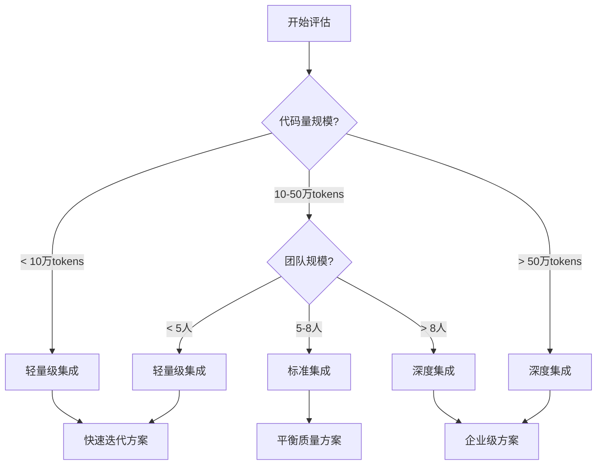

# 第三章：BMAD集成策略

## 🎯 本章目标

学完本章后，你将：
- 🎯 掌握不同项目复杂度的集成策略选择
- 📋 了解各种集成方式的优缺点和适用场景
- 🛠️ 能够制定适合的BMAD集成计划
- ⚖️ 学会平衡开发效率和项目风险

## 📊 集成策略决策框架

### 项目评估维度

在选择集成策略之前，需要从多个维度评估项目：

#### 1. 技术复杂度评估
```markdown
## 技术复杂度矩阵
         | 低复杂度 | 中复杂度 | 高复杂度 |
---------|---------|---------|---------|
单技术栈  |    A    |    B    |    C    |
多技术栈  |    D    |    E    |    F    |
混合架构  |    G    |    H    |    I    |
```

**评估标准**：
- **低复杂度**: 单一框架，结构清晰，依赖简单
- **中复杂度**: 2-3个主要技术，架构相对清晰  
- **高复杂度**: 多种技术混合，架构复杂，历史包袱重

#### 2. 业务影响评估
```markdown
## 业务影响评估
- **用户规模**: 小(< 1000) | 中(1K-10K) | 大(> 10K)
- **业务重要性**: 非核心 | 重要 | 核心业务
- **变更容忍度**: 高 | 中 | 低
- **停机接受度**: 可接受 | 受限 | 不可接受
```

#### 3. 团队能力评估
```markdown
## 团队能力矩阵
- **BMAD熟练度**: 新手 | 熟练 | 专家
- **项目理解度**: 浅层 | 中等 | 深度
- **技术栈熟悉度**: 陌生 | 一般 | 精通
- **团队规模**: 1-2人 | 3-5人 | 6+人
```

## 🚀 集成策略类型

### 策略一：轻量级集成（Lightweight Integration）

#### 适用场景
- ✅ **小型项目**: 代码量 < 10万tokens
- ✅ **低复杂度**: 单一技术栈，架构清晰
- ✅ **小团队**: 1-3人团队
- ✅ **快速改进**: 需要快速见效的优化

#### 集成方式
```bash
# 1. 基础BMAD安装
npx bmad-method install

# 2. 最小化配置
# 只配置必要的技术偏好

# 3. 选择性使用代理
# 主要使用Developer和QA代理
```

#### 工作流程
```markdown
轻量级工作流程:
项目分析 → 简化PRD → 直接开发 → QA检查 → 部署

跳过的步骤:
- 详细市场分析
- 复杂架构设计  
- 多阶段规划
```

#### 优缺点对比
```markdown
✅ 优势:
- 快速上手，学习成本低
- 开发效率高
- 适合敏捷迭代

❌ 劣势:  
- 规划深度有限
- 可能遗漏复杂问题
- 不适合大型变更
```

#### 实际操作示例
```bash
# 轻量级集成示例
# 步骤1: 生成代码分析
npx bmad-method flatten

# 步骤2: 创建简化PRD
@pm
为现有博客系统添加评论功能，要求简单易用，与现有UI风格一致。
请创建简化的功能需求文档。

# 步骤3: 直接开发
@dev  
基于PRD实现评论功能，包括前端界面和后端API。

# 步骤4: QA检查
@qa
检查评论功能的实现质量和与现有系统的集成。
```

### 策略二：标准集成（Standard Integration）

#### 适用场景
- ✅ **中型项目**: 代码量 10-50万tokens
- ✅ **中等复杂度**: 多技术栈但架构合理
- ✅ **中等团队**: 3-8人团队
- ✅ **平衡需求**: 需要平衡质量和效率

#### 集成方式
```bash
# 1. 完整BMAD安装
npx bmad-method install

# 2. 详细配置技术偏好
# 包括现有系统约束

# 3. Web UI + IDE双环境
# 规划用Web UI，开发用IDE
```

#### 工作流程
```markdown
标准工作流程:
项目分析 → Brownfield PRD → 架构评估 → 
故事规划 → 渐进开发 → 全面测试 → 分步部署

完整步骤:
- ✅ 系统分析和文档化
- ✅ Brownfield PRD创建
- ✅ 架构兼容性评估
- ✅ 分阶段故事规划
- ✅ 完整的QA流程
```

#### 代理使用策略
```markdown
## Web UI阶段 (规划)
- Analyst: 分析现有系统和改进需求
- PM: 创建Brownfield PRD
- Architect: 评估架构兼容性

## IDE阶段 (开发)  
- SM: 创建渐进式故事
- Developer: 实现功能
- QA: 全面质量检查
```

#### 实际操作示例
```bash
# 标准集成示例 - 为电商系统添加推荐引擎

# Web UI阶段
@analyst
分析现有电商系统的用户行为数据和推荐需求

@pm  
*create-brownfield-prd
基于分析结果创建推荐引擎的详细PRD

@architect
评估推荐引擎与现有系统的集成架构

# IDE阶段
@sm
*create-brownfield-story  
创建推荐引擎的渐进式实施故事

@dev
*develop-story {recommendation-engine-story}

@qa
*risk {recommendation-engine-story}
*review {recommendation-engine-story}
```

### 策略三：深度集成（Deep Integration）

#### 适用场景
- ✅ **大型项目**: 代码量 > 50万tokens
- ✅ **高复杂度**: 多技术栈，架构复杂
- ✅ **大团队**: 8+人团队
- ✅ **核心系统**: 业务关键系统改造

#### 集成方式
```bash
# 1. 分模块BMAD配置
# 每个模块独立配置BMAD

# 2. 定制化代理
# 创建项目专用代理

# 3. 企业级工作流
# 集成到现有开发流程
```

#### 工作流程
```markdown
深度集成工作流程:
全面分析 → 分层规划 → 架构重构 → 
分模块开发 → 集成测试 → 风险评估 → 
分阶段发布 → 持续监控

高级特性:
- ✅ 多维度风险评估
- ✅ 自定义代理和任务  
- ✅ 与CI/CD集成
- ✅ 性能和安全审计
- ✅ 回滚和应急预案
```

#### 模块化集成策略
```bash
# 大型项目模块化示例
large-project/
├── user-module/
│   ├── .bmad-core/        # 用户模块专用配置
│   └── docs/
├── order-module/  
│   ├── .bmad-core/        # 订单模块专用配置
│   └── docs/
├── payment-module/
│   ├── .bmad-core/        # 支付模块专用配置  
│   └── docs/
└── .bmad-core/            # 全局配置
    └── data/
        ├── integration-strategy.md
        └── cross-module-dependencies.md
```

#### 实际操作示例
```bash
# 深度集成示例 - 银行核心系统现代化

# 第一阶段：全面分析
npx bmad-method flatten --include="core/**" 
@architect *document-project

# 第二阶段：分层规划  
@pm *create-brownfield-prd --scope="core-modernization"
@architect *create-modernization-plan

# 第三阶段：风险评估
@qa *enterprise-risk-assessment
@security-expert *security-audit

# 第四阶段：分模块实施
@sm *create-migration-roadmap
@dev *implement-module --module="account-service"
```

## 📋 集成策略选择指南

### 决策树


### 策略对比表
| 维度 | 轻量级集成 | 标准集成 | 深度集成 |
|------|-----------|----------|----------|
| **学习成本** | 低 | 中 | 高 |
| **实施周期** | 1-2周 | 2-6周 | 4-12周 |
| **风险控制** | 基础 | 完善 | 企业级 |
| **文档质量** | 简化 | 标准 | 详尽 |
| **可扩展性** | 有限 | 良好 | 优秀 |
| **团队协作** | 简单 | 标准化 | 企业级 |

## 🔧 具体集成实施步骤

### 轻量级集成实施

#### 第一步：快速配置
```bash
# 15分钟快速配置
cd existing-project
npx bmad-method install

# 配置最基本的技术偏好
cat > .bmad-core/data/technical-preferences.md << EOF
# 快速配置
## 现有技术栈
- 前端: [填写实际技术栈]
- 后端: [填写实际技术栈]  
- 数据库: [填写实际数据库]

## 改进目标
- 快速增强功能
- 保持系统稳定
- 最小化风险
EOF
```

#### 第二步：直接开发
```bash
# 跳过复杂规划，直接开发
@dev
为现有系统添加[具体功能]，要求：
1. 与现有代码风格一致
2. 不影响现有功能
3. 添加基本测试覆盖

请直接提供实现方案。
```

### 标准集成实施

#### 第一步：完整分析
```bash
# 1小时完整分析流程
npx bmad-method flatten

# Web UI中进行系统分析
@analyst
分析现有系统现状和改进需求

@architect  
*document-project
基于代码库生成系统架构文档
```

#### 第二步：规划设计
```bash
# 2-3小时规划设计
@pm
*create-brownfield-prd
基于系统分析创建改进PRD

@architect
评估改进方案的架构影响和兼容性
```

#### 第三步：渐进开发
```bash
# 分阶段开发实施
@sm
*create-brownfield-story
创建考虑现有系统约束的开发故事

# 按故事逐步实施
@dev *develop-story {story-1}
@qa *review {story-1}
# 重复直到完成
```

### 深度集成实施

#### 第一步：全面评估
```bash
# 企业级评估流程（1-2天）

# 技术评估
@architect *enterprise-analysis
@security-expert *security-assessment
@performance-expert *performance-audit

# 业务评估  
@analyst *business-impact-analysis
@pm *stakeholder-analysis
```

#### 第二步：策略制定
```bash
# 制定企业级改进策略
@enterprise-architect *modernization-strategy
@project-manager *resource-planning
@risk-manager *comprehensive-risk-assessment
```

#### 第三步：分阶段实施
```bash
# 企业级分阶段实施
Phase1: *pilot-implementation
Phase2: *core-module-migration  
Phase3: *full-system-integration
Phase4: *optimization-and-monitoring
```

## ⚖️ 风险权衡和决策建议

### 风险容忍度评估

#### 低风险偏好项目
```markdown
推荐策略: 标准集成 → 深度集成
特点:
- 宁可慢一点，也要确保稳定
- 充分的测试和验证
- 详细的文档和计划
- 完整的回滚方案

适用场景:
- 金融、医疗等关键业务
- 用户量大的生产系统
- 监管要求严格的行业
```

#### 高风险偏好项目
```markdown
推荐策略: 轻量级集成 → 标准集成
特点:
- 快速迭代，快速试错
- 敏捷响应市场需求
- 可接受一定的不稳定性
- 持续改进和优化

适用场景:
- 初创公司产品
- 内部工具系统
- 创新项目试点
```

### 成本效益分析

#### 投入产出比评估
```markdown
## 轻量级集成
投入: 1-2人周
产出: 快速功能增强，适合小型改进

## 标准集成  
投入: 3-6人周
产出: 高质量系统改进，平衡风险收益

## 深度集成
投入: 8-16人周  
产出: 企业级系统现代化，长期价值最大
```

## 📊 策略效果评估

### 成功指标定义

#### 技术指标
- **代码质量**: 代码覆盖率、复杂度、可维护性指数
- **性能指标**: 响应时间、吞吐量、资源使用率
- **稳定性**: 错误率、可用性、恢复时间

#### 业务指标
- **开发效率**: 功能交付速度、bug修复时间
- **用户体验**: 用户满意度、使用频率
- **运维效率**: 部署频率、故障处理时间

### 持续改进机制

#### 定期回顾
```markdown
## 集成效果回顾（每2周）
1. 技术指标检查
2. 业务价值评估  
3. 团队反馈收集
4. 改进点识别
5. 策略调整决策
```

## ✅ 策略选择检查清单

### 项目评估完成
- [ ] 技术复杂度已评估
- [ ] 业务影响已分析  
- [ ] 团队能力已确认
- [ ] 风险偏好已明确

### 策略选择确认
- [ ] 集成策略已选定
- [ ] 实施计划已制定
- [ ] 成功指标已定义
- [ ] 风险缓解已准备

### 资源准备就绪
- [ ] 团队成员已分工
- [ ] 工具环境已配置
- [ ] 时间安排已确认
- [ ] 应急方案已准备

## 🚀 下一步

选择了合适的集成策略后，我们需要开始具体的实施工作。

**[点击这里进入下一章：04-文档化现有系统 →](04-文档化现有系统.md)**

---

*💡 提示：选择合适的集成策略是Brownfield项目成功的关键。没有万能的策略，只有最适合当前项目情况的策略。记住，策略可以在实施过程中调整优化。*