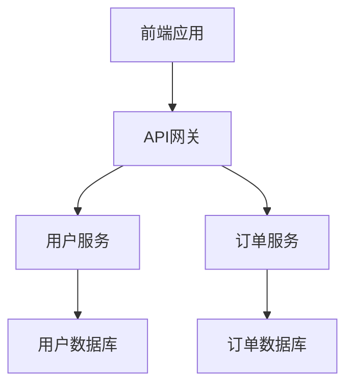

# 第四章：文档化现有系统

## 🎯 本章目标

学完本章后，你将：
- 🔍 掌握使用BMAD自动生成系统文档的方法
- 📊 学会从代码中提取业务逻辑和架构信息
- 📋 能够创建完整的现有系统知识库
- 🗺️ 建立系统改进的文档基础

## ⚠️ 重要提醒

**文档化是Brownfield项目成功的关键！**
- 理解现状是改进的前提
- 好的文档是团队协作的基础
- 文档化过程本身就是学习过程
- 投入文档化的时间会在后续开发中得到回报

## 🔍 第一步：代码库全面扫描

### 1.1 生成代码库概览

#### 使用BMAD扁平化工具
```bash
# 进入项目根目录
cd /path/to/existing-project

# 生成完整的代码库分析
npx bmad-method flatten

# 检查生成结果
ls -la flattened-codebase.xml
```

#### 理解扁平化结果
```bash
# 查看扁平化文件的基本信息
wc -l flattened-codebase.xml
du -h flattened-codebase.xml

# 检查包含的文件类型
grep -o 'path="[^"]*"' flattened-codebase.xml | \
  sed 's/path="//; s/"//' | \
  grep -E '\.[a-z]+$' | \
  cut -d. -f2 | \
  sort | uniq -c | sort -nr
```

#### 优化扫描范围
对于大型项目，可以分模块扫描：
```bash
# 只扫描核心模块
npx bmad-method flatten --input ./src/core --output core-module.xml

# 只扫描前端代码  
npx bmad-method flatten --input ./frontend --output frontend.xml

# 只扫描API相关代码
npx bmad-method flatten --input ./api --output api.xml
```

### 1.2 选择合适的文档化策略

#### 根据项目规模选择策略

##### 小型项目 (< 100个文件)
```bash
# 一次性全量分析
npx bmad-method flatten
# 上传完整的 flattened-codebase.xml 到 Web UI
```

##### 中型项目 (100-1000个文件)  
```bash
# 分模块分析
npx bmad-method flatten --input ./backend
npx bmad-method flatten --input ./frontend  
npx bmad-method flatten --input ./shared
# 分别上传各模块的XML文件
```

##### 大型项目 (> 1000个文件)
```bash
# 核心优先策略
# 1. 先分析最核心的模块
npx bmad-method flatten --input ./core
# 2. 再分析业务模块
npx bmad-method flatten --input ./modules/user
# 3. 最后分析辅助模块
npx bmad-method flatten --input ./utils
```

## 📊 第二步：使用AI代理进行系统分析

### 2.1 架构师代理系统分析

#### 基础架构分析
在Web UI中启动架构师代理：
```bash
@architect
*document-project

我需要你分析这个现有项目的系统架构。项目的代码已经通过XML文件上传。

请提供：
1. 整体系统架构概览
2. 技术栈分析和评估
3. 主要组件和模块说明
4. 数据流和业务流程
5. 潜在的架构问题和改进建议

项目背景：[这里描述项目的基本信息，如业务域、规模等]
```

#### 详细架构分析
```bash
@architect

基于前面的基础分析，请深入分析以下方面：

1. **设计模式识别**：项目中使用了哪些设计模式？
2. **依赖关系分析**：主要模块间的依赖关系如何？
3. **数据库设计评估**：数据库结构是否合理？
4. **API设计评估**：接口设计是否符合最佳实践？
5. **安全架构分析**：现有的安全机制如何？

请为每个方面提供具体的分析和改进建议。
```

### 2.2 业务分析师代理业务逻辑分析

#### 业务流程识别
```bash
@analyst

请分析项目的业务逻辑和流程：

1. **核心业务流程**：识别系统的主要业务流程
2. **用户角色分析**：系统支持哪些用户角色？
3. **数据实体分析**：主要的业务实体有哪些？
4. **业务规则提取**：代码中隐含的业务规则
5. **集成点识别**：与外部系统的集成点

重点关注：
- 复杂的业务逻辑实现
- 可能存在的业务漏洞
- 业务流程的优化空间
```

#### 用户体验分析
```bash
@analyst

从用户体验角度分析系统：

1. **用户界面评估**：UI/UX设计的优缺点
2. **用户旅程分析**：主要用户操作流程
3. **性能体验评估**：影响用户体验的性能问题
4. **易用性分析**：系统的易用性如何？
5. **移动端适配**：移动设备支持情况

请提供具体的改进建议和优先级排序。
```

### 2.3 质量保证代理代码质量分析

#### 代码质量评估
```bash
@qa

请从质量保证角度分析代码库：

1. **代码规范性**：代码是否遵循统一的编码规范？
2. **测试覆盖率**：现有测试的完整性如何？
3. **错误处理**：错误处理机制是否完善？
4. **性能问题**：潜在的性能瓶颈在哪里？
5. **安全漏洞**：可能存在的安全风险？

重点评估：
- 代码可维护性
- 潜在的bug风险
- 技术债务情况
- 改进优先级建议
```

#### 测试策略评估
```bash
@qa

分析现有的测试体系：

1. **测试类型分析**：单元测试、集成测试、端到端测试的现状
2. **测试覆盖分析**：哪些功能缺乏测试覆盖？
3. **测试质量评估**：现有测试的有效性如何？
4. **自动化程度**：测试自动化的现状？
5. **测试环境**：测试环境配置是否合理？

请提供：
- 测试策略改进建议
- 优先需要添加测试的功能
- 测试环境优化方案
```

## 📋 第三步：整理和结构化文档

### 3.1 创建项目文档结构

#### 建立文档目录
```bash
# 在项目中创建文档结构
mkdir -p docs/brownfield-analysis/{architecture,business,quality,integration}

# 创建基础文档文件
touch docs/brownfield-analysis/system-overview.md
touch docs/brownfield-analysis/architecture/technical-architecture.md
touch docs/brownfield-analysis/architecture/data-architecture.md
touch docs/brownfield-analysis/business/business-processes.md
touch docs/brownfield-analysis/business/user-journeys.md
touch docs/brownfield-analysis/quality/code-quality-report.md
touch docs/brownfield-analysis/quality/testing-assessment.md
touch docs/brownfield-analysis/integration/dependencies-analysis.md
```

#### 文档结构说明
```markdown
docs/brownfield-analysis/
├── system-overview.md              # 系统总览
├── architecture/                   # 架构分析
│   ├── technical-architecture.md   # 技术架构
│   ├── data-architecture.md        # 数据架构
│   ├── security-architecture.md    # 安全架构
│   └── deployment-architecture.md  # 部署架构
├── business/                       # 业务分析
│   ├── business-processes.md       # 业务流程
│   ├── user-journeys.md           # 用户旅程
│   ├── business-rules.md          # 业务规则
│   └── stakeholder-analysis.md    # 利益相关者
├── quality/                        # 质量分析
│   ├── code-quality-report.md     # 代码质量
│   ├── testing-assessment.md      # 测试评估
│   ├── performance-analysis.md    # 性能分析
│   └── security-assessment.md     # 安全评估
└── integration/                    # 集成分析
    ├── dependencies-analysis.md   # 依赖分析
    ├── api-documentation.md       # API文档
    └── third-party-services.md    # 第三方服务
```

### 3.2 系统总览文档

#### 系统总览模板
```markdown
# 系统总览 - [项目名称]

## 📊 基本信息
- **项目名称**: [项目名称]
- **业务领域**: [业务领域]
- **开发团队**: [团队信息]
- **技术栈**: [主要技术栈]
- **代码规模**: [代码行数/文件数]
- **用户规模**: [用户数量]

## 🏗️ 系统架构概览
[从架构师代理的分析中提取]

### 整体架构图
```
[系统架构图或描述]
```

### 核心模块
1. **[模块1名称]**: [功能描述]
2. **[模块2名称]**: [功能描述]
3. **[模块3名称]**: [功能描述]

## 💼 业务功能概览
[从业务分析师的分析中提取]

### 主要功能
- **[功能1]**: [功能描述和实现方式]
- **[功能2]**: [功能描述和实现方式]
- **[功能3]**: [功能描述和实现方式]

### 用户角色
- **[角色1]**: [权限和功能]
- **[角色2]**: [权限和功能]

## 🔧 技术实现概览
[从技术分析中提取]

### 技术栈详情
- **前端**: [框架、版本、主要库]
- **后端**: [框架、版本、主要库]  
- **数据库**: [类型、版本、设计模式]
- **部署**: [环境、容器、CI/CD]

## ⚠️ 主要问题和风险
[从QA分析中提取]

### 技术债务
1. **[问题1]**: [描述和影响]
2. **[问题2]**: [描述和影响]

### 改进建议
1. **[建议1]**: [优先级、实施难度、预期收益]
2. **[建议2]**: [优先级、实施难度、预期收益]

## 📈 改进路线图
[基于所有分析制定]

### 短期目标 (1-3个月)
- [ ] [改进项1]
- [ ] [改进项2]

### 中期目标 (3-6个月)  
- [ ] [改进项1]
- [ ] [改进项2]

### 长期目标 (6个月以上)
- [ ] [改进项1]
- [ ] [改进项2]
```

### 3.3 详细文档编写

#### 技术架构文档
```markdown
# 技术架构分析

## 🏗️ 架构模式
- **架构类型**: [单体/微服务/分层等]
- **设计模式**: [使用的主要设计模式]
- **通信方式**: [模块间通信方式]

## 📊 技术栈分析
[详细的技术栈评估]

## 🔗 依赖关系图
[模块依赖关系分析]

## ⚡ 性能架构
[性能相关的架构决策]

## 🛡️ 安全架构  
[安全相关的架构设计]

## 📝 改进建议
[具体的架构改进建议]
```

#### 业务流程文档
```markdown
# 业务流程分析

## 🔄 核心业务流程

### 流程1：[流程名称]
**触发条件**: [什么情况下触发]
**参与角色**: [涉及的用户角色]
**处理步骤**:
1. [步骤1]
2. [步骤2]
3. [步骤3]
**输出结果**: [流程的最终结果]

### 流程2：[流程名称]
[类似格式]

## 📊 业务数据流
[数据在业务流程中的流转]

## 📐 业务规则
[隐含在代码中的业务规则]

## 💡 优化建议
[业务流程的优化建议]
```

## 🔄 第四步：验证和完善文档

### 4.1 文档准确性验证

#### 与团队成员验证
```markdown
## 文档验证检查清单
- [ ] 架构分析是否准确？
- [ ] 业务流程描述是否完整？
- [ ] 技术细节是否正确？
- [ ] 问题识别是否合理？
- [ ] 改进建议是否可行？
```

#### 代码对照验证
```bash
# 验证架构分析的准确性
# 检查关键模块是否存在
find . -name "[关键模块名].js" -o -name "[关键模块名].py"

# 验证API分析的准确性  
grep -r "app.get\|app.post\|@app.route" . | wc -l

# 验证数据库分析的准确性
find . -name "*.sql" -o -name "*migration*" | head -5
```

### 4.2 文档质量提升

#### 使用BMAD代理优化文档
```bash
@bmad-master

请帮我优化这些系统分析文档：

1. **完整性检查**: 文档是否遗漏了重要信息？
2. **结构优化**: 文档结构是否清晰合理？
3. **可读性改进**: 如何提高文档的可读性？
4. **实用性增强**: 如何让文档更有实用价值？

请提供具体的改进建议。
```

#### 添加图表和可视化
```bash
# 使用工具生成架构图
# 例如使用 Mermaid 语法


## 📚 第五步：建立知识库

### 5.1 创建项目知识库

#### 知识库结构
```bash
# 创建知识库目录
mkdir -p docs/knowledge-base/{onboarding,troubleshooting,best-practices}

# 新人入门指南
touch docs/knowledge-base/onboarding/developer-onboarding.md
touch docs/knowledge-base/onboarding/system-walkthrough.md

# 故障排除指南
touch docs/knowledge-base/troubleshooting/common-issues.md
touch docs/knowledge-base/troubleshooting/debugging-guide.md

# 最佳实践  
touch docs/knowledge-base/best-practices/coding-standards.md
touch docs/knowledge-base/best-practices/deployment-practices.md
```

#### 新人入门指南
```markdown
# 开发者入门指南

## 🚀 快速开始
1. **环境搭建**: [详细的环境搭建步骤]
2. **代码获取**: [代码仓库和分支说明]
3. **本地运行**: [本地运行和调试指南]
4. **测试运行**: [如何运行测试套件]

## 📚 系统理解
1. **架构概览**: 阅读 [系统总览文档]
2. **业务理解**: 阅读 [业务流程文档]
3. **代码结构**: [关键文件和目录说明]
4. **数据模型**: [数据库结构和实体关系]

## 🔧 开发指南
1. **编码规范**: [代码风格和规范]
2. **提交规范**: [Git提交信息规范]
3. **测试要求**: [测试覆盖率和质量要求]
4. **代码审查**: [代码审查流程和标准]

## 📞 获取帮助
- **技术负责人**: [联系方式]
- **团队群组**: [沟通渠道]
- **文档资源**: [相关文档链接]
```

### 5.2 维护和更新机制

#### 文档更新策略
```markdown
## 文档维护责任
- **架构文档**: 技术负责人负责更新
- **业务文档**: 产品经理负责更新
- **质量文档**: QA负责人负责更新
- **开发指南**: 团队协作更新

## 更新触发条件
- 重大功能变更时
- 架构调整时
- 新人入职时
- 定期回顾时（每季度）

## 更新流程
1. 识别文档过期内容
2. 使用BMAD代理重新分析
3. 更新相关文档
4. 团队内部审查
5. 发布更新版本
```

## 🎯 第六步：文档化成果验收

### 6.1 文档质量标准

#### 完整性标准
- [ ] 系统架构描述完整
- [ ] 主要业务流程覆盖
- [ ] 技术实现细节清晰  
- [ ] 问题和风险识别全面
- [ ] 改进建议具体可行

#### 准确性标准
- [ ] 架构描述与代码一致
- [ ] 业务流程与实际相符
- [ ] 技术细节准确无误
- [ ] 数据流描述正确

#### 可用性标准
- [ ] 新人能够快速上手
- [ ] 开发者能够找到所需信息
- [ ] 管理者能够了解系统状况
- [ ] 文档结构清晰易导航

### 6.2 成果交付清单

#### 核心文档
- [ ] 系统总览文档
- [ ] 技术架构文档  
- [ ] 业务流程文档
- [ ] 代码质量报告
- [ ] 改进建议报告

#### 支撑资料
- [ ] 代码分析XML文件
- [ ] AI代理分析记录
- [ ] 验证测试记录
- [ ] 团队评审意见

#### 后续维护
- [ ] 文档更新机制
- [ ] 维护责任分工
- [ ] 定期回顾计划

## 💡 最佳实践建议

### 文档化过程中的注意事项

#### 1. 保持客观和准确
- 基于代码事实而非主观判断
- 承认不确定的地方
- 区分问题和改进机会

#### 2. 关注实用性
- 面向实际使用场景编写
- 提供可操作的建议
- 保持文档的可维护性

#### 3. 平衡详细程度
- 核心模块详细分析
- 辅助模块概要说明
- 避免过度细节化

#### 4. 持续迭代改进
- 文档是活的，需要持续更新
- 根据使用反馈优化结构
- 定期检查文档的有效性

## ✅ 完成检查

完成本章实践后，你应该拥有：

### 分析成果
- [ ] 完整的代码库扫描结果
- [ ] AI代理生成的系统分析报告
- [ ] 结构化的项目文档
- [ ] 项目知识库框架

### 理解深度
- [ ] 清楚系统的技术架构
- [ ] 了解主要业务流程
- [ ] 识别了关键问题和风险
- [ ] 制定了改进方向

### 团队资产
- [ ] 新人入门指南
- [ ] 系统维护手册
- [ ] 问题排查指南
- [ ] 最佳实践文档

## 🚀 下一步

现在你已经全面了解了现有系统，可以开始规划具体的增强功能了。

**[点击这里进入下一章：05-增强功能规划 →](05-增强功能规划.md)**

---

*💡 提示：文档化不是一次性工作，而是持续的过程。好的文档是团队最宝贵的资产，它会在项目的整个生命周期中持续产生价值。记住：今天花时间写的文档，会为明天节省更多时间。*