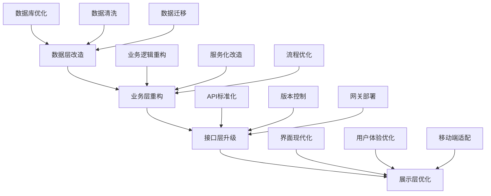

# BMAD-METHOD Brownfield 最佳实践指南

## 📋 指南概览

本指南汇总了多个成功Brownfield项目的实践经验，为团队提供系统化的方法论和可操作的最佳实践。适用于各种规模和类型的现有系统改造项目。

### 🎯 指南定位
- **系统性方法论**：完整的Brownfield项目实施框架
- **实践导向**：基于真实项目经验的具体建议
- **工具化支持**：配合BMAD-METHOD工具链使用
- **风险可控**：重点关注风险识别和控制

### 📚 适用范围
- 遗留系统现代化改造
- 技术栈升级迁移
- 架构重构和优化
- 功能增强和扩展
- 性能优化改进

## 🏗️ 项目准备阶段最佳实践

### 1. 系统分析和理解

#### 1.1 代码库全面扫描
```bash
# 最佳实践：分层次扫描策略
# 第一层：整体概览
npx bmad-method flatten --output system-overview.xml

# 第二层：核心模块详细分析
npx bmad-method flatten --input ./core --output core-analysis.xml

# 第三层：问题热点深度分析
npx bmad-method flatten --input ./problem-areas --output hotspot-analysis.xml
```

**关键经验：**
- 🔍 **先整体后局部**：不要一开始就深入细节
- 📊 **量化分析**：用数据说话，避免主观判断
- 🎯 **重点突出**：识别20%的关键代码解决80%的问题
- 📝 **文档同步**：分析过程中同步记录发现和思考

#### 1.2 利用AI代理系统分析
```bash
# 最佳实践：多角度AI分析
@architect
*comprehensive-system-analysis

请从以下维度分析系统：
1. 架构模式和设计原则
2. 技术债务和风险点
3. 性能瓶颈和扩展性问题
4. 安全漏洞和合规风险
5. 可维护性和可测试性

重点关注：
- 改造的技术可行性
- 业务连续性风险
- 资源投入估算
- 改造优先级建议
```

**最佳实践原则：**
- 🤖 **充分利用AI**：让AI承担重复性分析工作
- 🔄 **迭代深化**：多轮对话深入挖掘问题
- ✅ **人工验证**：AI结论需要人工验证和补充
- 📋 **结构化记录**：将AI分析结果结构化整理

### 2. 需求和目标定义

#### 2.1 业务价值驱动的目标设定
```markdown
# 目标设定最佳实践模板

## 业务目标（SMART原则）
- **具体(Specific)**：明确要解决的业务问题
- **可衡量(Measurable)**：设定可量化的成功指标
- **可达成(Achievable)**：基于资源现状的现实目标
- **相关性(Relevant)**：与业务战略高度相关
- **时限性(Time-bound)**：明确的时间节点

## 技术目标
- **架构目标**：[具体的架构改进目标]
- **性能目标**：[具体的性能指标]
- **质量目标**：[代码质量和可维护性目标]
- **安全目标**：[安全加固和合规要求]

## 约束条件
- **业务约束**：不能中断的关键业务
- **技术约束**：必须保持的技术选择
- **资源约束**：预算、人力、时间限制
- **合规约束**：法规和标准要求
```

#### 2.2 风险驱动的方案设计
**关键实践：**
- ⚠️ **风险优先**：先识别最大风险，再设计缓解方案
- 🛡️ **多重保险**：关键环节设置多重保护措施
- 🔄 **渐进策略**：分阶段降低单次变更风险
- 📊 **量化评估**：用概率和影响度量化风险

### 3. 团队组织和协作

#### 3.1 跨职能团队建设
```markdown
# Brownfield项目理想团队结构

## 核心团队（5-8人）
- **项目负责人**：整体协调和决策
- **架构师**：技术方案设计和评审
- **资深开发**：核心功能实现和重构
- **QA工程师**：质量保证和测试策略
- **DevOps工程师**：部署和运维自动化

## 扩展团队
- **业务专家**：业务需求确认和验收
- **UI/UX设计师**：用户体验优化
- **安全专家**：安全评估和加固
- **数据工程师**：数据迁移和整合

## 协作原则
- 📅 **定期同步**：每日站会 + 每周回顾
- 📝 **透明沟通**：决策过程和原因要透明
- 🤝 **协作决策**：重大技术决策团队讨论
- 📚 **知识分享**：定期技术分享和复盘
```

#### 3.2 干系人管理
**关键策略：**
- 👥 **识别关键干系人**：业务用户、管理层、运维团队
- 📢 **建立沟通机制**：定期汇报和反馈渠道
- 🎯 **管理期望**：明确传达项目目标和约束
- 🔄 **持续反馈**：建立快速反馈和调整机制

## 🚀 实施阶段最佳实践

### 4. 渐进式改造策略

#### 4.1 分层改造方法


**分层改造优势：**
- 🎯 **风险隔离**：每层改造相对独立，降低整体风险
- 📈 **渐进价值**：每层完成都能产生业务价值
- 🔧 **技能匹配**：不同层次对应不同技能要求
- 🕐 **时间分摊**：避免长时间的大规模停机

#### 4.2 功能开关和灰度发布
```javascript
// 功能开关最佳实践
class FeatureToggleManager {
    constructor() {
        this.features = new Map();
        this.userSegments = new Map();
    }
    
    // 渐进式发布控制
    setFeatureRollout(featureName, config) {
        this.features.set(featureName, {
            enabled: config.enabled,
            rolloutPercentage: config.rolloutPercentage || 0,
            userWhitelist: config.userWhitelist || [],
            userBlacklist: config.userBlacklist || [],
            startTime: config.startTime,
            endTime: config.endTime,
            conditions: config.conditions || []
        });
    }
    
    // 智能用户分组
    isFeatureEnabledForUser(featureName, userId, userContext = {}) {
        const feature = this.features.get(featureName);
        if (!feature || !feature.enabled) return false;
        
        // 黑名单检查
        if (feature.userBlacklist.includes(userId)) return false;
        
        // 白名单优先
        if (feature.userWhitelist.includes(userId)) return true;
        
        // 时间窗口检查
        const now = new Date();
        if (feature.startTime && now < feature.startTime) return false;
        if (feature.endTime && now > feature.endTime) return false;
        
        // 条件检查
        for (const condition of feature.conditions) {
            if (!this.evaluateCondition(condition, userContext)) return false;
        }
        
        // 百分比控制
        const userHash = this.hashUser(userId);
        return (userHash % 100) < feature.rolloutPercentage;
    }
    
    private hashUser(userId: string): number {
        // 一致性哈希，确保同一用户总是得到相同结果
        let hash = 0;
        for (let i = 0; i < userId.length; i++) {
            const char = userId.charCodeAt(i);
            hash = ((hash << 5) - hash) + char;
            hash = hash & hash; // 转换为32位整数
        }
        return Math.abs(hash);
    }
}

// 使用示例
const toggleManager = new FeatureToggleManager();

// 配置新功能的渐进发布
toggleManager.setFeatureRollout('new_payment_system', {
    enabled: true,
    rolloutPercentage: 10, // 先给10%用户开放
    userWhitelist: ['internal_tester_1', 'internal_tester_2'],
    conditions: [
        { field: 'userType', operator: 'equals', value: 'premium' },
        { field: 'registrationDate', operator: 'before', value: '2024-01-01' }
    ]
});
```

### 5. 数据迁移和一致性

#### 5.1 安全的数据迁移策略
```python
# 数据迁移最佳实践
class SafeDataMigration:
    
    def __init__(self):
        self.source_db = SourceDatabase()
        self.target_db = TargetDatabase()
        self.validator = DataValidator()
        self.logger = MigrationLogger()
    
    async def execute_migration(self, migration_config):
        """执行安全的数据迁移"""
        
        try:
            # 阶段1：预迁移验证
            await self.pre_migration_validation(migration_config)
            
            # 阶段2：创建备份
            backup_info = await self.create_backup()
            
            # 阶段3：增量数据同步
            sync_checkpoint = await self.start_incremental_sync(migration_config)
            
            # 阶段4：全量数据迁移
            await self.migrate_full_data(migration_config, sync_checkpoint)
            
            # 阶段5：数据一致性验证
            validation_result = await self.validate_data_consistency(migration_config)
            
            if not validation_result.is_consistent:
                await self.rollback_migration(backup_info)
                raise MigrationException("数据一致性验证失败")
            
            # 阶段6：切换读写
            await self.switch_database_traffic(migration_config)
            
            # 阶段7：清理和优化
            await self.post_migration_cleanup()
            
            self.logger.info("数据迁移成功完成")
            
        except Exception as e:
            await self.handle_migration_failure(e, backup_info)
            raise
    
    async def pre_migration_validation(self, config):
        """迁移前验证"""
        
        # 检查源数据质量
        data_quality = await self.validator.check_source_data_quality(config.source_tables)
        if data_quality.score < 0.95:
            raise ValidationException(f"源数据质量不达标: {data_quality.issues}")
        
        # 检查目标环境准备情况
        target_ready = await self.validator.check_target_environment(config.target_schema)
        if not target_ready.is_ready:
            raise ValidationException(f"目标环境未准备就绪: {target_ready.issues}")
        
        # 检查网络和资源
        resource_check = await self.validator.check_migration_resources()
        if not resource_check.sufficient:
            raise ValidationException("迁移资源不足")
    
    async def start_incremental_sync(self, config):
        """启动增量数据同步"""
        
        checkpoint = {
            'start_time': datetime.utcnow(),
            'last_sync_timestamps': {}
        }
        
        for table_config in config.tables:
            # 记录当前时间点
            checkpoint['last_sync_timestamps'][table_config.name] = await self.get_table_max_timestamp(
                table_config.name,
                table_config.timestamp_column
            )
            
            # 启动变更数据捕获
            await self.setup_cdc(table_config)
        
        return checkpoint
    
    async def validate_data_consistency(self, config):
        """数据一致性验证"""
        
        validation_result = DataValidationResult()
        
        for table_config in config.tables:
            # 记录数对比
            source_count = await self.source_db.get_record_count(table_config.source_table)
            target_count = await self.target_db.get_record_count(table_config.target_table)
            
            if source_count != target_count:
                validation_result.add_inconsistency(
                    table_config.name,
                    f"记录数不一致: 源{source_count}, 目标{target_count}"
                )
            
            # 关键字段校验和对比
            checksum_match = await self.compare_table_checksums(
                table_config.source_table,
                table_config.target_table,
                table_config.key_columns
            )
            
            if not checksum_match:
                validation_result.add_inconsistency(
                    table_config.name,
                    "数据内容校验和不匹配"
                )
        
        return validation_result
```

#### 5.2 双写模式和数据同步
**双写策略优势：**
- 🔒 **数据安全**：新旧系统同时写入，确保数据不丢失
- ⚡ **快速切换**：可以随时在新旧系统间切换
- 📊 **数据验证**：可以对比新旧系统数据一致性
- 🔄 **灵活回滚**：出现问题可以快速回滚到旧系统

### 6. 质量保证和测试

#### 6.1 分层测试策略
```markdown
# Brownfield项目测试金字塔

## 单元测试（70%）
### 重点测试内容
- 新编写的业务逻辑
- 重构后的核心算法
- 数据转换和映射逻辑
- 边界条件和异常处理

### 最佳实践
- 测试覆盖率>90%
- 使用测试替身隔离依赖
- 参数化测试提高覆盖
- 快速反馈（<30秒运行完成）

## 集成测试（20%）
### 重点测试内容
- 新旧系统接口集成
- 数据库读写操作
- 第三方服务调用
- 消息队列处理

### 最佳实践
- 使用测试数据库
- 模拟外部依赖
- 测试正常和异常流程
- 验证数据一致性

## 端到端测试（10%）
### 重点测试内容
- 关键业务流程
- 用户操作路径
- 跨系统数据流
- 性能和稳定性

### 最佳实践
- 基于真实用户场景
- 自动化执行
- 包含性能验证
- 定期更新维护
```

#### 6.2 回归测试自动化
```python
# 回归测试自动化框架
class RegressionTestSuite:
    
    def __init__(self):
        self.test_cases = []
        self.baseline_data = {}
        self.test_results = []
    
    def add_api_regression_test(self, endpoint, test_data):
        """添加API回归测试"""
        test_case = {
            'type': 'api_regression',
            'endpoint': endpoint,
            'test_data': test_data,
            'expected_schema': self.extract_response_schema(endpoint),
            'performance_baseline': self.get_performance_baseline(endpoint)
        }
        self.test_cases.append(test_case)
    
    def add_data_consistency_test(self, query, expected_result):
        """添加数据一致性测试"""
        test_case = {
            'type': 'data_consistency',
            'query': query,
            'expected_result': expected_result,
            'tolerance': 0.01  # 允许的数据差异容忍度
        }
        self.test_cases.append(test_case)
    
    async def run_regression_suite(self):
        """运行完整的回归测试套件"""
        
        print("开始执行回归测试...")
        start_time = time.time()
        
        # 并行执行测试
        tasks = []
        for test_case in self.test_cases:
            if test_case['type'] == 'api_regression':
                tasks.append(self.run_api_test(test_case))
            elif test_case['type'] == 'data_consistency':
                tasks.append(self.run_data_test(test_case))
            elif test_case['type'] == 'performance':
                tasks.append(self.run_performance_test(test_case))
        
        results = await asyncio.gather(*tasks, return_exceptions=True)
        
        # 汇总测试结果
        passed = 0
        failed = 0
        for i, result in enumerate(results):
            if isinstance(result, Exception):
                print(f"测试 {i} 执行异常: {result}")
                failed += 1
            elif result.get('passed', False):
                passed += 1
            else:
                failed += 1
                print(f"测试失败: {result.get('message', '未知错误')}")
        
        total_time = time.time() - start_time
        
        print(f"回归测试完成:")
        print(f"  总测试数: {len(self.test_cases)}")
        print(f"  通过: {passed}")
        print(f"  失败: {failed}")
        print(f"  执行时间: {total_time:.2f}秒")
        print(f"  成功率: {passed/(passed+failed)*100:.1f}%")
        
        return {
            'total': len(self.test_cases),
            'passed': passed,
            'failed': failed,
            'success_rate': passed/(passed+failed) if (passed+failed) > 0 else 0,
            'execution_time': total_time
        }
```

### 7. 性能优化

#### 7.1 系统性能优化方法论
```markdown
# 性能优化最佳实践

## 1. 性能基准建立
- **基准测试**：记录改造前的性能数据
- **监控指标**：响应时间、吞吐量、资源使用率
- **测试场景**：正常负载、峰值负载、异常场景
- **环境一致**：测试环境尽量接近生产环境

## 2. 瓶颈识别方法
### 数据库层面
- 慢查询分析
- 索引使用情况
- 连接池配置
- 读写分离效果

### 应用层面
- 代码热点分析
- 内存使用模式
- CPU密集操作
- I/O操作效率

### 网络层面
- 带宽使用情况
- 网络延迟分析
- 数据传输优化
- CDN缓存效果

## 3. 优化策略实施
### 缓存策略
- 多级缓存架构
- 缓存失效策略
- 缓存穿透预防
- 缓存雪崩处理

### 数据库优化
- 查询语句优化
- 索引策略调整
- 分库分表实施
- 读写分离部署

### 架构优化
- 服务拆分合并
- 异步处理引入
- 负载均衡配置
- 弹性扩缩容
```

## 🔧 技术实施最佳实践

### 8. 架构设计原则

#### 8.1 微服务拆分策略
```markdown
# 微服务拆分最佳实践

## 拆分原则
1. **业务边界明确**：按业务域而非技术层拆分
2. **数据独立性**：每个服务拥有独立的数据存储
3. **接口稳定性**：服务间通过稳定的API通信
4. **团队规模匹配**：服务规模与团队能力匹配

## 拆分策略
### 单一职责拆分
- 每个服务负责一个业务领域
- 避免跨业务领域的服务
- 保持服务的内聚性

### 数据驱动拆分
- 根据数据模型边界拆分
- 避免跨服务的事务
- 最小化服务间数据依赖

### 团队能力拆分
- 考虑团队技术栈
- 匹配团队维护能力
- 平衡开发和运维复杂度
```

#### 8.2 API设计最佳实践
```typescript
// RESTful API设计最佳实践
interface APIDesignStandards {
    // 1. URL设计规范
    endpoints: {
        // 使用名词，避免动词
        good: "/api/v1/users/{id}",
        bad: "/api/v1/getUser/{id}",
        
        // 使用复数形式
        collections: "/api/v1/users",
        resource: "/api/v1/users/{id}",
        
        // 嵌套资源
        nested: "/api/v1/users/{userId}/orders/{orderId}"
    };
    
    // 2. HTTP方法使用
    methods: {
        GET: "获取资源",
        POST: "创建资源",
        PUT: "完整更新资源",
        PATCH: "部分更新资源",
        DELETE: "删除资源"
    };
    
    // 3. 状态码使用
    statusCodes: {
        200: "请求成功",
        201: "创建成功",
        204: "删除成功（无返回内容）",
        400: "请求参数错误",
        401: "未认证",
        403: "无权限",
        404: "资源不存在",
        409: "资源冲突",
        422: "请求格式正确但语义错误",
        500: "服务器内部错误"
    };
}

// API响应格式标准化
interface StandardResponse<T> {
    success: boolean;
    data?: T;
    error?: {
        code: string;
        message: string;
        details?: any;
    };
    pagination?: {
        page: number;
        limit: number;
        total: number;
        hasNext: boolean;
    };
    metadata?: {
        timestamp: string;
        requestId: string;
        version: string;
    };
}

// 版本控制策略
class APIVersionManagement {
    
    // 1. URL版本控制（推荐）
    urlVersioning = {
        v1: "/api/v1/users",
        v2: "/api/v2/users"
    };
    
    // 2. Header版本控制
    headerVersioning = {
        header: "API-Version",
        values: ["v1", "v2"]
    };
    
    // 3. 向后兼容策略
    backwardCompatibility = {
        // 新增字段：不影响老版本
        addField: "safe",
        
        // 删除字段：需要版本升级
        removeField: "breaking",
        
        // 修改字段类型：需要版本升级
        changeFieldType: "breaking",
        
        // 修改API行为：需要版本升级
        changeBehavior: "breaking"
    };
}
```

### 9. 数据管理最佳实践

#### 9.1 数据架构设计
```sql
-- 数据模型设计最佳实践

-- 1. 统一主数据模型
CREATE TABLE unified_users (
    id BIGINT PRIMARY KEY AUTO_INCREMENT,
    uuid VARCHAR(36) UNIQUE NOT NULL,  -- 全局唯一标识
    external_ids JSON,                 -- 存储各系统的外部ID
    
    -- 基础信息
    name VARCHAR(100) NOT NULL,
    email VARCHAR(255) UNIQUE,
    phone VARCHAR(20),
    
    -- 审计字段
    created_at TIMESTAMP DEFAULT CURRENT_TIMESTAMP,
    updated_at TIMESTAMP DEFAULT CURRENT_TIMESTAMP ON UPDATE CURRENT_TIMESTAMP,
    created_by BIGINT,
    updated_by BIGINT,
    
    -- 软删除
    deleted_at TIMESTAMP NULL,
    
    -- 版本控制
    version INT DEFAULT 1,
    
    -- 索引
    INDEX idx_email (email),
    INDEX idx_phone (phone),
    INDEX idx_created_at (created_at),
    INDEX idx_external_ids ((CAST(external_ids->'$.legacy_system_id' AS UNSIGNED)))
);

-- 2. 数据变更日志表
CREATE TABLE data_change_log (
    id BIGINT PRIMARY KEY AUTO_INCREMENT,
    table_name VARCHAR(64) NOT NULL,
    record_id BIGINT NOT NULL,
    operation ENUM('INSERT', 'UPDATE', 'DELETE') NOT NULL,
    old_values JSON,
    new_values JSON,
    changed_by BIGINT,
    changed_at TIMESTAMP DEFAULT CURRENT_TIMESTAMP,
    
    INDEX idx_table_record (table_name, record_id),
    INDEX idx_changed_at (changed_at)
);

-- 3. 数据质量监控
CREATE TABLE data_quality_metrics (
    id BIGINT PRIMARY KEY AUTO_INCREMENT,
    table_name VARCHAR(64) NOT NULL,
    metric_name VARCHAR(64) NOT NULL,
    metric_value DECIMAL(10, 4),
    threshold_min DECIMAL(10, 4),
    threshold_max DECIMAL(10, 4),
    status ENUM('GOOD', 'WARNING', 'CRITICAL') NOT NULL,
    measured_at TIMESTAMP DEFAULT CURRENT_TIMESTAMP,
    
    INDEX idx_table_metric (table_name, metric_name),
    INDEX idx_measured_at (measured_at)
);
```

#### 9.2 数据一致性保证
```python
# 分布式数据一致性最佳实践
class DistributedDataConsistency:
    
    def __init__(self):
        self.saga_coordinator = SagaCoordinator()
        self.event_bus = EventBus()
        self.outbox_processor = OutboxProcessor()
    
    # Saga模式处理分布式事务
    async def execute_distributed_transaction(self, saga_definition):
        """执行分布式事务"""
        
        saga_execution = await self.saga_coordinator.start_saga(saga_definition)
        
        try:
            for step in saga_definition.steps:
                # 执行步骤
                step_result = await self.execute_saga_step(step, saga_execution.context)
                
                if not step_result.success:
                    # 执行补偿操作
                    await self.compensate_saga(saga_execution, step)
                    raise SagaException(f"步骤 {step.name} 执行失败: {step_result.error}")
                
                # 更新上下文
                saga_execution.context.update(step_result.data)
            
            await self.saga_coordinator.complete_saga(saga_execution)
            return saga_execution
            
        except Exception as e:
            await self.saga_coordinator.fail_saga(saga_execution, str(e))
            raise
    
    # Outbox模式确保事件可靠发送
    async def publish_domain_event(self, aggregate_id, event):
        """发布领域事件"""
        
        # 在同一事务中保存业务数据和事件
        async with self.db_transaction() as tx:
            # 保存业务数据
            await tx.save_aggregate(aggregate_id, event.aggregate_data)
            
            # 保存事件到outbox表
            outbox_event = OutboxEvent(
                aggregate_id=aggregate_id,
                event_type=event.__class__.__name__,
                event_data=event.to_dict(),
                created_at=datetime.utcnow()
            )
            await tx.save_outbox_event(outbox_event)
        
        # 异步处理器会定期扫描outbox表并发送事件
        await self.outbox_processor.schedule_processing()
    
    # 最终一致性验证
    async def verify_eventual_consistency(self, verification_rules):
        """验证最终一致性"""
        
        inconsistencies = []
        
        for rule in verification_rules:
            try:
                # 等待数据传播
                await asyncio.sleep(rule.propagation_delay)
                
                # 执行一致性检查
                result = await self.execute_consistency_check(rule)
                
                if not result.is_consistent:
                    inconsistencies.append({
                        'rule': rule.name,
                        'details': result.details,
                        'severity': rule.severity
                    })
                    
            except Exception as e:
                inconsistencies.append({
                    'rule': rule.name,
                    'error': str(e),
                    'severity': 'CRITICAL'
                })
        
        return ConsistencyReport(
            total_rules=len(verification_rules),
            inconsistencies=inconsistencies,
            overall_status='CONSISTENT' if not inconsistencies else 'INCONSISTENT'
        )
```

### 10. 监控和运维

#### 10.1 全链路监控体系
```yaml
# 监控体系配置最佳实践
monitoring:
  # 基础设施监控
  infrastructure:
    - name: "服务器资源监控"
      metrics: ["cpu", "memory", "disk", "network"]
      collection_interval: "30s"
      alerting:
        cpu_usage: "> 80%"
        memory_usage: "> 85%"
        disk_usage: "> 90%"
    
    - name: "数据库监控"
      metrics: ["connections", "query_time", "lock_waits", "replication_lag"]
      collection_interval: "60s"
      alerting:
        slow_query: "> 2s"
        connection_usage: "> 80%"
  
  # 应用性能监控
  application:
    - name: "API性能监控"
      metrics: ["response_time", "throughput", "error_rate"]
      dimensions: ["endpoint", "method", "status_code"]
      collection_interval: "10s"
      alerting:
        response_time_p95: "> 2s"
        error_rate: "> 1%"
    
    - name: "业务指标监控"
      metrics: ["user_registrations", "order_completions", "payment_success_rate"]
      collection_interval: "300s"
      alerting:
        registration_drop: "< -20% compared to last week"
        payment_failure_rate: "> 5%"
  
  # 日志监控
  logging:
    - name: "错误日志监控"
      log_level: "ERROR"
      patterns: ["Exception", "Error", "Failed"]
      alerting:
        error_spike: "> 10 errors/min"
    
    - name: "安全日志监控"
      patterns: ["login_failed", "access_denied", "suspicious_activity"]
      alerting:
        security_incident: "> 5 failed logins from same IP"

# 告警分级和响应
alerting:
  severity_levels:
    P0_CRITICAL:
      description: "系统完全不可用"
      response_time: "< 5 minutes"
      notification: ["phone", "sms", "email", "slack"]
      escalation: "immediate"
    
    P1_HIGH:
      description: "核心功能受影响"
      response_time: "< 30 minutes" 
      notification: ["email", "slack"]
      escalation: "30 minutes"
    
    P2_MEDIUM:
      description: "部分功能异常"
      response_time: "< 2 hours"
      notification: ["email"]
      escalation: "4 hours"
    
    P3_LOW:
      description: "性能下降或警告"
      response_time: "< 8 hours"
      notification: ["email"]
      escalation: "next business day"
```

#### 10.2 自动化运维
```bash
#!/bin/bash
# 自动化运维脚本最佳实践

# 健康检查和自愈
health_check_and_heal() {
    echo "执行系统健康检查..."
    
    # 检查关键服务
    services=("api-gateway" "user-service" "order-service" "payment-service")
    
    for service in "${services[@]}"; do
        if ! systemctl is-active --quiet "$service"; then
            echo "警告: $service 服务异常"
            
            # 尝试重启服务
            echo "尝试重启 $service..."
            systemctl restart "$service"
            
            # 等待服务启动
            sleep 30
            
            if systemctl is-active --quiet "$service"; then
                echo "$service 重启成功"
                # 发送恢复通知
                send_notification "info" "$service 已自动恢复"
            else
                echo "$service 重启失败，需要人工干预"
                # 发送告警
                send_alert "critical" "$service 自动恢复失败"
            fi
        fi
    done
}

# 性能优化
performance_optimization() {
    echo "执行性能优化..."
    
    # 清理临时文件
    find /tmp -type f -mtime +7 -delete
    
    # 优化数据库
    mysql -e "OPTIMIZE TABLE users, orders, payments;"
    
    # 清理应用日志
    find /var/log/app -name "*.log" -mtime +30 -delete
    
    # 重启缓存服务以清理内存碎片
    if [ $(redis-cli info memory | grep used_memory_rss_human | cut -d: -f2 | sed 's/M//') -gt 1000 ]; then
        echo "Redis内存使用过高，重启服务"
        systemctl restart redis
    fi
}

# 备份和清理
backup_and_cleanup() {
    echo "执行备份和清理..."
    
    # 数据库备份
    mysqldump --single-transaction --routines --triggers ecommerce_db > /backup/db_$(date +%Y%m%d_%H%M%S).sql
    
    # 删除7天前的备份
    find /backup -name "db_*.sql" -mtime +7 -delete
    
    # 应用文件备份
    tar -czf /backup/app_$(date +%Y%m%d_%H%M%S).tar.gz /app/uploads
    
    # 删除30天前的应用备份
    find /backup -name "app_*.tar.gz" -mtime +30 -delete
}

# 安全扫描
security_scan() {
    echo "执行安全扫描..."
    
    # 检查异常登录
    suspicious_ips=$(tail -1000 /var/log/auth.log | grep "Failed password" | awk '{print $11}' | sort | uniq -c | sort -nr | head -5)
    
    if [ -n "$suspicious_ips" ]; then
        echo "发现可疑IP登录尝试:"
        echo "$suspicious_ips"
        send_alert "warning" "发现可疑登录尝试: $suspicious_ips"
    fi
    
    # 检查系统更新
    updates=$(yum check-update --security | grep -c "^[a-zA-Z]")
    if [ "$updates" -gt 0 ]; then
        echo "发现 $updates 个安全更新"
        send_notification "info" "系统有 $updates 个安全更新待安装"
    fi
}

# 主执行流程
main() {
    echo "开始自动化运维任务 - $(date)"
    
    health_check_and_heal
    performance_optimization
    backup_and_cleanup
    security_scan
    
    echo "自动化运维任务完成 - $(date)"
}

# 执行主函数
main
```

## 📋 项目管理最佳实践

### 11. 敏捷开发流程

#### 11.1 迭代规划
```markdown
# Brownfield项目敏捷实践

## Sprint规划原则
1. **价值优先**：优先交付高业务价值功能
2. **风险控制**：每个Sprint包含风险缓解措施  
3. **可演示**：每个Sprint结束都有可演示成果
4. **渐进稳定**：逐步提升系统稳定性

## Sprint周期设置
- **2周Sprint**：适合小型改造项目
- **3周Sprint**：适合中型复杂项目  
- **4周Sprint**：适合大型企业项目

## 每日站会焦点
- 昨天完成了什么？
- 今天计划做什么？
- 遇到什么阻碍？
- **Brownfield特有**：发现了什么新的技术债务？

## Sprint回顾重点
- 改造效果评估
- 技术债务状况
- 风险缓解效果
- 团队协作改进
```

#### 11.2 需求管理
```markdown
# Brownfield需求管理模板

## 用户故事格式
作为[角色]，我需要[功能]，以便[价值]。

### 额外信息（Brownfield特有）
- **现有系统影响**：对当前系统的影响范围
- **数据迁移需求**：需要迁移或转换的数据
- **兼容性要求**：与现有功能的兼容性要求
- **风险评估**：实施风险和缓解措施

## 验收条件（INVEST原则）
- **Independent**：独立可实现
- **Negotiable**：可以讨论和调整
- **Valuable**：对用户有价值
- **Estimable**：可以估算工作量
- **Small**：足够小可以在一个Sprint完成
- **Testable**：可以测试验证

## 完成定义（DoD）
- [ ] 功能开发完成
- [ ] 单元测试通过（覆盖率>80%）
- [ ] 集成测试通过
- [ ] 代码审查通过
- [ ] 性能测试达标
- [ ] 文档更新完成
- [ ] 安全扫描通过
- [ ] 产品负责人验收通过
```

### 12. 风险管理

#### 12.1 风险识别框架
```markdown
# Brownfield项目风险分类

## 技术风险
### 高风险
- 架构不兼容导致重大返工
- 数据迁移失败导致数据丢失
- 性能严重下降影响业务
- 安全漏洞导致数据泄露

### 中风险  
- 第三方依赖升级困难
- 测试覆盖不足导致bug
- 开发工具链不匹配
- 技术债务超出预期

### 低风险
- 代码规范不统一
- 文档不够完善
- 开发效率暂时下降
- 学习成本增加

## 业务风险
### 高风险
- 关键业务流程中断
- 用户数据丢失或错误
- 系统长时间不可用
- 合规性要求不满足

### 中风险
- 用户体验暂时下降
- 部分功能临时不可用
- 报表数据不准确
- 业务流程需要调整

### 低风险
- 界面风格不统一
- 操作习惯需要适应
- 培训成本增加
- 用户接受度较低

## 管理风险
### 高风险
- 关键人员流失
- 预算严重超支
- 进度严重延迟
- 团队技能不匹配

### 中风险
- 需求变更频繁
- 沟通协调困难
- 资源冲突
- 质量标准不明确

### 低风险
- 文档管理不规范
- 工作流程需要优化
- 团队磨合期较长
- 决策效率有待提升
```

#### 12.2 风险应对策略
```python
# 风险管理最佳实践
class RiskManagement:
    
    def __init__(self):
        self.risk_register = {}
        self.mitigation_strategies = {}
        self.monitoring_metrics = {}
    
    def register_risk(self, risk_id, risk_info):
        """注册项目风险"""
        self.risk_register[risk_id] = {
            'description': risk_info['description'],
            'category': risk_info['category'],  # 技术/业务/管理
            'probability': risk_info['probability'],  # 1-5
            'impact': risk_info['impact'],  # 1-5
            'risk_score': risk_info['probability'] * risk_info['impact'],
            'status': 'active',
            'owner': risk_info['owner'],
            'identified_date': datetime.now(),
            'review_date': risk_info.get('review_date')
        }
    
    def create_mitigation_plan(self, risk_id, strategies):
        """制定风险缓解计划"""
        self.mitigation_strategies[risk_id] = {
            'prevention': strategies.get('prevention', []),
            'mitigation': strategies.get('mitigation', []),
            'contingency': strategies.get('contingency', []),
            'acceptance': strategies.get('acceptance', False)
        }
    
    def monitor_risk_indicators(self):
        """监控风险指标"""
        risk_status = {}
        
        for risk_id, risk in self.risk_register.items():
            if risk['status'] != 'active':
                continue
                
            # 检查风险指标
            indicators = self.monitoring_metrics.get(risk_id, [])
            current_status = self.evaluate_risk_status(risk_id, indicators)
            
            risk_status[risk_id] = {
                'risk_description': risk['description'],
                'current_score': current_status['score'],
                'trend': current_status['trend'],
                'action_required': current_status['action_required']
            }
            
            # 如果风险加剧，执行缓解措施
            if current_status['action_required']:
                self.execute_mitigation_actions(risk_id)
        
        return risk_status
    
    # 典型的Brownfield项目风险缓解策略
    BROWNFIELD_RISK_STRATEGIES = {
        'data_migration_failure': {
            'prevention': [
                '建立完整的数据备份',
                '设计增量迁移方案',
                '实施数据质量检查'
            ],
            'mitigation': [
                '双写模式保证数据安全',
                '分批迁移降低风险',
                '实时数据校验'
            ],
            'contingency': [
                '快速回滚到原系统',
                '数据修复程序',
                '应急数据恢复方案'
            ]
        },
        
        'performance_degradation': {
            'prevention': [
                '性能基准测试',
                '容量规划评估',
                '代码性能审查'
            ],
            'mitigation': [
                '缓存策略优化',
                '数据库索引调优',
                '负载均衡配置'
            ],
            'contingency': [
                '服务降级预案',
                '流量限制机制',
                '紧急扩容方案'
            ]
        },
        
        'business_disruption': {
            'prevention': [
                '详细的业务流程分析',
                '充分的用户培训',
                '灰度发布策略'
            ],
            'mitigation': [
                '功能开关控制',
                '并行运行双系统',
                '快速反馈机制'
            ],
            'contingency': [
                '紧急回滚程序',
                '业务连续性预案',
                '客服支持加强'
            ]
        }
    }
```

## 🎯 成功要素总结

### 13. 关键成功因素

#### 13.1 组织层面
```markdown
# 组织成功要素

## 领导支持
- **高层承诺**：获得组织高层的明确支持和资源承诺
- **变革管理**：建立变革管理机制，处理组织阻力
- **文化建设**：培养持续改进和创新的技术文化
- **长期视角**：建立长期的技术发展规划

## 团队建设
- **技能匹配**：确保团队具备项目所需的技术技能
- **知识传承**：建立知识分享和传承机制
- **激励机制**：建立合理的激励机制鼓励创新
- **学习成长**：提供持续学习和技能提升机会

## 流程规范
- **标准化**：建立标准化的开发和部署流程
- **自动化**：大力推进工具链和流程自动化
- **质量保证**：建立完善的质量保证体系
- **持续改进**：建立持续改进的反馈循环
```

#### 13.2 技术层面
```markdown
# 技术成功要素

## 架构设计
- **前瞻性**：架构设计要考虑未来3-5年发展需求
- **灵活性**：保持架构的灵活性和可扩展性
- **标准化**：遵循行业标准和最佳实践
- **文档化**：完整的架构文档和设计决策记录

## 代码质量
- **可读性**：代码清晰易读，便于理解和维护
- **可测试性**：设计易于测试的代码结构
- **可复用性**：提取公共组件和工具库
- **一致性**：统一的编码规范和风格

## 运维体系
- **可观测性**：完整的监控、日志、追踪体系
- **自动化**：自动化的部署、测试、运维流程
- **弹性设计**：系统具备故障恢复和自愈能力
- **安全保证**：全方位的安全防护措施
```

#### 13.3 业务层面
```markdown
# 业务成功要素

## 价值导向
- **业务对齐**：技术改造与业务目标高度一致
- **用户中心**：以用户体验为中心设计系统
- **持续交付**：快速响应业务需求变化
- **数据驱动**：基于数据进行决策和优化

## 风险控制
- **渐进式**：采用渐进式改造降低业务风险
- **可回滚**：确保每个阶段都可以安全回滚
- **并行运行**：新旧系统并行运行确保业务连续性
- **应急预案**：完善的应急响应和恢复方案

## 成果衡量
- **量化指标**：建立量化的成果衡量指标
- **定期评估**：定期评估项目进展和成果
- **持续优化**：基于反馈持续优化改进
- **知识积累**：总结经验教训，形成组织资产
```

### 14. 避免常见陷阱

#### 14.1 技术陷阱
```markdown
# 常见技术陷阱及避免方法

## 过度工程
### 陷阱表现
- 追求技术完美，过度设计系统架构
- 引入不必要的复杂技术栈
- 提前优化不存在的性能问题

### 避免方法
- 坚持YAGNI原则（You Ain't Gonna Need It）
- 基于实际需求进行设计
- 优先解决当前问题，再考虑未来扩展

## 技术债务轻视
### 陷阱表现
- 忽视现有系统的技术债务
- 低估重构的复杂度和工作量
- 缺乏长期的技术债务管理

### 避免方法
- 系统性分析技术债务现状
- 制定分阶段的债务清理计划
- 将技术债务管理纳入日常开发

## 兼容性忽视
### 陷阱表现
- 破坏现有API的兼容性
- 忽视数据格式的向后兼容
- 强制用户改变使用习惯

### 避免方法
- 制定明确的兼容性标准
- 实施API版本控制策略
- 提供平滑的迁移路径
```

#### 14.2 管理陷阱
```markdown
# 常见管理陷阱及避免方法

## 范围蔓延
### 陷阱表现
- 项目需求不断增加
- 目标不明确导致工作散焦
- 缺乏变更控制流程

### 避免方法
- 明确定义项目范围和边界
- 建立正式的需求变更流程
- 定期回顾和确认项目目标

## 资源不足
### 陷阱表现
- 低估项目所需资源
- 关键技能人员不足
- 时间安排过于紧张

### 避免方法
- 基于类似项目进行资源估算
- 提前进行技能培训和储备
- 预留合理的缓冲时间

## 沟通不畅
### 陷阱表现
- 团队间缺乏有效沟通
- 需求理解不一致
- 进度信息不透明

### 避免方法
- 建立定期沟通机制
- 使用可视化的项目管理工具
- 确保关键信息及时同步
```

## 🔧 工具和资源

### 15. 推荐工具链

#### 15.1 分析和设计工具
```markdown
# Brownfield项目工具推荐

## 代码分析工具
- **BMAD-METHOD**：专业的代码库分析工具
- **SonarQube**：代码质量和安全分析
- **NDepend**：.NET代码依赖分析
- **Structure101**：架构和依赖可视化

## 架构设计工具
- **Draw.io**：免费的架构图绘制工具
- **Lucidchart**：专业的流程和架构图工具
- **PlantUML**：代码化的UML图工具
- **Miro**：协作式设计和头脑风暴

## 文档工具
- **GitBook**：技术文档编写和发布
- **Notion**：团队知识库管理
- **Confluence**：企业级文档协作
- **Markdown + Git**：版本化的文档管理
```

#### 15.2 开发和测试工具
```markdown
# 开发测试工具链

## 版本控制和协作
- **Git + GitHub/GitLab**：代码版本控制
- **Conventional Commits**：标准化提交信息
- **Husky**：Git钩子管理
- **Commitizen**：交互式提交工具

## CI/CD工具
- **GitHub Actions**：集成在GitHub的CI/CD
- **GitLab CI/CD**：GitLab内置的CI/CD
- **Jenkins**：老牌开源CI/CD工具
- **Azure DevOps**：微软的完整DevOps平台

## 测试工具
- **Jest**：JavaScript单元测试框架
- **Postman**：API测试工具
- **Selenium**：Web自动化测试
- **K6**：性能和负载测试

## 监控工具
- **Prometheus + Grafana**：开源监控方案
- **ELK Stack**：日志收集和分析
- **Jaeger**：分布式链路追踪
- **Sentry**：错误监控和性能分析
```

### 16. 学习资源

#### 16.1 推荐书籍
```markdown
# Brownfield项目相关书籍

## 架构和设计
- **《重构：改善既有代码的设计》** - Martin Fowler
- **《架构整洁之道》** - Robert C. Martin
- **《微服务架构设计模式》** - Chris Richardson
- **《建设演进式架构》** - Neal Ford等

## 项目管理
- **《敏捷软件开发》** - Robert C. Martin
- **《Scrum指南》** - Ken Schwaber & Jeff Sutherland
- **《精益思想》** - James P. Womack
- **《团队拓扑》** - Matthew Skelton

## 技术实践
- **《持续集成》** - Paul M. Duvall
- **《发布！软件的设计与部署》** - Michael T. Nygard
- **《Google SRE运维解密》** - Google SRE团队
- **《DevOps实践》** - Gene Kim等
```

#### 16.2 在线资源
```markdown
# 在线学习资源

## 官方文档
- **BMAD-METHOD官方文档**：详细的工具使用指南
- **各技术栈官方文档**：权威的技术参考
- **云平台文档**：AWS、Azure、GCP等

## 技术社区
- **Stack Overflow**：技术问题问答
- **GitHub**：开源项目和代码示例
- **Medium**：技术文章和经验分享
- **InfoQ**：企业级技术资讯

## 在线课程
- **Pluralsight**：技术技能培训平台
- **Coursera**：大学级别的在线课程
- **Udemy**：实用技能培训课程
- **极客时间**：中文技术学习平台

## 会议和活动
- **技术会议**：QCon、ArchSummit等
- **本地Meetup**：各地技术社区活动
- **在线研讨会**：厂商和社区组织的webinar
- **开源项目**：参与开源项目获得实战经验
```

## 📋 总结

### 17. 核心要点回顾

#### 17.1 方法论精要
```markdown
# BMAD-METHOD Brownfield核心要点

## 分析阶段（Analyze）
1. **系统性理解**：使用BMAD工具全面分析现有系统
2. **多维度评估**：技术、业务、风险、成本全面评估
3. **AI辅助分析**：充分利用AI代理深度挖掘问题
4. **文档化沉淀**：将分析结果结构化整理成文档

## 设计阶段（Design）
1. **目标导向**：明确业务目标和技术目标
2. **约束驱动**：在约束条件下寻找最优解
3. **风险优先**：风险识别和缓解方案设计
4. **渐进策略**：分阶段实施降低风险

## 实施阶段（Implement）
1. **最小可行**：从MVP开始逐步完善
2. **持续集成**：自动化的构建测试部署
3. **质量保证**：多层次的测试和质量控制
4. **监控反馈**：全方位监控和快速反馈

## 优化阶段（Optimize）
1. **数据驱动**：基于监控数据进行优化
2. **持续改进**：建立持续改进的机制
3. **经验总结**：提炼最佳实践和经验教训
4. **知识传承**：建立组织级的知识资产
```

#### 17.2 成功关键因素
1. 🎯 **明确的目标和期望**：业务价值驱动的目标设定
2. 🔍 **深入的系统理解**：基于事实的系统分析
3. 🛡️ **有效的风险管控**：识别风险并制定缓解措施
4. 👥 **优秀的团队协作**：跨职能团队的高效协作
5. 🔄 **渐进的实施策略**：小步快跑降低风险
6. 📊 **持续的监控优化**：数据驱动的持续改进

### 18. 下一步行动建议

#### 18.1 立即行动清单
- [ ] 评估当前项目是否适合应用Brownfield方法
- [ ] 组建跨职能的项目团队
- [ ] 使用BMAD-METHOD进行系统分析
- [ ] 制定详细的项目计划和风险管控方案

#### 18.2 能力建设建议
- [ ] 团队技能培训和知识分享
- [ ] 建立标准化的开发和部署流程  
- [ ] 完善监控和质量保证体系
- [ ] 积累和沉淀组织级最佳实践

#### 18.3 持续改进建议
- [ ] 定期回顾和优化项目流程
- [ ] 收集和分析项目成功案例
- [ ] 参与技术社区交流和学习
- [ ] 建立技术发展的长期规划

---

## 📞 获取支持

### 社区资源
- 📖 **官方文档**：详细的使用指南和API参考
- 💬 **社区论坛**：与其他开发者交流经验
- 🐛 **问题反馈**：报告bug和提出改进建议
- 📝 **贡献指南**：参与BMAD-METHOD的改进和发展

### 商业支持
- 🎓 **专业培训**：企业团队的专业培训服务
- 🔧 **咨询服务**：项目实施的专业咨询
- 🏆 **最佳实践**：行业最佳实践分享和指导
- 📊 **成功案例**：详细的成功案例分析

---

*💡 **记住**：Brownfield项目改造是一个复杂的系统工程，成功需要技术、业务、管理的全方位协同。本指南提供了系统化的方法和实践经验，但最终的成功还是要结合项目的具体情况，灵活运用这些最佳实践。祝你的Brownfield项目取得成功！*