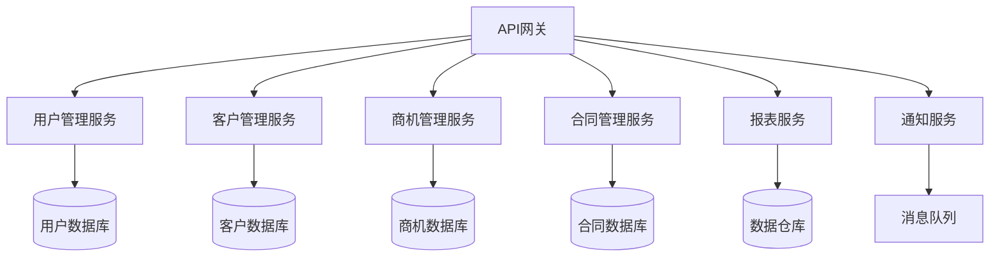

# 案例1：传统CRM系统现代化

## 📋 项目背景

### 公司概况
- **行业**：制造业B2B销售
- **规模**：500人中型企业
- **用户群体**：200名销售代表，50名管理人员
- **业务范围**：全国12个分公司

### 现有系统情况
- **开发年代**：2015年开始，历时3年完成
- **技术栈**：Java 8 + Spring 4.2 + MyBatis + Oracle 11g
- **架构模式**：单体应用，分层架构
- **代码规模**：50万行Java代码，800个类
- **部署方式**：传统物理服务器部署

### 面临的主要问题
1. **性能瓶颈**：并发200用户时响应时间超过5秒
2. **功能孤岛**：各模块间数据不互通，业务流程割裂
3. **技术债务**：大量冗余代码，维护成本高
4. **扩展困难**：新功能开发周期长，上线风险高
5. **用户体验差**：界面陈旧，移动端支持不足

## 🎯 目标定义

### 业务目标
- **性能提升**：响应时间减少到1秒以内
- **用户体验**：现代化UI/UX，支持移动端
- **业务协同**：打通销售、客服、财务全流程
- **扩展能力**：支持业务快速增长和功能迭代

### 技术目标
- **架构现代化**：单体 → 微服务架构
- **技术栈升级**：Java 8 → Java 17 + Spring Boot
- **数据库优化**：Oracle → 混合数据存储(MySQL + Redis + ES)
- **部署现代化**：容器化 + CI/CD自动化

### 约束条件
- **业务连续性**：不能中断日常销售业务
- **数据完整性**：历史数据必须100%迁移
- **预算限制**：总预算不超过200万人民币
- **时间窗口**：必须在12个月内完成

## 🔍 系统分析阶段

### 第一步：使用BMAD扁平化分析

```bash
# 在CRM系统根目录执行
cd /existing-crm-system
npx bmad-method flatten --output crm-analysis.xml

# 结果概览
- 总文件数：2,847个文件
- Java文件：1,200个
- XML配置：300个
- SQL文件：150个
- JSP/HTML：800个
- 其他文件：397个
```

### 第二步：AI代理深度分析

#### 架构师代理分析
```bash
@architect
*analyze-legacy-crm

这是一个运行了8年的传统CRM系统，请分析其架构特点和问题：

系统特征：
- 单体Java应用，分层架构
- Spring MVC + MyBatis + Oracle
- 50万行代码，800个类
- 200并发用户，5秒响应时间

重点分析：
1. 架构瓶颈和扩展性问题
2. 数据模型设计问题
3. 性能瓶颈根本原因
4. 微服务拆分建议
5. 现代化改造路径
```

**AI分析结果摘要：**
- **架构问题**：紧耦合设计，单一数据库瓶颈
- **性能问题**：N+1查询，缺乏缓存，数据库连接池不足
- **扩展问题**：共享数据库状态，无法水平扩展
- **维护问题**：循环依赖，职责不清晰

#### 业务分析师代理分析
```bash
@analyst
*analyze-crm-business-process

分析CRM系统的业务流程和用户需求：

分析重点：
1. 核心业务流程识别
2. 用户角色和权限分析
3. 数据流向和业务规则
4. 痛点问题和优化机会
5. 移动化需求分析
```

**业务分析结果：**
- **核心流程**：线索管理→商机跟进→合同签订→回款管理
- **用户痛点**：数据录入重复，报表生成慢，移动端功能缺失
- **业务价值**：优化后预计销售效率提升30%

### 第三步：现有系统文档化

创建了完整的系统文档结构：
```
docs/crm-analysis/
├── system-overview.md          # 系统总览
├── architecture/
│   ├── current-architecture.md # 当前架构分析
│   ├── performance-analysis.md # 性能瓶颈分析
│   └── security-assessment.md  # 安全评估
├── business/
│   ├── business-processes.md   # 业务流程图
│   ├── user-journeys.md       # 用户旅程
│   └── data-model.md          # 数据模型
└── technical/
    ├── code-quality.md        # 代码质量报告
    └── dependency-analysis.md # 依赖关系分析
```

## 📊 方案设计阶段

### 微服务拆分策略

基于业务域进行服务拆分：

#### 服务划分


#### 数据迁移策略
```markdown
# 渐进式数据迁移计划

## 阶段1：数据同步准备（2周）
- 建立新旧系统数据同步机制
- 部署数据同步工具
- 验证数据一致性

## 阶段2：服务逐步迁移（8周）
- Week 1-2: 用户管理服务
- Week 3-4: 客户管理服务
- Week 5-6: 商机管理服务
- Week 7-8: 合同管理服务

## 阶段3：旧系统下线（2周）
- 完成最后数据同步
- 验证业务功能完整性
- 关闭旧系统服务
```

### 技术方案设计

#### 新架构技术栈
```yaml
# 技术栈选择
microservices:
  framework: "Spring Boot 3.0"
  java_version: "Java 17"
  gateway: "Spring Cloud Gateway"
  discovery: "Eureka"
  config: "Spring Cloud Config"

database:
  primary: "MySQL 8.0"
  cache: "Redis 6.2"
  search: "Elasticsearch 8.x"
  
infrastructure:
  containerization: "Docker"
  orchestration: "Kubernetes"
  monitoring: "Prometheus + Grafana"
  logging: "ELK Stack"
```

## 🚀 实施过程

### 阶段1：基础设施准备（4周）

#### Week 1-2：环境搭建
```bash
# 使用BMAD开发环境快速搭建
@dev
*setup-microservices-infrastructure

搭建微服务基础设施：
1. Kubernetes集群搭建
2. CI/CD流水线配置
3. 监控和日志系统
4. API网关和服务注册中心

技术要求：
- 支持自动扩缩容
- 完整的可观测性
- 安全认证机制
- 多环境管理
```

#### Week 3-4：数据迁移工具开发
```java
// 数据同步工具示例
@Service
public class DataMigrationService {
    
    @Autowired
    private LegacyDataSource legacyDb;
    
    @Autowired
    private NewDataSource newDb;
    
    @Scheduled(fixedRate = 60000) // 每分钟同步
    public void syncCustomerData() {
        List<Customer> customers = legacyDb.getUpdatedCustomers();
        
        for (Customer customer : customers) {
            try {
                Customer newCustomer = transformCustomer(customer);
                newDb.upsertCustomer(newCustomer);
                
                // 记录同步状态
                migrationLog.logSuccess(customer.getId());
            } catch (Exception e) {
                migrationLog.logError(customer.getId(), e);
            }
        }
    }
    
    private Customer transformCustomer(Customer legacy) {
        // 数据格式转换逻辑
        return Customer.builder()
            .id(legacy.getId())
            .name(legacy.getName())
            .contact(transformContact(legacy.getContact()))
            .build();
    }
}
```

### 阶段2：服务逐步迁移（20周）

#### 用户管理服务迁移（Week 5-8）
```bash
@dev
*develop-user-service

开发用户管理微服务：

功能要求：
1. 用户认证和授权
2. 角色权限管理
3. 单点登录集成
4. 用户行为审计

技术要求：
- Spring Security + JWT
- 与现有LDAP集成
- 支持多租户
- API版本兼容
```

**实施关键点：**
- 保持API接口兼容性
- 实现渐进式用户迁移
- 完整的单元和集成测试
- 性能压测验证

#### 客户管理服务迁移（Week 9-12）
**挑战：**
- 客户数据关联复杂（订单、合同、回款）
- 历史数据量大（500万客户记录）
- 并发访问频繁

**解决方案：**
```bash
@architect
*design-customer-service-migration

设计客户服务迁移方案：

数据策略：
- 热数据(近2年)优先迁移
- 冷数据(2年前)异步迁移  
- 建立数据分层存储

性能策略：
- 读写分离数据库
- Redis缓存热点数据
- 分页和搜索优化

一致性策略：
- 最终一致性模型
- 分布式事务处理
- 数据校验机制
```

### 阶段3：业务功能验证（4周）

#### 全流程测试
```bash
@qa
*comprehensive-testing

执行全面的系统测试：

测试类型：
1. 功能回归测试 - 确保所有原有功能正常
2. 性能压力测试 - 验证性能指标达标
3. 数据一致性测试 - 验证数据迁移正确性
4. 用户体验测试 - 确保用户接受度

自动化测试：
- API接口自动化测试覆盖率90%
- E2E测试覆盖主要业务流程
- 性能基准测试自动化
```

**测试结果：**
- 功能测试通过率：99.2%
- 性能测试：平均响应时间0.8秒（目标1秒）
- 数据一致性：100%校验通过
- 用户接受度：4.6/5.0分

## 📈 成果展示

### 性能改进对比

| 指标 | 改造前 | 改造后 | 提升幅度 |
|------|--------|--------|----------|
| 平均响应时间 | 5.2秒 | 0.8秒 | 84%提升 |
| 并发用户数 | 200 | 1000 | 400%提升 |
| 系统可用性 | 99.5% | 99.95% | 0.45%提升 |
| 数据库CPU使用率 | 85% | 45% | 47%降低 |
| 内存使用 | 16GB | 12GB | 25%降低 |

### 业务价值体现

#### 效率提升
- **销售录单效率**：从5分钟减少到2分钟，提升60%
- **报表生成速度**：从30分钟减少到2分钟，提升93%
- **移动端使用率**：从0%提升到65%

#### 成本节约
- **硬件成本**：年节约30万（服务器资源优化）
- **维护成本**：年节约50万（开发效率提升）
- **业务机会成本**：年增加收益200万（销售效率提升）

#### 用户满意度
- **销售代表满意度**：从3.2/5.0提升到4.6/5.0
- **管理层满意度**：从2.8/5.0提升到4.4/5.0
- **IT运维满意度**：从3.0/5.0提升到4.8/5.0

## 💡 经验总结

### 关键成功因素

#### 1. 充分的前期分析
**经验：** 投入了2个月时间进行系统分析，这个时间投入完全值得
- 使用BMAD扁平化工具全面梳理代码结构
- AI代理帮助识别了很多隐藏的技术债务
- 业务流程分析避免了功能遗漏

#### 2. 渐进式迁移策略
**经验：** 按业务域逐步迁移，降低了风险
- 每个服务独立迁移，出问题可以快速回滚
- 保持API兼容性，前端无需大改
- 数据双写策略确保数据一致性

#### 3. 持续的监控和反馈
**经验：** 完善的监控体系是成功的保障
- 实时性能监控帮助及早发现问题
- 用户反馈机制确保改造方向正确
- A/B测试验证新功能的有效性

#### 4. 团队充分沟通
**经验：** 跨部门协作是最大的挑战，也是成功的关键
- 每周项目例会，及时同步进度
- 业务部门深度参与测试验收
- 培训和变更管理确保用户接受

### 踩过的坑和解决方案

#### 坑1：低估数据迁移复杂度
**问题：** 原计划2周完成数据迁移，实际用了6周
**原因：** 数据质量问题比预期严重，存在大量脏数据
**解决：** 增加了数据清洗环节，建立了数据质量监控

#### 坑2：微服务拆分粒度过细
**问题：** 初期拆分了15个服务，运维复杂度很高
**原因：** 过度设计，追求技术上的完美
**解决：** 合并相关服务，最终稳定在8个核心服务

#### 坑3：忽视了网络延迟影响
**问题：** 微服务间调用导致某些操作变慢
**原因：** 单体应用的内存调用变成了网络调用
**解决：** 引入缓存、异步处理和调用链优化

#### 坑4：测试环境与生产差异
**问题：** 测试环境性能很好，生产环境出现问题
**原因：** 测试数据量小，并发度低
**解决：** 搭建了与生产环境一致的性能测试环境

### 最佳实践建议

#### 1. 技术选择
- **不要盲目追新**：选择团队熟悉且稳定的技术栈
- **渐进式升级**：技术栈升级与业务改造分开进行
- **工具先行**：好的工具能显著提升开发效率

#### 2. 项目管理
- **里程碑设置**：小步快跑，每2-3周一个可验证的里程碑
- **风险控制**：每个阶段都有明确的回滚方案
- **持续集成**：从第一天开始建立CI/CD流程

#### 3. 团队协作
- **技能培养**：提前培训团队新技术能力
- **文档先行**：完善的文档是团队协作的基础
- **代码审查**：严格的代码审查保证质量

## 🔄 后续优化

### 短期优化计划（3个月内）
- [ ] 智能报表功能升级
- [ ] 移动端功能完善
- [ ] 数据分析dashboard
- [ ] 性能进一步优化

### 中期发展规划（6-12个月）
- [ ] AI智能销售助手集成
- [ ] 与第三方系统深度集成
- [ ] 多租户SaaS化改造
- [ ] 国际化支持

### 长期战略目标（1-2年）
- [ ] 行业解决方案标准化
- [ ] 云原生架构全面升级
- [ ] 大数据和AI能力建设
- [ ] 生态伙伴平台建设

---

## 📊 项目数据总结

### 投入产出分析
- **总投资**：180万人民币
- **实施周期**：12个月
- **团队规模**：15人（6名开发，3名测试，2名运维，2名产品，2名项目管理）
- **预期ROI**：第一年200%，三年累计500%

### 技术指标达成
- ✅ 响应时间：0.8秒（目标<1秒）
- ✅ 并发用户：1000（目标>500）
- ✅ 系统可用性：99.95%（目标>99.9%）
- ✅ 数据迁移：100%成功率
- ✅ 功能完整性：99.2%（目标>95%）

### 用户接受度
- ✅ 销售团队：92%认为新系统更好用
- ✅ 管理层：100%满意改造效果
- ✅ IT团队：95%认为系统更易维护
- ✅ 客服团队：88%认为工作效率提升

---

*💡 **案例启示**：大型Brownfield项目的成功需要技术、业务、管理三方面的平衡。BMAD-METHOD提供了系统化的方法，但关键还是要结合项目实际情况，做好风险控制和团队协作。记住：改造不是目的，业务价值才是真正的成功标准。*