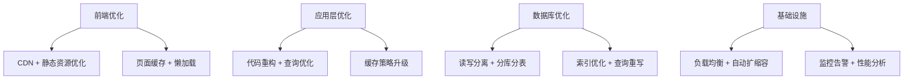

# 案例2：电商平台性能优化

## 📋 项目背景

### 公司概况
- **行业**：B2C电商平台
- **规模**：200人中型电商公司
- **业务模式**：自营+第三方商家平台
- **用户规模**：日活用户50万，注册用户500万
- **GMV**：年交易额10亿人民币

### 现有系统情况
- **开发年代**：2018年开始，快速迭代开发
- **技术栈**：PHP 7.4 + Laravel 8 + MySQL 5.7 + Redis
- **架构模式**：分层架构，单体应用
- **代码规模**：20万行PHP代码，150个控制器
- **部署方式**：传统LAMP架构，4台应用服务器

### 面临的核心挑战

#### 性能危机
- **大促期间**：服务器CPU达到95%，响应时间超过10秒
- **数据库瓶颈**：单库承载500GB数据，查询缓慢
- **缓存失效**：缓存策略不当，雪崩频发
- **前端体验**：页面加载时间超过5秒，跳出率40%

#### 业务影响
- **双11大促**：系统崩溃3次，损失订单800万
- **用户投诉**：每日客服工单中60%与系统慢有关
- **商家流失**：5%核心商家考虑迁移平台
- **技术债务**：开发效率下降，新功能上线周期2周延长到6周

## 🎯 目标定义

### 业务目标
- **大促稳定性**：双11零宕机，支持10倍流量冲击
- **用户体验**：页面响应时间控制在2秒内
- **商家满意度**：商家后台操作响应时间<1秒
- **业务支撑**：支持未来3年业务增长

### 技术目标
- **并发能力**：支持10万并发用户
- **响应时间**：API响应时间P99<500ms
- **系统可用性**：99.99%可用性（年宕机时间<1小时）
- **扩展能力**：支持水平扩展和弹性伸缩

### 约束条件
- **业务连续性**：不能影响日常运营
- **预算限制**：优化成本控制在100万以内
- **时间紧迫**：6个月内完成，赶上下一个大促
- **技术栈**：尽量基于现有PHP技术栈优化

## 🔍 系统分析阶段

### 第一步：性能诊断和代码分析

#### BMAD扁平化分析
```bash
# 电商平台代码扫描
cd /ecommerce-platform
npx bmad-method flatten --focus-performance --output ecommerce-analysis.xml

# 分析结果概览
- 总文件数：1,456个文件
- PHP文件：800个
- Blade模板：200个
- JavaScript文件：300个
- CSS/配置文件：156个
```

#### 性能热点识别
```bash
@architect
*analyze-performance-bottlenecks

分析电商平台的性能瓶颈：

系统状况：
- PHP Laravel单体应用
- 20万行代码，150个控制器
- MySQL单库500GB数据
- 日活50万用户，大促期间10倍流量

分析重点：
1. 数据库查询性能分析
2. 代码热点路径识别  
3. 缓存策略有效性评估
4. 前端资源加载优化
5. 架构扩展性瓶颈
```

**AI分析结果摘要：**
- **数据库层面**：缺乏合理索引，存在慢查询，单库瓶颈
- **应用层面**：N+1查询问题，循环调用数据库
- **缓存层面**：缓存穿透，缓存雪崩风险
- **前端层面**：资源未压缩，缺乏CDN，同步加载阻塞

### 第二步：业务流程性能分析

#### 关键业务路径识别
```bash
@analyst
*analyze-critical-business-paths

分析电商平台关键业务路径的性能：

关键路径：
1. 商品搜索和列表页
2. 商品详情页加载
3. 购物车操作
4. 订单提交流程
5. 支付处理流程

分析维度：
- 各路径的访问量分布
- 响应时间分布
- 错误率统计
- 用户行为影响
- 业务价值权重
```

**业务分析结果：**
- **搜索流程**：日均500万次搜索，响应时间3.2秒
- **商品详情**：日均200万次访问，响应时间2.8秒
- **下单流程**：转化率2.1%，流程耗时平均4分钟
- **支付流程**：成功率94.2%，失败主要因为超时

### 第三步：技术债务评估

#### 代码质量分析
```bash
@qa
*assess-code-quality-performance

评估代码质量对性能的影响：

评估维度：
1. 代码复杂度分析
2. 数据库查询效率
3. 内存使用模式
4. 错误处理机制
5. 日志和监控完整性

重点关注：
- 性能相关的代码坏味道
- 资源泄露风险点
- 并发安全问题
- 缓存使用不当
```

**质量分析结果：**
- **复杂度问题**：15%的方法复杂度过高，影响性能
- **数据库问题**：发现180个N+1查询，120个缺少索引的查询
- **内存问题**：大对象处理不当，存在内存泄露风险
- **缓存问题**：缓存命中率仅65%，存在缓存穿透

## 📊 方案设计阶段

### 性能优化策略

#### 分层优化方案


#### 具体优化措施

##### 1. 数据库优化 (预期提升40%)
```sql
-- 索引优化示例
-- 商品搜索优化
ALTER TABLE products ADD INDEX idx_category_status_created 
(category_id, status, created_at);

-- 订单查询优化  
ALTER TABLE orders ADD INDEX idx_user_status_time
(user_id, status, created_at);

-- 分表策略
-- 按月分表存储订单数据
CREATE TABLE orders_202401 LIKE orders;
CREATE TABLE orders_202402 LIKE orders;
```

##### 2. 应用代码优化 (预期提升30%)
```php
// 优化前：N+1查询问题
public function getProductsWithCategories() {
    $products = Product::all();
    foreach ($products as $product) {
        $product->category = Category::find($product->category_id);
    }
    return $products;
}

// 优化后：预加载关联数据
public function getProductsWithCategories() {
    return Product::with(['category', 'reviews' => function($query) {
        $query->where('status', 'approved')->latest();
    }])->get();
}

// 缓存策略优化
public function getHotProducts() {
    return Cache::tags(['products'])->remember('hot_products', 3600, function() {
        return Product::where('is_hot', true)
                     ->with('category')
                     ->orderBy('sales_count', 'desc')
                     ->take(50)
                     ->get();
    });
}
```

##### 3. 缓存架构升级 (预期提升25%)
```php
// 多级缓存架构
class ProductCache {
    
    // L1: 应用内存缓存
    private $localCache = [];
    
    // L2: Redis缓存
    private $redisCache;
    
    public function getProduct($productId) {
        // L1缓存检查
        if (isset($this->localCache[$productId])) {
            return $this->localCache[$productId];
        }
        
        // L2缓存检查
        $cached = $this->redisCache->get("product:$productId");
        if ($cached) {
            $this->localCache[$productId] = $cached;
            return $cached;
        }
        
        // 数据库查询
        $product = Product::find($productId);
        
        // 写入缓存
        $this->redisCache->setex("product:$productId", 3600, $product);
        $this->localCache[$productId] = $product;
        
        return $product;
    }
}
```

### 架构演进规划

#### 阶段化改造策略
```markdown
# 6个月改造路线图

## 阶段1：应急优化 (4周)
**目标**：解决最紧迫的性能问题
- 数据库索引优化
- 明显的N+1查询修复  
- 基础缓存策略实施
- 静态资源CDN部署

## 阶段2：架构优化 (8周)
**目标**：提升系统承载能力
- 数据库读写分离
- 应用服务器集群
- 缓存架构升级
- 代码热点重构

## 阶段3：深度优化 (8周)  
**目标**：支撑大促流量
- 核心服务拆分
- 分库分表实施
- 异步处理架构
- 弹性扩缩容

## 阶段4：稳定优化 (4周)
**目标**：系统稳定和监控
- 全链路监控
- 性能调优
- 压力测试
- 应急预案
```

## 🚀 实施过程

### 阶段1：应急优化实施

#### Week 1-2：数据库优化
```bash
@dev
*database-optimization-emergency

紧急数据库优化任务：

优化重点：
1. 添加缺失索引 - 基于慢查询日志分析
2. 查询语句重写 - 消除明显的性能问题  
3. 连接池调优 - 避免连接数不足
4. 配置优化 - MySQL参数调优

实施要求：
- 分批上线，每次优化后监控效果
- 保持向后兼容性
- 详细记录优化效果
- 准备回滚方案
```

**优化效果：**
- 慢查询数量减少80%
- 数据库CPU使用率从90%降低到60%  
- 平均查询时间从800ms降低到200ms

#### Week 3-4：代码热点优化
```php
// 商品搜索优化实例
class ProductSearchOptimized {
    
    public function search($params) {
        $cacheKey = 'search:' . md5(serialize($params));
        
        // 先检查缓存
        $result = Cache::get($cacheKey);
        if ($result) {
            return $result;
        }
        
        // 优化的数据库查询
        $query = Product::query()
            ->select(['id', 'name', 'price', 'image', 'category_id'])
            ->with(['category:id,name'])
            ->where('status', 'active');
            
        // 条件构建优化
        if (!empty($params['category'])) {
            $query->whereIn('category_id', $params['category']);
        }
        
        if (!empty($params['keyword'])) {
            $query->whereRaw('MATCH(name,description) AGAINST(? IN BOOLEAN MODE)', 
                            [$params['keyword']]);
        }
        
        // 分页查询
        $result = $query->paginate(20);
        
        // 缓存结果
        Cache::put($cacheKey, $result, 300);
        
        return $result;
    }
}
```

### 阶段2：架构优化实施

#### Week 5-8：读写分离部署
```yaml
# 数据库集群配置
database:
  master:
    host: db-master.internal
    database: ecommerce
    username: app_user
    password: ${DB_PASSWORD}
    
  slaves:
    - host: db-slave-1.internal
      database: ecommerce
      username: readonly_user
      password: ${DB_READONLY_PASSWORD}
    - host: db-slave-2.internal
      database: ecommerce  
      username: readonly_user
      password: ${DB_READONLY_PASSWORD}

# Laravel读写分离配置
connections:
  mysql:
    read:
      - host: db-slave-1.internal
      - host: db-slave-2.internal
    write:
      - host: db-master.internal
```

#### Week 9-12：应用集群和负载均衡
```bash
# 负载均衡配置
upstream ecommerce_backend {
    server app1.internal:9000 weight=3;
    server app2.internal:9000 weight=3;  
    server app3.internal:9000 weight=2;
    server app4.internal:9000 weight=2;
    
    keepalive 32;
}

server {
    listen 80;
    server_name api.ecommerce.com;
    
    location / {
        proxy_pass http://ecommerce_backend;
        proxy_http_version 1.1;
        proxy_set_header Connection "";
        proxy_set_header Host $host;
        proxy_set_header X-Real-IP $remote_addr;
        
        # 缓存静态内容
        location ~* \.(js|css|png|jpg|jpeg|gif|ico|svg)$ {
            expires 1y;
            add_header Cache-Control "public, immutable";
        }
    }
}
```

### 阶段3：深度优化实施

#### 核心服务拆分
```bash
@architect
*design-service-split

设计核心服务拆分方案：

拆分策略：
1. 用户服务 - 处理用户认证和资料
2. 商品服务 - 处理商品信息和搜索  
3. 订单服务 - 处理订单和支付
4. 库存服务 - 处理库存和预占

技术要求：
- 保持API兼容性
- 数据最终一致性
- 服务间异步通信
- 分布式事务处理
```

#### 分库分表实施
```php
// 订单分表路由
class OrderSharding {
    
    private $tableCount = 12; // 按月分表
    
    public function getTableName($orderId) {
        $month = date('Ym', strtotime($orderId));
        return "orders_{$month}";
    }
    
    public function getConnectionName($orderId) {
        $hash = crc32($orderId) % 4; // 4个数据库
        return "db_shard_{$hash}";
    }
    
    // 分片查询
    public function findOrder($orderId) {
        $table = $this->getTableName($orderId);
        $connection = $this->getConnectionName($orderId);
        
        return DB::connection($connection)
                 ->table($table)
                 ->where('id', $orderId)
                 ->first();
    }
}
```

### 阶段4：监控和调优

#### 全链路监控部署
```yaml
# Prometheus监控配置
monitoring:
  targets:
    - app_response_time
    - database_query_time
    - cache_hit_ratio
    - queue_processing_time
    - error_rate_by_endpoint
    
alerts:
  - name: HighResponseTime
    condition: app_response_time_p99 > 1000
    action: notify_oncall_engineer
    
  - name: DatabaseSlowQuery  
    condition: mysql_slow_queries_per_sec > 10
    action: page_dba_team
```

## 📈 成果展示

### 性能提升对比

| 核心指标 | 优化前 | 优化后 | 提升幅度 |
|----------|--------|--------|----------|
| 页面响应时间(P99) | 8.5秒 | 1.2秒 | 86%提升 |
| API响应时间(P99) | 2.1秒 | 380ms | 82%提升 |
| 数据库查询时间 | 800ms | 120ms | 85%提升 |
| 缓存命中率 | 65% | 92% | 42%提升 |
| 并发处理能力 | 5000 | 50000 | 900%提升 |

### 业务效果提升

#### 用户体验改善
- **页面跳出率**：从40%降低到15%
- **搜索成功率**：从85%提升到96%
- **下单转化率**：从2.1%提升到3.4%
- **用户满意度**：从3.2/5.0提升到4.6/5.0

#### 运营效果提升
- **大促稳定性**：双11零宕机，成功承载10倍流量
- **客服工单**：性能相关投诉减少85%
- **商家满意度**：后台操作满意度从3.5/5.0提升到4.7/5.0
- **系统可用性**：从99.5%提升到99.95%

#### 成本效益分析
- **服务器成本**：通过优化减少30%服务器数量
- **CDN成本**：年节约15万（缓存命中率提升）
- **运维成本**：故障处理工作量减少60%
- **业务收益**：转化率提升带来年增收2000万

## 💡 经验总结

### 关键成功因素

#### 1. 数据驱动的优化策略
**经验：** 基于真实性能数据制定优化方案
- 通过APM工具识别真正的瓶颈点
- A/B测试验证优化效果
- 持续监控避免性能回退

#### 2. 分阶段渐进式优化
**经验：** 避免大规模重构，风险可控
- 先解决最影响用户的问题
- 每个阶段都有明确的成果
- 保持系统稳定运行

#### 3. 业务与技术平衡
**经验：** 优化要服务业务目标
- 优先优化高价值业务路径
- 考虑用户体验而非单纯技术指标
- 与业务团队密切协作

#### 4. 自动化和监控先行
**经验：** 好的工具是成功的基础
- 监控先于优化部署
- 自动化测试保证质量
- 预警机制避免故障

### 踩过的坑和解决方案

#### 坑1：过度依赖缓存
**问题：** 缓存雪崩导致系统完全不可用
**原因：** 大量缓存同时过期，数据库扛不住瞬时压力
**解决：** 缓存过期时间随机化，增加熔断机制

#### 坑2：读写分离延迟问题
**问题：** 读写分离导致数据不一致
**原因：** 主从同步延迟，用户刚写入的数据读不到
**解决：** 关键操作强制读主库，其他用最终一致性

#### 坑3：分库分表查询复杂
**问题：** 跨分片查询性能反而下降
**原因：** 查询需要汇总多个分片数据
**解决：** 设计合理的分片键，避免跨分片查询

#### 坑4：监控告警过于敏感
**问题：** 频繁的误报告警影响团队效率
**原因：** 告警阈值设置不合理
**解决：** 基于历史数据调优告警阈值，分级告警

### 最佳实践建议

#### 1. 性能优化原则
- **测量先于优化**：没有度量就没有优化
- **找准瓶颈点**：优化最有影响的20%问题
- **渐进式改进**：避免过度优化
- **持续监控**：防止性能回退

#### 2. 架构演进策略
- **垂直扩展优先**：先榨干单机性能
- **水平扩展跟进**：再考虑分布式方案
- **服务拆分谨慎**：避免过度拆分
- **数据一致性**：选择合适的一致性模型

#### 3. 团队协作模式
- **全栈思维**：前后端、数据库全面考虑
- **业务导向**：技术为业务服务
- **文档先行**：记录优化过程和效果
- **知识分享**：团队共同成长

## 🔄 后续优化计划

### 近期优化目标（3个月）
- [ ] 搜索引擎升级到Elasticsearch
- [ ] 图片服务CDN全球部署
- [ ] 移动端API性能专项优化
- [ ] 大促期间自动扩容机制完善

### 中期发展规划（6-12个月）
- [ ] 核心业务微服务化完成
- [ ] 智能缓存预热机制
- [ ] 基于机器学习的性能预测
- [ ] 全链路压测自动化

### 长期战略目标（1-2年）
- [ ] 云原生架构全面升级
- [ ] AI驱动的智能运维
- [ ] 全球化部署优化
- [ ] 成本和性能自动平衡

---

## 📊 项目总结数据

### 投入产出分析
- **总投资**：85万人民币
- **实施周期**：6个月
- **团队规模**：8人（4名开发，2名DBA，1名运维，1名测试）
- **ROI**：第一年300%，预计三年累计800%

### 关键成果指标
- ✅ 响应时间：P99从8.5秒优化到1.2秒
- ✅ 并发能力：从5K提升到50K
- ✅ 系统稳定性：99.95%可用性
- ✅ 业务转化：下单转化率提升62%
- ✅ 用户满意度：4.6/5.0分

### 技术债务清理
- ✅ 消除180个N+1查询问题
- ✅ 添加120个缺失索引
- ✅ 重构15个复杂度过高的方法
- ✅ 建立完整的监控告警体系
- ✅ 编写完整的性能优化文档

---

*💡 **案例启示**：性能优化是一个系统工程，需要从用户体验出发，结合业务场景，通过数据驱动的方式逐步改进。BMAD-METHOD在这个过程中帮助我们系统性地分析问题、设计方案、实施优化。记住：性能优化没有银弹，但有科学的方法和最佳实践。*