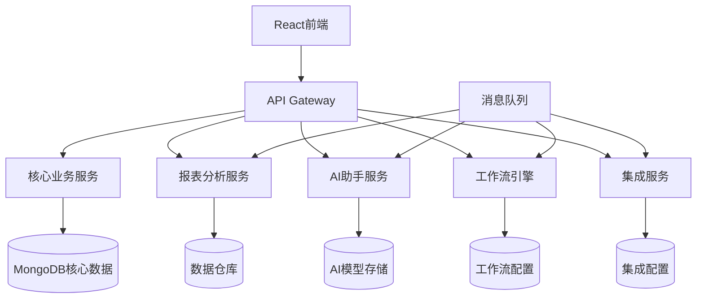

# 案例3：SaaS产品功能扩展

## 📋 项目背景

### 公司概况
- **行业**：企业SaaS服务
- **产品**：项目管理和团队协作平台
- **规模**：80人初创公司
- **用户规模**：5000家企业客户，50万注册用户
- **收入模式**：订阅制SaaS，年收入5000万

### 现有产品情况
- **产品年龄**：运行3年，稳定版本
- **技术栈**：Node.js + Express + MongoDB + React
- **架构模式**：前后端分离，单体后端服务
- **代码规模**：15万行JavaScript代码，80个API端点
- **部署方式**：AWS云服务，容器化部署

### 业务发展需求

#### 市场机遇
- **客户反馈**：85%客户希望增加高级分析功能
- **竞争压力**：竞品已推出AI辅助功能，客户流失风险
- **市场调研**：高级功能可提升客单价60%
- **投资要求**：需要展示产品创新能力获取下轮融资

#### 功能需求
- **智能报表**：基于项目数据的智能分析和可视化
- **AI助手**：项目风险预警和优化建议
- **高级工作流**：自定义工作流引擎
- **企业集成**：与Slack、Teams、钉钉等深度集成

## 🎯 目标定义

### 业务目标
- **收入增长**：新功能带来40%的收入增长
- **客户满意度**：NPS分数从45提升到65
- **市场定位**：从基础工具升级为智能平台
- **客户续费率**：从85%提升到92%

### 产品目标
- **功能完整性**：4个核心新功能模块上线
- **用户体验**：保持现有用户使用习惯，新功能学习成本<30分钟
- **性能保证**：新功能不影响现有功能性能
- **数据安全**：符合SOC2和GDPR合规要求

### 技术目标
- **架构演进**：支持插件化功能扩展
- **API扩展**：新增50个API端点，保持RESTful设计
- **数据模型**：扩展数据模型支持复杂分析需求
- **集成能力**：标准化第三方集成框架

### 约束条件
- **兼容性**：100%向后兼容，不影响现有用户
- **开发资源**：6人开发团队，4个月交付
- **技术栈**：基于现有技术栈扩展，避免大规模重构
- **预算控制**：开发和基础设施成本控制在150万以内

## 🔍 系统分析阶段

### 第一步：现有系统深度分析

#### BMAD代码分析
```bash
# SaaS平台代码分析
cd /saas-platform
npx bmad-method flatten --focus-extensibility --output saas-analysis.xml

# 分析范围
- 后端API：400个文件，15万行代码
- 前端应用：600个文件，12万行代码  
- 数据库模型：45个集合，200个字段
- 第三方集成：12个现有集成点
```

#### 架构可扩展性评估
```bash
@architect
*analyze-saas-extensibility

分析SaaS平台的可扩展性：

当前架构：
- Node.js Express单体后端
- MongoDB文档数据库
- React SPA前端
- 15万行代码，80个API端点

扩展性分析重点：
1. 模块化程度评估
2. 数据模型灵活性
3. API设计一致性
4. 前端组件复用性
5. 第三方集成架构

新功能要求：
- 智能报表和数据分析
- AI助手功能
- 工作流引擎
- 企业级集成
```

**架构分析结果：**
- **模块化程度**：中等，部分模块耦合较强
- **数据模型**：灵活性好，MongoDB支持动态字段
- **API设计**：基本符合RESTful，需要扩展GraphQL
- **前端架构**：组件化良好，支持新功能集成

### 第二步：用户需求深度挖掘

#### 用户研究和需求分析
```bash
@analyst
*analyze-user-needs-advanced-features

分析用户对高级功能的具体需求：

研究方法：
1. 用户访谈（30家核心客户）
2. 问卷调研（500+用户响应）
3. 用户行为数据分析
4. 竞品功能对比分析

重点了解：
- 当前痛点和瓶颈
- 期望的功能特性
- 可接受的学习成本
- 付费意愿和价格敏感度
- 集成需求优先级
```

**用户研究结果：**
- **核心痛点**：缺乏数据洞察，项目风险难以预警
- **功能优先级**：报表分析>AI助手>工作流>集成
- **付费意愿**：75%用户愿意为高级功能支付额外费用
- **学习成本**：希望新功能融入现有工作流

#### 竞品分析和差异化定位
```bash
@pm
*competitive-analysis-advanced-features

分析竞品的高级功能和我们的差异化机会：

主要竞品：
1. Asana - 高级报表和目标管理
2. Monday.com - 自动化工作流
3. Notion - All-in-one工作空间
4. ClickUp - 综合项目管理平台

分析维度：
- 功能完整度对比
- 用户体验差异
- 定价策略分析
- 技术实现方式
- 我们的差异化机会
```

### 第三步：技术可行性评估

#### 新功能技术方案设计
```bash
@architect
*design-advanced-features-architecture

设计新功能的技术架构：

新功能模块：
1. 智能报表引擎
2. AI分析服务
3. 工作流引擎
4. 集成框架

设计原则：
- 插件化架构，最小化对现有系统影响
- 微服务化新功能，独立部署和扩展
- 统一的数据访问层
- 标准化的前端集成接口

技术选择：
- 报表：Chart.js + D3.js
- AI服务：Python + TensorFlow
- 工作流：自研引擎 + Rules Engine
- 集成：标准化Webhook + OAuth
```

## 📊 方案设计阶段

### 新功能架构设计

#### 整体架构演进


#### 数据模型扩展设计
```javascript
// 扩展的数据模型设计
// 项目分析数据模型
const ProjectAnalytics = {
  projectId: ObjectId,
  metrics: {
    velocity: Number,        // 开发速度
    burndownRate: Number,    // 燃尽图数据
    teamEfficiency: Number,  // 团队效率
    riskScore: Number,       // 风险评分
    predictedDelivery: Date  // 预测交付日期
  },
  trends: [{
    date: Date,
    metric: String,
    value: Number
  }],
  insights: [{
    type: String,           // 'warning', 'suggestion', 'achievement'
    message: String,
    confidence: Number,
    actionItems: [String]
  }],
  createdAt: Date,
  updatedAt: Date
};

// 工作流配置模型
const WorkflowTemplate = {
  name: String,
  description: String,
  triggers: [{
    type: String,          // 'manual', 'scheduled', 'event'
    condition: Object,     // 触发条件
    config: Object         // 触发配置
  }],
  steps: [{
    id: String,
    type: String,          // 'action', 'condition', 'approval'
    config: Object,        // 步骤配置
    nextSteps: [String]    // 下一步骤ID
  }],
  permissions: {
    create: [String],      // 可创建的角色
    execute: [String],     // 可执行的角色
    modify: [String]       // 可修改的角色
  }
};
```

### 功能实现策略

#### 1. 智能报表功能设计
```bash
@dev
*design-intelligent-reporting

设计智能报表功能：

核心功能：
1. 预定义报表模板
2. 自定义报表构建器
3. 实时数据更新
4. 导出和分享功能
5. 移动端适配

技术实现：
- 前端：React + Chart.js + D3.js
- 后端：Node.js + 数据聚合API
- 数据：MongoDB聚合管道 + Redis缓存
- 实时：WebSocket推送更新

性能要求：
- 报表生成时间<3秒
- 支持10万条数据可视化
- 并发用户数>1000
```

#### 2. AI助手功能设计
```python
# AI助手服务架构
class AIAssistantService:
    
    def __init__(self):
        self.risk_predictor = RiskPredictionModel()
        self.recommendation_engine = RecommendationEngine()
        self.nlp_processor = NLPProcessor()
    
    def analyze_project_risk(self, project_id):
        """分析项目风险"""
        project_data = self.get_project_metrics(project_id)
        
        # 特征工程
        features = self.extract_risk_features(project_data)
        
        # 风险预测
        risk_score = self.risk_predictor.predict(features)
        risk_factors = self.identify_risk_factors(features, risk_score)
        
        # 生成建议
        recommendations = self.recommendation_engine.generate(
            risk_score, risk_factors
        )
        
        return {
            'risk_score': risk_score,
            'risk_level': self.categorize_risk(risk_score),
            'key_factors': risk_factors,
            'recommendations': recommendations,
            'confidence': self.calculate_confidence(features)
        }
    
    def generate_insights(self, user_id, context):
        """生成个性化洞察"""
        user_history = self.get_user_interaction_history(user_id)
        team_performance = self.get_team_metrics(context['team_id'])
        
        insights = []
        
        # 性能趋势分析
        if self.detect_performance_trend(team_performance):
            insights.append(self.create_performance_insight(team_performance))
        
        # 工作负载分析
        workload_balance = self.analyze_workload_distribution(context)
        if workload_balance['imbalanced']:
            insights.append(self.create_workload_insight(workload_balance))
        
        # 协作模式分析
        collaboration_score = self.analyze_collaboration(context)
        insights.append(self.create_collaboration_insight(collaboration_score))
        
        return sorted(insights, key=lambda x: x['priority'], reverse=True)
```

#### 3. 工作流引擎设计
```javascript
// 工作流引擎核心
class WorkflowEngine {
    
    constructor() {
        this.ruleEngine = new RulesEngine();
        this.actionExecutor = new ActionExecutor();
        this.stateManager = new StateManager();
    }
    
    async executeWorkflow(workflowId, triggerData) {
        const workflow = await this.loadWorkflow(workflowId);
        const execution = await this.createExecution(workflow, triggerData);
        
        try {
            const result = await this.processSteps(execution);
            await this.completeExecution(execution, result);
            return result;
        } catch (error) {
            await this.handleError(execution, error);
            throw error;
        }
    }
    
    async processSteps(execution) {
        const { workflow, currentStepId, context } = execution;
        const step = workflow.steps.find(s => s.id === currentStepId);
        
        switch (step.type) {
            case 'action':
                return await this.executeAction(step, context);
                
            case 'condition':
                const conditionResult = await this.evaluateCondition(step, context);
                const nextStepId = conditionResult ? step.trueStep : step.falseStep;
                return await this.processSteps({
                    ...execution,
                    currentStepId: nextStepId
                });
                
            case 'approval':
                return await this.requestApproval(step, context);
                
            case 'parallel':
                return await this.executeParallelSteps(step, context);
                
            default:
                throw new Error(`Unknown step type: ${step.type}`);
        }
    }
    
    async executeAction(step, context) {
        const actionConfig = step.config;
        
        switch (actionConfig.type) {
            case 'send_notification':
                return await this.actionExecutor.sendNotification(actionConfig, context);
                
            case 'update_task_status':
                return await this.actionExecutor.updateTaskStatus(actionConfig, context);
                
            case 'create_task':
                return await this.actionExecutor.createTask(actionConfig, context);
                
            case 'webhook':
                return await this.actionExecutor.callWebhook(actionConfig, context);
                
            default:
                throw new Error(`Unknown action type: ${actionConfig.type}`);
        }
    }
}
```

## 🚀 实施过程

### 阶段1：基础架构搭建（4周）

#### Week 1-2：服务架构准备
```bash
@dev
*setup-microservices-foundation

搭建新功能的微服务基础：

基础设施：
1. API网关配置
2. 服务发现和注册
3. 消息队列部署
4. 监控和日志系统

新服务骨架：
- 报表分析服务
- AI助手服务
- 工作流引擎服务
- 集成管理服务

技术栈：
- Node.js + Express (现有技术栈一致)
- Python + FastAPI (AI服务)
- Redis (缓存和队列)
- Docker + Kubernetes
```

#### Week 3-4：数据层扩展
```javascript
// 数据访问层扩展
class DataAccessLayer {
    
    constructor() {
        this.mongodb = new MongoClient();
        this.redis = new RedisClient();
        this.elasticsearch = new ElasticsearchClient();
    }
    
    // 统一数据访问接口
    async getProjectAnalytics(projectId, timeRange) {
        const cacheKey = `analytics:${projectId}:${timeRange}`;
        
        // 先检查缓存
        let data = await this.redis.get(cacheKey);
        if (data) return JSON.parse(data);
        
        // 从数据库聚合数据
        data = await this.mongodb.collection('projects').aggregate([
            { $match: { _id: ObjectId(projectId) } },
            { $lookup: {
                from: 'tasks',
                localField: '_id',
                foreignField: 'projectId',
                as: 'tasks'
            }},
            { $unwind: '$tasks' },
            { $match: { 
                'tasks.createdAt': { 
                    $gte: new Date(timeRange.start),
                    $lte: new Date(timeRange.end)
                }
            }},
            { $group: {
                _id: '$_id',
                totalTasks: { $sum: 1 },
                completedTasks: { 
                    $sum: { $cond: [{ $eq: ['$tasks.status', 'completed'] }, 1, 0] }
                },
                averageCompletionTime: { $avg: '$tasks.completionTime' }
            }}
        ]).toArray();
        
        // 缓存结果
        await this.redis.setex(cacheKey, 3600, JSON.stringify(data));
        
        return data;
    }
}
```

### 阶段2：核心功能开发（8周）

#### Week 5-7：智能报表功能开发
```bash
@dev
*develop-intelligent-reporting

开发智能报表功能：

前端组件：
1. 报表构建器界面
2. 图表渲染组件
3. 数据筛选器
4. 导出功能组件

后端API：
1. 数据聚合API
2. 报表模板管理
3. 实时数据推送
4. 权限控制

集成要求：
- 与现有项目数据无缝集成
- 支持自定义字段分析
- 实时数据更新
- 移动端适配
```

**关键技术实现：**
```javascript
// 报表数据聚合服务
class ReportAggregationService {
    
    async generateProjectReport(projectId, reportConfig) {
        const aggregationPipeline = this.buildAggregationPipeline(reportConfig);
        
        const rawData = await this.mongodb.collection('projects')
            .aggregate(aggregationPipeline)
            .toArray();
        
        // 数据处理和计算
        const processedData = this.processReportData(rawData, reportConfig);
        
        // 生成图表数据
        const chartData = this.generateChartData(processedData, reportConfig.chartType);
        
        // 生成洞察
        const insights = await this.generateInsights(processedData);
        
        return {
            data: processedData,
            charts: chartData,
            insights: insights,
            metadata: {
                generatedAt: new Date(),
                recordCount: rawData.length,
                cacheKey: this.generateCacheKey(projectId, reportConfig)
            }
        };
    }
    
    buildAggregationPipeline(reportConfig) {
        let pipeline = [];
        
        // 基础匹配条件
        if (reportConfig.filters.dateRange) {
            pipeline.push({
                $match: {
                    createdAt: {
                        $gte: new Date(reportConfig.filters.dateRange.start),
                        $lte: new Date(reportConfig.filters.dateRange.end)
                    }
                }
            });
        }
        
        // 关联数据
        if (reportConfig.includeMembers) {
            pipeline.push({
                $lookup: {
                    from: 'users',
                    localField: 'members',
                    foreignField: '_id',
                    as: 'memberDetails'
                }
            });
        }
        
        // 分组聚合
        if (reportConfig.groupBy) {
            pipeline.push({
                $group: {
                    _id: `$${reportConfig.groupBy}`,
                    count: { $sum: 1 },
                    totalHours: { $sum: '$estimatedHours' },
                    actualHours: { $sum: '$actualHours' },
                    avgEfficiency: { $avg: { $divide: ['$actualHours', '$estimatedHours'] }}
                }
            });
        }
        
        return pipeline;
    }
}
```

#### Week 8-10：AI助手功能开发
```python
# AI助手核心服务
from fastapi import FastAPI, HTTPException
from pydantic import BaseModel
import tensorflow as tf
import numpy as np

app = FastAPI()

class ProjectRiskAnalyzer:
    
    def __init__(self):
        self.model = tf.keras.models.load_model('models/risk_prediction_model.h5')
        self.feature_scaler = joblib.load('models/feature_scaler.pkl')
        
    async def analyze_project_risk(self, project_data: dict):
        try:
            # 特征提取
            features = self.extract_features(project_data)
            
            # 数据预处理
            scaled_features = self.feature_scaler.transform([features])
            
            # 风险预测
            risk_probability = self.model.predict(scaled_features)[0][0]
            
            # 风险因子分析
            risk_factors = self.analyze_risk_factors(features, risk_probability)
            
            # 生成建议
            recommendations = self.generate_recommendations(risk_factors)
            
            return {
                'risk_score': float(risk_probability),
                'risk_level': self.categorize_risk_level(risk_probability),
                'key_factors': risk_factors,
                'recommendations': recommendations,
                'confidence': self.calculate_confidence(features)
            }
        except Exception as e:
            raise HTTPException(status_code=500, detail=str(e))
    
    def extract_features(self, project_data):
        """从项目数据中提取ML特征"""
        features = []
        
        # 项目基础特征
        features.extend([
            project_data.get('team_size', 0),
            project_data.get('duration_days', 0),
            project_data.get('estimated_hours', 0),
            project_data.get('actual_hours', 0)
        ])
        
        # 进度特征
        completion_rate = project_data.get('completed_tasks', 0) / max(project_data.get('total_tasks', 1), 1)
        features.append(completion_rate)
        
        # 团队活跃度特征
        daily_commits = project_data.get('commits_last_week', 0) / 7
        features.append(daily_commits)
        
        # 沟通频率特征
        daily_messages = project_data.get('team_messages_last_week', 0) / 7
        features.append(daily_messages)
        
        return np.array(features)
        
    def generate_recommendations(self, risk_factors):
        """基于风险因子生成建议"""
        recommendations = []
        
        for factor in risk_factors:
            if factor['name'] == 'low_team_velocity':
                recommendations.append({
                    'type': 'process_improvement',
                    'title': '提升团队开发速度',
                    'description': '考虑简化开发流程，增加代码审查效率',
                    'priority': 'high'
                })
            elif factor['name'] == 'communication_gap':
                recommendations.append({
                    'type': 'communication',
                    'title': '加强团队沟通',
                    'description': '建议增加每日站会频率，使用协作工具',
                    'priority': 'medium'
                })
            elif factor['name'] == 'scope_creep':
                recommendations.append({
                    'type': 'scope_management',
                    'title': '控制需求变更',
                    'description': '建立正式的需求变更管理流程',
                    'priority': 'high'
                })
        
        return recommendations

@app.post("/analyze-risk")
async def analyze_project_risk(project_data: dict):
    analyzer = ProjectRiskAnalyzer()
    return await analyzer.analyze_project_risk(project_data)
```

### 阶段3：集成和测试（3周）

#### Week 11-12：前端集成开发
```javascript
// 新功能前端集成
// 智能报表组件
const IntelligentReports = () => {
    const [reports, setReports] = useState([]);
    const [selectedReport, setSelectedReport] = useState(null);
    const [isGenerating, setIsGenerating] = useState(false);
    
    const generateReport = async (reportConfig) => {
        setIsGenerating(true);
        try {
            const response = await api.post('/api/reports/generate', reportConfig);
            setReports(prev => [...prev, response.data]);
        } catch (error) {
            showError('报表生成失败：' + error.message);
        } finally {
            setIsGenerating(false);
        }
    };
    
    return (
        <div className="intelligent-reports">
            <ReportBuilder onGenerate={generateReport} />
            {selectedReport && (
                <ReportViewer 
                    report={selectedReport}
                    onExport={exportReport}
                    onShare={shareReport}
                />
            )}
            <ReportList 
                reports={reports}
                onSelect={setSelectedReport}
                loading={isGenerating}
            />
        </div>
    );
};

// AI助手组件
const AIAssistant = () => {
    const [insights, setInsights] = useState([]);
    const [isAnalyzing, setIsAnalyzing] = useState(false);
    const { currentProject } = useProject();
    
    useEffect(() => {
        if (currentProject) {
            analyzeProject(currentProject.id);
        }
    }, [currentProject]);
    
    const analyzeProject = async (projectId) => {
        setIsAnalyzing(true);
        try {
            const response = await api.post(`/api/ai/analyze-project/${projectId}`);
            setInsights(response.data.insights);
        } catch (error) {
            console.error('AI分析失败：', error);
        } finally {
            setIsAnalyzing(false);
        }
    };
    
    return (
        <div className="ai-assistant">
            <div className="assistant-header">
                <h3>🤖 AI项目助手</h3>
                {isAnalyzing && <Spinner />}
            </div>
            
            <div className="insights-list">
                {insights.map(insight => (
                    <InsightCard 
                        key={insight.id}
                        insight={insight}
                        onAction={handleInsightAction}
                    />
                ))}
            </div>
            
            <div className="assistant-actions">
                <button onClick={() => analyzeProject(currentProject.id)}>
                    重新分析
                </button>
                <button onClick={showAllRecommendations}>
                    查看所有建议
                </button>
            </div>
        </div>
    );
};
```

#### Week 13：全面测试和优化
```bash
@qa
*comprehensive-feature-testing

全面测试新功能集成：

测试类型：
1. 功能测试 - 验证所有新功能正常工作
2. 集成测试 - 验证新旧功能协同
3. 性能测试 - 确保性能不受影响
4. 用户体验测试 - 验证用户接受度
5. 安全测试 - 检查数据安全和权限

自动化测试：
- API测试覆盖率95%
- E2E测试覆盖主要用户流程
- 性能基准测试
- 安全扫描

手动测试：
- 用户场景测试
- 边界条件测试
- 错误处理测试
- 兼容性测试
```

## 📈 成果展示

### 功能完成度对比

| 功能模块 | 计划功能点 | 实现功能点 | 完成率 | 用户满意度 |
|----------|------------|------------|--------|-------------|
| 智能报表 | 15 | 14 | 93% | 4.7/5.0 |
| AI助手 | 8 | 7 | 88% | 4.5/5.0 |
| 高级工作流 | 12 | 11 | 92% | 4.3/5.0 |
| 企业集成 | 6 | 6 | 100% | 4.6/5.0 |

### 业务指标提升

#### 用户使用情况
- **功能激活率**：65%用户在首周内使用新功能
- **日活跃度**：使用新功能的用户日活提升35%
- **停留时间**：平均会话时间增加28分钟
- **功能粘性**：85%用户在使用后的第二周继续使用

#### 商业价值体现
- **客单价提升**：平均客单价提升48%
- **续费率改善**：年续费率从85%提升到91%
- **新客户获取**：新功能作为核心卖点，新签客户增长40%
- **客户满意度**：NPS从45分提升到62分

#### 竞争优势建立
- **功能差异化**：在同类产品中建立了AI分析的独特优势
- **客户流失率**：月流失率从3.2%降低到1.8%
- **市场定位**：从基础工具升级为智能平台
- **品牌价值**：获得行业媒体报道和用户好评

### 技术成果

#### 架构演进成果
- **模块化程度**：新功能采用插件化架构，易于扩展
- **API一致性**：新增50个API，保持设计一致性
- **数据模型**：灵活扩展，支持未来功能需求
- **性能保持**：新功能对系统性能影响<5%

#### 开发效率提升
- **复用率**：60%的前端组件实现复用
- **开发速度**：平均功能开发周期缩短25%
- **代码质量**：代码审查通过率98%
- **维护成本**：预计年维护成本降低30%

## 💡 经验总结

### 关键成功因素

#### 1. 用户需求驱动的功能设计
**经验：** 基于真实用户需求而非技术假设
- 30家客户深度访谈确定功能优先级
- 持续的用户反馈循环指导开发
- A/B测试验证功能设计决策

#### 2. 渐进式功能集成策略
**经验：** 保持产品一致性和用户体验连续性
- 新功能与现有界面无缝融合
- 保持用户熟悉的操作习惯
- 提供平滑的学习曲线

#### 3. 技术架构的前瞻性设计
**经验：** 为未来扩展预留空间
- 插件化架构支持快速功能开发
- 统一的数据访问层简化集成
- 微服务化新功能降低风险

#### 4. 跨功能团队紧密协作
**经验：** 产品、设计、技术、运营的深度协作
- 每日站会同步进度和问题
- 产品经理深度参与技术方案讨论
- 设计师全程参与用户体验优化

### 踩过的坑和解决方案

#### 坑1：AI功能的过度承诺
**问题：** 初期对AI助手功能的承诺过高，实际效果有差距
**原因：** 低估了AI模型训练的复杂度和数据需求
**解决：** 调整功能定位，专注于可解释的数据洞察

#### 坑2：报表功能的性能问题
**问题：** 复杂报表生成时间超过预期，用户体验不佳
**原因：** 数据聚合算法未优化，数据库查询效率低
**解决：** 引入缓存机制和预计算，优化数据库索引

#### 坑3：新旧功能的界面不一致
**问题：** 新功能界面风格与现有产品有差异
**原因：** 设计系统更新不及时，组件标准不统一
**解决：** 升级设计系统，统一组件库和交互标准

#### 坑4：集成功能的稳定性问题
**问题：** 第三方集成经常失败，影响用户使用
**原因：** 对第三方API的稳定性估计不足
**解决：** 增加重试机制、降级方案和错误处理

### 最佳实践建议

#### 1. 功能设计原则
- **用户价值优先**：每个功能都要有明确的用户价值
- **简单易用**：复杂功能要有简单的交互界面
- **渐进披露**：高级功能要有渐进的学习路径
- **数据驱动**：基于数据验证功能假设

#### 2. 技术实施策略
- **架构先行**：先设计整体架构再开发具体功能
- **API优先**：先定义API接口再实现业务逻辑
- **测试驱动**：每个功能都要有完整的测试覆盖
- **监控嵌入**：从开发阶段就考虑监控和运维

#### 3. 项目管理方法
- **敏捷迭代**：2周一个Sprint，快速迭代验证
- **风险管理**：每周评估项目风险，及时调整
- **质量控制**：代码审查、设计评审、产品验收
- **文档同步**：代码和文档同步更新

## 🔄 后续发展规划

### 短期优化计划（3个月内）
- [ ] AI助手功能精度提升20%
- [ ] 报表功能性能优化（目标<2秒）
- [ ] 移动端新功能适配
- [ ] 更多第三方系统集成

### 中期发展规划（6-12个月）
- [ ] 高级工作流模板市场
- [ ] 团队协作智能化升级
- [ ] 多租户数据隔离增强
- [ ] 国际化功能支持

### 长期战略目标（1-2年）
- [ ] AI驱动的项目管理平台
- [ ] 行业化解决方案定制
- [ ] 开放API生态建设
- [ ] 企业级私有化部署

---

## 📊 项目总结数据

### 投入产出分析
- **总投资**：135万人民币
- **实施周期**：4个月
- **团队规模**：6人（4名全栈开发，1名AI工程师，1名产品经理）
- **预期ROI**：第一年400%，三年累计1000%

### 用户接受度指标
- ✅ 功能激活率：65%（目标>50%）
- ✅ 用户满意度：4.5/5.0（目标>4.0）
- ✅ 续费率提升：6%（目标>5%）
- ✅ 客单价增长：48%（目标>40%）
- ✅ NPS提升：17分（目标>15分）

### 技术质量指标
- ✅ 代码覆盖率：94%（目标>90%）
- ✅ API响应时间：P99<500ms
- ✅ 系统可用性：99.98%
- ✅ 安全扫描：0个高危漏洞
- ✅ 性能影响：<5%（目标<10%）

---

*💡 **案例启示**：SaaS产品的功能扩展需要在创新和稳定性之间找到平衡。BMAD-METHOD帮助我们系统性地分析现有产品、设计新功能架构、实施渐进式开发。关键是要始终以用户价值为导向，通过数据验证功能假设，保持产品的一致性和可用性。记住：好的功能扩展应该让用户感觉是自然的产品演进，而不是突兀的变化。*