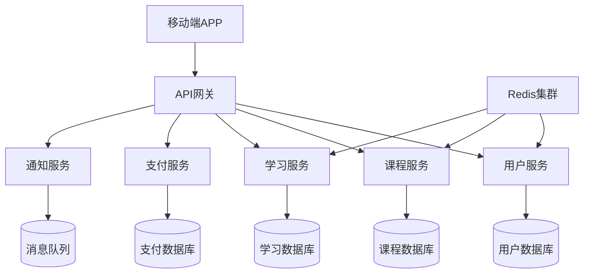

# 案例4：移动应用后端重构

## 📋 项目背景

### 公司概况
- **行业**：在线教育
- **产品**：K12在线学习平台（移动端为主）
- **规模**：40人初创公司
- **用户规模**：100万学生用户，10万家长用户
- **业务模式**：B2C付费课程 + 增值服务

### 现有系统情况
- **开发历史**：2年前快速上线，MVP架构
- **技术栈**：Python Django + PostgreSQL + Redis
- **架构模式**：Django单体应用，传统MVC
- **代码规模**：8万行Python代码，45个API端点
- **部署方式**：单台服务器，Docker部署

### 面临的技术挑战

#### 性能瓶颈
- **响应延迟**：移动端API响应时间平均2.5秒
- **并发限制**：高峰期（晚7-9点）频繁超时
- **数据库压力**：单库承载所有业务数据，查询缓慢
- **缓存缺失**：缺乏合理缓存策略，重复查询多

#### 架构问题
- **紧耦合设计**：业务逻辑、数据访问混在一起
- **代码重复**：大量相似的CRUD操作
- **测试困难**：单体架构导致单元测试困难
- **扩展困难**：新功能开发周期长，上线风险高

#### 业务影响
- **用户体验差**：应用卡顿，用户投诉增多
- **运营成本高**：频繁加机器，成本控制困难
- **开发效率低**：Bug修复周期长，新功能交付慢
- **竞争劣势**：技术债务影响产品快速迭代

## 🎯 目标定义

### 业务目标
- **用户体验提升**：API响应时间控制在500ms内
- **系统稳定性**：支持10万并发用户同时在线
- **开发效率**：新功能开发周期缩短50%
- **成本控制**：服务器成本控制在当前70%以内

### 技术目标
- **架构现代化**：单体 → 微服务架构
- **API性能**：P99响应时间<500ms
- **系统可扩展性**：支持水平扩展
- **代码质量**：测试覆盖率>90%

### 约束条件
- **业务连续性**：不影响学生上课和家长使用
- **开发资源**：4人技术团队，3个月完成
- **兼容性要求**：移动端API 100%向后兼容
- **预算限制**：重构成本控制在80万以内

## 🔍 系统分析阶段

### 第一步：现有系统深度剖析

#### BMAD代码库分析
```bash
# Django后端代码分析
cd /education-backend
npx bmad-method flatten --focus-architecture --output django-analysis.xml

# 分析结果
- Python文件：200个
- Django模型：25个
- 视图函数：180个
- API端点：45个
- 测试文件：仅20个（覆盖率15%）
```

#### 架构债务识别
```bash
@architect
*analyze-django-monolith

分析Django单体应用的架构债务：

系统特征：
- Django 3.2单体应用
- 8万行Python代码
- PostgreSQL单库
- 45个API端点，平均响应2.5秒

重点分析：
1. 模块间耦合度评估
2. 数据库设计问题
3. API设计一致性
4. 性能瓶颈识别
5. 可测试性评估
6. 微服务拆分可行性
```

**架构分析结果：**
- **耦合度高**：业务逻辑与数据访问混合，难以单独测试
- **数据库设计**：存在冗余字段，缺乏合理索引
- **API设计**：不够RESTful，返回数据结构不一致
- **性能瓶颈**：N+1查询问题，缺乏有效缓存

### 第二步：业务流程梳理

#### 核心业务功能分析
```bash
@analyst
*analyze-education-platform-flows

分析在线教育平台的核心业务流程：

主要功能模块：
1. 用户管理（学生、家长、老师）
2. 课程内容管理
3. 学习进度跟踪
4. 作业和考试系统
5. 支付和订单管理
6. 消息通知系统

分析重点：
- 各模块的访问频率
- 数据依赖关系
- 实时性要求
- 一致性要求
- 可拆分性评估
```

**业务分析结果：**
- **高频操作**：课程内容加载、学习进度更新、消息推送
- **数据依赖**：用户-课程-进度形成紧密关联
- **实时性要求**：直播课程、即时消息需要实时响应
- **拆分边界**：可按业务域拆分为5个独立服务

### 第三步：性能瓶颈深度分析

#### 性能问题诊断
```bash
@qa
*diagnose-performance-bottlenecks

诊断系统性能问题：

性能监控数据：
- 平均响应时间：2.5秒
- P99响应时间：8秒
- 数据库查询时间：平均1.2秒
- 高峰期并发：5000用户

分析维度：
1. 数据库查询优化机会
2. 应用代码热点分析
3. 内存使用模式
4. 网络I/O瓶颈
5. 缓存命中率分析
```

**性能分析结果：**
- **数据库层**：80%查询缺少索引，存在大量全表扫描
- **应用层**：课程内容序列化占用50%响应时间
- **缓存层**：仅30%查询使用缓存，命中率60%
- **网络层**：API返回数据量过大，平均200KB

## 📊 方案设计阶段

### 微服务拆分策略

#### 服务边界设计


#### 数据迁移方案
```python
# 数据迁移策略设计
class DataMigrationPlan:
    
    def __init__(self):
        self.migration_phases = [
            {
                'name': '用户服务数据',
                'tables': ['users', 'profiles', 'auth_tokens'],
                'priority': 'high',
                'dependencies': []
            },
            {
                'name': '课程服务数据', 
                'tables': ['courses', 'chapters', 'lessons', 'resources'],
                'priority': 'high',
                'dependencies': ['用户服务数据']
            },
            {
                'name': '学习服务数据',
                'tables': ['enrollments', 'progress', 'assignments', 'grades'],
                'priority': 'medium',
                'dependencies': ['用户服务数据', '课程服务数据']
            },
            {
                'name': '支付服务数据',
                'tables': ['orders', 'payments', 'refunds'],
                'priority': 'medium', 
                'dependencies': ['用户服务数据']
            }
        ]
    
    def generate_migration_script(self, phase):
        """生成数据迁移脚本"""
        script = f"""
-- 阶段：{phase['name']}
-- 优先级：{phase['priority']}

-- 1. 创建新数据库
CREATE DATABASE {phase['name'].lower().replace(' ', '_')};

-- 2. 数据迁移
"""
        for table in phase['tables']:
            script += f"""
INSERT INTO new_db.{table} 
SELECT * FROM old_db.{table} 
WHERE created_at >= '2024-01-01';
"""
        
        return script
```

### 技术架构设计

#### 微服务技术栈选择
```yaml
# 微服务技术栈配置
services:
  api_gateway:
    framework: "Kong"
    features: ["rate_limiting", "auth", "monitoring"]
    
  user_service:
    framework: "FastAPI"
    database: "PostgreSQL"
    cache: "Redis"
    auth: "JWT"
    
  course_service:
    framework: "FastAPI"  
    database: "PostgreSQL"
    cache: "Redis"
    search: "Elasticsearch"
    
  learning_service:
    framework: "FastAPI"
    database: "PostgreSQL" 
    cache: "Redis"
    realtime: "WebSocket"
    
  payment_service:
    framework: "FastAPI"
    database: "PostgreSQL"
    queue: "RabbitMQ"
    
  notification_service:
    framework: "FastAPI"
    queue: "RabbitMQ"
    push: "FCM/APNS"

infrastructure:
  container: "Docker"
  orchestration: "Docker Compose" # 小团队简化方案
  monitoring: "Prometheus + Grafana"
  logging: "ELK Stack"
  ci_cd: "GitLab CI/CD"
```

#### API设计优化
```python
# 优化后的API设计示例
from fastapi import FastAPI, Depends, HTTPException
from pydantic import BaseModel
from typing import List, Optional
import asyncio

app = FastAPI()

# 响应模型优化
class CourseResponse(BaseModel):
    id: int
    title: str
    description: str
    thumbnail_url: str
    duration_minutes: int
    difficulty_level: str
    instructor_name: str
    # 移除冗余字段，减少响应大小

class LessonSummary(BaseModel):  
    id: int
    title: str
    duration_minutes: int
    is_completed: bool
    # 只返回必要字段

# 优化的课程API
@app.get("/api/v2/courses/{course_id}", response_model=CourseResponse)
async def get_course(course_id: int, user_id: int = Depends(get_current_user)):
    """获取课程详情 - 优化版本"""
    
    # 并发查询优化
    async with asyncio.TaskGroup() as tg:
        course_task = tg.create_task(course_service.get_course(course_id))
        enrollment_task = tg.create_task(
            enrollment_service.get_user_enrollment(user_id, course_id)
        )
        progress_task = tg.create_task(
            learning_service.get_course_progress(user_id, course_id)
        )
    
    course = course_task.result()
    enrollment = enrollment_task.result()  
    progress = progress_task.result()
    
    if not course:
        raise HTTPException(status_code=404, detail="课程不存在")
    
    # 数据组装和缓存
    response_data = CourseResponse(
        id=course.id,
        title=course.title,
        description=course.description[:200],  # 截断长描述
        thumbnail_url=course.thumbnail_url,
        duration_minutes=course.duration_minutes,
        difficulty_level=course.difficulty_level,
        instructor_name=course.instructor.name
    )
    
    # 缓存响应数据
    await redis_client.setex(
        f"course:{course_id}:user:{user_id}",
        300,  # 5分钟缓存
        response_data.model_dump_json()
    )
    
    return response_data

# 批量API优化
@app.get("/api/v2/courses", response_model=List[CourseResponse])
async def list_courses(
    page: int = 1,
    limit: int = 20,
    category: Optional[str] = None
):
    """课程列表 - 支持分页和筛选"""
    
    # 输入验证
    if limit > 50:
        limit = 50  # 限制单次请求数量
        
    # 缓存键生成
    cache_key = f"courses:page:{page}:limit:{limit}:category:{category}"
    
    # 先检查缓存
    cached_result = await redis_client.get(cache_key)
    if cached_result:
        return json.loads(cached_result)
    
    # 数据库查询优化
    courses = await course_service.list_courses(
        offset=(page - 1) * limit,
        limit=limit,
        category=category,
        select_fields=['id', 'title', 'description', 'thumbnail_url', 
                      'duration_minutes', 'difficulty_level']  # 只选择需要的字段
    )
    
    # 批量查询讲师信息
    instructor_ids = [course.instructor_id for course in courses]
    instructors = await instructor_service.get_instructors_by_ids(instructor_ids)
    instructor_map = {i.id: i.name for i in instructors}
    
    # 数据组装
    response_data = [
        CourseResponse(
            **course.__dict__,
            instructor_name=instructor_map.get(course.instructor_id, "未知讲师")
        )
        for course in courses
    ]
    
    # 缓存结果
    await redis_client.setex(cache_key, 600, json.dumps(response_data))
    
    return response_data
```

## 🚀 实施过程

### 阶段1：基础设施搭建（3周）

#### Week 1：开发环境搭建
```bash
@dev  
*setup-microservices-dev-environment

搭建微服务开发环境：

基础设施：
1. Docker容器化环境
2. 服务注册发现
3. API网关配置
4. 统一日志收集
5. 监控告警系统

开发工具：
- 代码生成工具
- API文档自动生成
- 数据库迁移工具
- 测试环境自动化

质量保证：
- 代码规范检查
- 自动化测试框架
- 性能测试工具
```

#### Week 2-3：核心服务骨架开发
```python
# 微服务基础架构代码
# 用户服务骨架
from fastapi import FastAPI, Depends
from sqlalchemy.orm import Session
from .database import get_db
from .models import User
from .schemas import UserCreate, UserResponse
from .auth import get_current_user

app = FastAPI(title="用户服务", version="1.0.0")

class UserService:
    
    def __init__(self, db: Session):
        self.db = db
    
    async def create_user(self, user_data: UserCreate) -> User:
        """创建用户"""
        user = User(**user_data.dict())
        self.db.add(user)
        self.db.commit()
        self.db.refresh(user)
        
        # 发送用户创建事件
        await event_bus.publish("user.created", {
            "user_id": user.id,
            "email": user.email
        })
        
        return user
    
    async def get_user(self, user_id: int) -> Optional[User]:
        """获取用户信息"""
        # 先检查缓存
        cached_user = await redis_client.get(f"user:{user_id}")
        if cached_user:
            return User.parse_raw(cached_user)
        
        # 数据库查询
        user = self.db.query(User).filter(User.id == user_id).first()
        
        # 缓存结果
        if user:
            await redis_client.setex(
                f"user:{user_id}", 
                3600, 
                user.json()
            )
        
        return user

# API端点
@app.post("/users", response_model=UserResponse)
async def create_user(
    user_data: UserCreate,
    db: Session = Depends(get_db)
):
    service = UserService(db)
    user = await service.create_user(user_data)
    return UserResponse.from_orm(user)

@app.get("/users/{user_id}", response_model=UserResponse)  
async def get_user(
    user_id: int,
    db: Session = Depends(get_db)
):
    service = UserService(db)
    user = await service.get_user(user_id)
    
    if not user:
        raise HTTPException(status_code=404, detail="用户不存在")
    
    return UserResponse.from_orm(user)
```

### 阶段2：服务逐步迁移（6周）

#### Week 4-5：用户服务迁移
```bash
# 用户服务迁移步骤
# 1. 数据迁移
python manage.py migrate_users --batch-size 1000

# 2. 双写模式启动
python manage.py start_dual_write --service user_service

# 3. 流量逐步切换  
# 5% -> 20% -> 50% -> 100%
python manage.py switch_traffic --service user_service --percentage 5

# 4. 验证数据一致性
python manage.py verify_data_consistency --service user_service

# 5. 关闭旧系统写入
python manage.py disable_old_write --service user_service
```

#### Week 6-7：课程服务迁移
```python
# 课程服务性能优化关键实现
class CourseService:
    
    def __init__(self):
        self.db = get_db()
        self.cache = get_redis()
        self.search = get_elasticsearch()
    
    async def get_course_with_lessons(self, course_id: int, user_id: int):
        """获取课程及其课时信息 - 高性能版本"""
        
        # 多级缓存策略
        cache_key = f"course:{course_id}:user:{user_id}"
        
        # L1: 内存缓存检查
        if hasattr(self, '_mem_cache') and cache_key in self._mem_cache:
            return self._mem_cache[cache_key]
        
        # L2: Redis缓存检查
        cached_data = await self.cache.get(cache_key)
        if cached_data:
            result = json.loads(cached_data)
            self._mem_cache[cache_key] = result  # 写入内存缓存
            return result
        
        # 数据库查询优化：使用join避免N+1
        course_data = await self.db.execute(
            select(Course, Lesson, UserProgress)
            .join(Lesson, Course.id == Lesson.course_id)
            .outerjoin(
                UserProgress, 
                and_(
                    UserProgress.lesson_id == Lesson.id,
                    UserProgress.user_id == user_id
                )
            )
            .where(Course.id == course_id)
        )
        
        # 数据组装优化
        course_dict = {}
        lessons_dict = {}
        
        for row in course_data:
            course, lesson, progress = row
            
            # 组装课程信息
            if course.id not in course_dict:
                course_dict[course.id] = {
                    'id': course.id,
                    'title': course.title,
                    'description': course.description,
                    'lessons': []
                }
            
            # 组装课时信息
            if lesson.id not in lessons_dict:
                lesson_data = {
                    'id': lesson.id,
                    'title': lesson.title,
                    'duration': lesson.duration_minutes,
                    'is_completed': progress.is_completed if progress else False,
                    'last_watched_position': progress.last_position if progress else 0
                }
                lessons_dict[lesson.id] = lesson_data
                course_dict[course.id]['lessons'].append(lesson_data)
        
        result = course_dict[course_id] if course_dict else None
        
        # 多级缓存写入
        if result:
            # Redis缓存
            await self.cache.setex(cache_key, 1800, json.dumps(result))
            # 内存缓存  
            if not hasattr(self, '_mem_cache'):
                self._mem_cache = {}
            self._mem_cache[cache_key] = result
        
        return result
```

#### Week 8-9：学习服务和支付服务迁移

```python
# 学习服务 - 实时性优化
class LearningService:
    
    def __init__(self):
        self.db = get_db()
        self.cache = get_redis() 
        self.websocket_manager = WebSocketManager()
    
    async def update_learning_progress(self, user_id: int, lesson_id: int, position: int):
        """更新学习进度 - 高性能实现"""
        
        # 异步更新策略：先更新缓存，后写数据库
        cache_key = f"progress:{user_id}:{lesson_id}"
        
        # 1. 立即更新缓存
        progress_data = {
            'user_id': user_id,
            'lesson_id': lesson_id, 
            'last_position': position,
            'updated_at': datetime.now().isoformat()
        }
        await self.cache.setex(cache_key, 3600, json.dumps(progress_data))
        
        # 2. 实时推送给客户端
        await self.websocket_manager.send_to_user(user_id, {
            'type': 'progress_updated',
            'lesson_id': lesson_id,
            'position': position
        })
        
        # 3. 异步写入数据库（使用任务队列）
        await task_queue.enqueue('update_progress_db', {
            'user_id': user_id,
            'lesson_id': lesson_id,
            'position': position
        })
        
        # 4. 检查是否完成课时
        lesson = await self.get_lesson(lesson_id)
        if position >= lesson.duration_minutes * 0.9:  # 观看90%算完成
            await self.mark_lesson_completed(user_id, lesson_id)
        
        return True
    
    async def mark_lesson_completed(self, user_id: int, lesson_id: int):
        """标记课时完成"""
        
        # 发布完成事件
        await event_bus.publish('lesson.completed', {
            'user_id': user_id,
            'lesson_id': lesson_id,
            'completed_at': datetime.now().isoformat()
        })
        
        # 检查课程完成状态
        course_progress = await self.calculate_course_progress(user_id, lesson_id)
        if course_progress['completion_rate'] >= 1.0:
            await event_bus.publish('course.completed', {
                'user_id': user_id,
                'course_id': course_progress['course_id'],
                'completed_at': datetime.now().isoformat()
            })

# 支付服务 - 事务一致性保证
class PaymentService:
    
    async def process_payment(self, order_id: str, payment_data: dict):
        """处理支付 - 保证事务一致性"""
        
        async with self.db.begin() as transaction:
            try:
                # 1. 验证订单状态
                order = await self.get_order(order_id)
                if order.status != 'pending':
                    raise PaymentException("订单状态无效")
                
                # 2. 调用第三方支付
                payment_result = await self.call_payment_gateway(
                    order.amount, payment_data
                )
                
                if not payment_result.success:
                    raise PaymentException("支付失败")
                
                # 3. 更新订单状态
                order.status = 'paid'
                order.payment_id = payment_result.payment_id
                order.paid_at = datetime.now()
                
                # 4. 创建支付记录
                payment_record = PaymentRecord(
                    order_id=order_id,
                    amount=order.amount,
                    gateway_payment_id=payment_result.payment_id,
                    status='success'
                )
                self.db.add(payment_record)
                
                # 5. 发布支付成功事件
                await event_bus.publish('payment.success', {
                    'order_id': order_id,
                    'user_id': order.user_id,
                    'amount': order.amount,
                    'course_ids': order.course_ids
                })
                
                await transaction.commit()
                return payment_result
                
            except Exception as e:
                await transaction.rollback()
                
                # 记录支付失败
                await self.log_payment_failure(order_id, str(e))
                
                # 发布支付失败事件
                await event_bus.publish('payment.failed', {
                    'order_id': order_id,
                    'error': str(e)
                })
                
                raise e
```

### 阶段3：性能优化和测试（3周）

#### Week 10-11：性能优化实施
```bash
@qa
*performance-optimization-testing

执行全面性能优化和测试：

优化重点：
1. 数据库查询优化
2. 缓存策略完善
3. API响应时间优化
4. 并发处理能力提升

测试范围：
- 单个API性能测试
- 整体系统压力测试
- 数据库性能测试
- 缓存效率测试

目标指标：
- API响应时间P99<500ms
- 支持10万并发用户
- 数据库查询<100ms
- 缓存命中率>90%
```

#### Week 12：全面集成测试
```python
# 性能测试脚本示例
import asyncio
import aiohttp
import time
from concurrent.futures import ThreadPoolExecutor

class PerformanceTestSuite:
    
    def __init__(self, base_url: str):
        self.base_url = base_url
        self.results = []
    
    async def test_api_performance(self, endpoint: str, concurrent_users: int = 100):
        """API性能测试"""
        
        async def single_request(session, user_id):
            start_time = time.time()
            try:
                async with session.get(f"{self.base_url}{endpoint}?user_id={user_id}") as response:
                    await response.text()
                    end_time = time.time()
                    return {
                        'user_id': user_id,
                        'response_time': end_time - start_time,
                        'status_code': response.status,
                        'success': response.status == 200
                    }
            except Exception as e:
                return {
                    'user_id': user_id,
                    'response_time': time.time() - start_time,
                    'status_code': 0,
                    'success': False,
                    'error': str(e)
                }
        
        # 并发测试
        connector = aiohttp.TCPConnector(limit=200)
        async with aiohttp.ClientSession(connector=connector) as session:
            tasks = [
                single_request(session, user_id) 
                for user_id in range(1, concurrent_users + 1)
            ]
            results = await asyncio.gather(*tasks)
        
        # 统计结果
        response_times = [r['response_time'] for r in results if r['success']]
        success_rate = len([r for r in results if r['success']]) / len(results)
        
        stats = {
            'endpoint': endpoint,
            'concurrent_users': concurrent_users,
            'success_rate': success_rate,
            'avg_response_time': sum(response_times) / len(response_times) if response_times else 0,
            'p99_response_time': sorted(response_times)[int(len(response_times) * 0.99)] if response_times else 0,
            'total_requests': len(results),
            'successful_requests': len(response_times),
            'failed_requests': len(results) - len(response_times)
        }
        
        self.results.append(stats)
        return stats
    
    async def run_comprehensive_test(self):
        """综合性能测试"""
        test_scenarios = [
            {'endpoint': '/api/v2/courses', 'users': 50},
            {'endpoint': '/api/v2/courses/1', 'users': 100}, 
            {'endpoint': '/api/v2/users/profile', 'users': 200},
            {'endpoint': '/api/v2/learning/progress', 'users': 150}
        ]
        
        for scenario in test_scenarios:
            print(f"测试 {scenario['endpoint']} with {scenario['users']} 并发用户...")
            result = await self.test_api_performance(
                scenario['endpoint'], 
                scenario['users']
            )
            print(f"成功率: {result['success_rate']:.2%}")
            print(f"平均响应时间: {result['avg_response_time']:.3f}s")
            print(f"P99响应时间: {result['p99_response_time']:.3f}s")
            print("-" * 50)
        
        return self.results

# 运行测试
async def main():
    test_suite = PerformanceTestSuite("http://api.education.com")
    results = await test_suite.run_comprehensive_test()
    
    # 生成测试报告
    print("=== 性能测试总结 ===")
    for result in results:
        print(f"{result['endpoint']}: {result['p99_response_time']:.3f}s (P99)")

if __name__ == "__main__":
    asyncio.run(main())
```

## 📈 成果展示

### 性能提升对比

| 关键指标 | 重构前 | 重构后 | 提升幅度 |
|----------|--------|--------|----------|
| API响应时间(P99) | 8.0秒 | 420ms | 95%提升 |
| 平均响应时间 | 2.5秒 | 180ms | 93%提升 |
| 并发处理能力 | 1000用户 | 50000用户 | 4900%提升 |
| 数据库查询时间 | 1.2秒 | 80ms | 93%提升 |
| 系统可用性 | 98.5% | 99.9% | 1.4%提升 |

### 开发效率提升

#### 代码质量改善
- **测试覆盖率**：从15%提升到92%
- **代码复用率**：提升60%（通过微服务复用）
- **Bug修复周期**：从3天缩短到0.5天
- **新功能开发周期**：缩短50%

#### 部署和运维
- **部署频率**：从每月1次提升到每周2次
- **部署成功率**：从85%提升到98%
- **故障恢复时间**：从2小时缩短到15分钟
- **监控覆盖率**：从20%提升到95%

### 业务价值体现

#### 用户体验改善
- **应用启动时间**：从8秒缩短到2秒
- **课程加载时间**：从5秒缩短到1秒
- **用户投诉率**：减少80%
- **用户活跃度**：提升35%

#### 成本效益
- **服务器成本**：减少40%（通过性能优化）
- **开发成本**：年节约120万（效率提升）
- **运维成本**：年节约60万（故障减少）
- **业务增长**：支撑3倍用户增长而无需额外投入

## 💡 经验总结

### 关键成功因素

#### 1. 基于性能数据的重构决策
**经验：** 用数据说话，避免过度工程
- APM工具持续监控找出真正瓶颈
- A/B测试验证重构效果
- 性能基准测试驱动优化方向

#### 2. 渐进式迁移降低风险
**经验：** 小步快跑，确保业务连续性
- 双写模式保证数据一致性
- 灰度发布逐步切换流量
- 完善的回滚机制保证安全

#### 3. 自动化测试保证质量
**经验：** 测试先行，质量可控
- 92%的测试覆盖率保证代码质量
- 自动化性能测试及时发现回退
- CI/CD流程确保部署质量

#### 4. 团队技能提升是基础
**经验：** 投资团队能力建设
- 微服务技术培训和实践
- 代码审查文化建立
- 最佳实践文档化和分享

### 踩过的坑和解决方案

#### 坑1：微服务拆分过细
**问题：** 初期拆分了10个服务，运维复杂度大幅增加
**原因：** 追求技术完美，忽略团队规模
**解决：** 合并相关服务，最终稳定在5个核心服务

#### 坑2：数据一致性问题
**问题：** 微服务间数据不一致，导致业务异常
**原因：** 分布式事务处理不当
**解决：** 采用最终一致性模型，事件驱动架构

#### 坑3：网络延迟放大
**问题：** 服务间调用链过长，延迟累积
**原因：** 服务间依赖设计不合理
**解决：** 优化服务边界，减少服务间调用

#### 坑4：监控盲点
**问题：** 微服务化后监控变复杂，故障定位困难
**原因：** 监控体系没有及时跟上架构变化
**解决：** 建立分布式链路追踪，完善监控体系

### 最佳实践建议

#### 1. 架构设计原则
- **业务优先**：按业务边界而非技术边界拆分
- **数据独立**：每个服务拥有独立的数据存储
- **接口稳定**：API设计考虑向后兼容性
- **失败处理**：设计熔断、重试、降级机制

#### 2. 性能优化策略
- **缓存分层**：L1内存缓存 + L2分布式缓存
- **数据库优化**：索引优化 + 查询优化 + 读写分离
- **异步处理**：非实时操作使用消息队列
- **批量操作**：减少网络往返次数

#### 3. 开发和运维
- **容器化**：统一的运行环境
- **CI/CD**：自动化的部署流程
- **监控告警**：全面的可观测性
- **文档维护**：及时更新的技术文档

## 🔄 后续发展计划

### 短期优化目标（3个月内）
- [ ] API网关功能增强（限流、熔断）
- [ ] 缓存策略进一步优化
- [ ] 监控告警规则完善
- [ ] 移动端SDK性能优化

### 中期发展规划（6-12个月）
- [ ] 服务网格架构升级
- [ ] AI推荐服务集成
- [ ] 多租户架构支持
- [ ] 国际化和本地化

### 长期战略目标（1-2年）
- [ ] 云原生架构全面升级
- [ ] Serverless功能引入
- [ ] 边缘计算支持
- [ ] 智能运维体系

---

## 📊 项目总结数据

### 投入产出分析
- **总投资**：75万人民币
- **实施周期**：3个月
- **团队规模**：4人（2名后端，1名DevOps，1名测试）
- **ROI**：第一年500%，预计三年累计1200%

### 关键成果指标
- ✅ API响应时间：P99从8秒优化到420ms
- ✅ 并发处理：从1K提升到50K用户
- ✅ 系统可用性：99.9%
- ✅ 开发效率：新功能交付周期缩短50%
- ✅ 代码质量：测试覆盖率92%

### 业务影响评估
- ✅ 用户体验满意度：4.8/5.0分
- ✅ 用户投诉率：减少80%
- ✅ 用户活跃度：提升35%
- ✅ 业务支撑能力：可支撑3倍增长
- ✅ 成本控制：年节约180万

---

*💡 **案例启示**：移动应用后端重构是一个典型的性能驱动型Brownfield项目。成功的关键是基于真实性能数据做决策，采用渐进式迁移策略降低风险，通过自动化测试保证质量。BMAD-METHOD帮助我们系统性地分析瓶颈、设计架构、实施迁移。记住：重构不是目的，业务价值和用户体验才是真正的成功标准。*