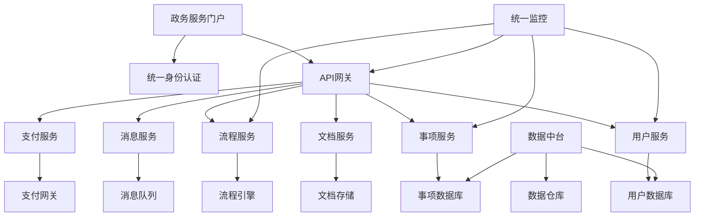

# 案例5：政务系统数字化升级

## 📋 项目背景

### 机构概况
- **部门**：某市政府政务服务中心
- **服务范围**：全市300万人口，涉及80个政府部门
- **业务规模**：年办理各类政务服务1200万件
- **服务窗口**：线下100个窗口，线上门户网站
- **工作人员**：600名政务服务人员

### 现有系统情况
- **建设年代**：2010年开始，分期建设
- **技术栈**：.NET Framework 4.5 + SQL Server 2012 + IIS
- **架构模式**：传统三层架构，多个独立系统
- **代码规模**：80万行C#代码，300个页面
- **部署方式**：物理机部署，专网环境

### 系统现状和挑战

#### 技术架构老化
- **技术栈陈旧**：.NET Framework 4.5，安全漏洞多
- **数据孤岛严重**：15个独立系统，数据无法互通
- **性能问题突出**：高峰期响应时间超过30秒
- **维护困难**：代码耦合度高，bug修复影响面大

#### 用户体验不佳
- **办事流程复杂**：同一事项需要跑多个部门
- **重复填表**：相同信息需要反复填写
- **办事时间长**：平均办结时间15个工作日
- **查询困难**：办事进度无法在线查询

#### 管理运营痛点
- **统计报表困难**：数据分散，难以形成全局视图
- **决策支持不足**：缺乏数据分析和预测能力
- **运维成本高**：需要大量人工维护和数据录入
- **安全风险**：系统漏洞多，数据安全隐患大

### 数字化转型需求

#### 政策驱动
- **国务院要求**：2024年实现政务服务"一网通办"
- **省级部署**：全省政务服务标准化、规范化
- **市级目标**：打造"数字政府"示范城市
- **评估压力**：政务服务能力评估排名靠后

#### 民生需求  
- **便民服务**：企业群众办事"最多跑一次"
- **高效服务**：办事时间压缩到5个工作日内
- **透明服务**：办事流程和进度全程可查
- **智能服务**：推荐服务、智能填表、智能审批

## 🎯 目标定义

### 业务目标
- **服务效率**：办事时间平均缩短70%
- **用户满意度**：政务服务满意度提升到95%以上
- **办事便利性**：80%事项实现"一次不用跑"
- **政务服务能力**：进入全省前5名

### 技术目标
- **系统整合**：15个独立系统整合为统一平台
- **技术升级**：升级到.NET Core + 微服务架构
- **性能提升**：系统响应时间控制在3秒内
- **安全合规**：达到网络安全等级保护三级标准

### 管理目标
- **数据统一**：建立统一的政务数据中心
- **流程优化**：梳理优化500个政务服务流程
- **智能化水平**：实现80%事项智能预审
- **运维效率**：运维人员减少50%，故障响应时间<30分钟

### 约束条件
- **安全要求**：必须符合政府网络安全规范
- **合规性**：符合《政府信息公开条例》等法规
- **稳定性**：不能影响日常政务服务正常开展
- **预算控制**：总预算不超过2000万人民币
- **时间窗口**：18个月内完成全部改造

## 🔍 系统分析阶段

### 第一步：全面系统调研

#### BMAD代码库分析
```bash
# 政务系统代码分析（涉及多个子系统）
cd /gov-systems/
for system in system_*; do
  cd $system
  npx bmad-method flatten --output ${system}_analysis.xml
  cd ..
done

# 汇总分析结果
Total Analysis Results:
- 总系统数：15个独立系统
- C#代码文件：3,200个
- ASPX页面：800个  
- 数据库表：450个
- 存储过程：1,200个
- Web服务：150个
```

#### 业务流程梳理
```bash
@analyst
*analyze-government-service-processes

梳理政务服务业务流程：

分析范围：
- 个人服务事项：200个
- 企业服务事项：300个  
- 内部办公流程：150个
- 跨部门协同流程：80个

重点分析：
1. 高频服务事项流程
2. 跨部门协作环节
3. 数据流转关系
4. 审批节点分析
5. 办事时长分布
6. 用户痛点识别

优化目标：
- 流程简化合并
- 并行审批改造
- 数据共享复用
- 智能审批应用
```

**业务流程分析结果：**
- **高频事项**：身份证办理、营业执照申请、不动产登记占60%业务量
- **流程冗余**：平均每个事项有8个审批环节，存在重复审核
- **数据重复**：同一企业/个人信息在不同系统重复录入15次以上
- **协同困难**：跨部门事项平均涉及4个部门，协调成本高

### 第二步：技术架构深度评估

#### 架构现状分析
```bash
@architect  
*analyze-legacy-government-systems

分析政务系统架构现状和问题：

系统架构：
- 15个独立的.NET Framework系统
- SQL Server数据库分散存储
- 传统Web Forms技术
- 缺乏统一的认证和权限管理

技术债务：
- .NET Framework版本过旧
- 大量重复代码和功能
- 数据库设计不规范
- 缺乏API标准和接口文档

现代化改造方案：
1. 微服务架构设计
2. 统一身份认证
3. 数据中台建设
4. API网关和服务治理
5. 容器化部署
```

**架构评估结果：**
- **技术栈老化**：安全漏洞150+，性能瓶颈明显
- **架构混乱**：缺乏统一规划，系统间接口混乱
- **数据分散**：企业信息在12个系统中重复存储
- **运维困难**：部署复杂，故障排查困难

### 第三步：安全和合规评估

#### 安全现状评估
```bash
@security-specialist
*assess-government-system-security

评估政务系统安全现状：

安全评估维度：
1. 网络安全防护能力
2. 数据安全和隐私保护
3. 身份认证和访问控制
4. 系统漏洞和补丁管理
5. 安全监控和应急响应

合规性检查：
- 网络安全等级保护要求
- 政府信息公开条例
- 个人信息保护法
- 数据安全法

风险评估：
- 高风险问题识别
- 安全加固建议
- 合规改造方案
```

**安全评估结果：**
- **安全等级**：当前仅达到二级，需升级到三级
- **主要风险**：SQL注入、XSS攻击、权限绕过等高风险漏洞
- **数据保护**：个人敏感信息缺乏加密存储
- **访问控制**：缺乏细粒度权限管理

## 📊 方案设计阶段

### 整体架构设计

#### 数字政府统一平台架构


#### 数据整合架构设计
```csharp
// 数据整合服务架构
public class DataIntegrationService
{
    private readonly IUnifiedDataAccess _dataAccess;
    private readonly IDataTransformService _transformService;
    private readonly ICacheService _cacheService;
    
    // 统一用户信息服务
    public async Task<UnifiedUser> GetUnifiedUserInfoAsync(string identityNumber)
    {
        var cacheKey = $"user:{identityNumber}";
        
        // 检查缓存
        var cachedUser = await _cacheService.GetAsync<UnifiedUser>(cacheKey);
        if (cachedUser != null) return cachedUser;
        
        // 从多个源系统获取数据
        var tasks = new List<Task<UserDataSource>>
        {
            GetUserFromPopulationSystem(identityNumber),     // 人口信息系统
            GetUserFromTaxSystem(identityNumber),           // 税务系统
            GetUserFromSocialSecuritySystem(identityNumber), // 社保系统
            GetUserFromHousingSystem(identityNumber)         // 房管系统
        };
        
        var sourceData = await Task.WhenAll(tasks);
        
        // 数据融合和清洗
        var unifiedUser = await _transformService.MergeUserDataAsync(sourceData);
        
        // 缓存结果
        await _cacheService.SetAsync(cacheKey, unifiedUser, TimeSpan.FromHours(1));
        
        return unifiedUser;
    }
    
    // 企业信息统一服务
    public async Task<UnifiedEnterprise> GetUnifiedEnterpriseInfoAsync(string creditCode)
    {
        var enterpriseData = await Task.WhenAll(
            GetEnterpriseFromMarketRegulation(creditCode),  // 市场监管
            GetEnterpriseFromTax(creditCode),              // 税务
            GetEnterpriseFromCustoms(creditCode),          // 海关
            GetEnterpriseFromSocialCredit(creditCode)      // 社会信用
        );
        
        return await _transformService.MergeEnterpriseDataAsync(enterpriseData);
    }
}

// 统一数据访问层
public class UnifiedDataAccess : IUnifiedDataAccess
{
    private readonly Dictionary<string, ISystemConnector> _connectors;
    
    public UnifiedDataAccess()
    {
        // 初始化各系统连接器
        _connectors = new Dictionary<string, ISystemConnector>
        {
            {"population", new PopulationSystemConnector()},
            {"tax", new TaxSystemConnector()},
            {"social_security", new SocialSecurityConnector()},
            {"housing", new HousingSystemConnector()},
            {"market_regulation", new MarketRegulationConnector()}
        };
    }
    
    public async Task<T> QueryAsync<T>(string systemCode, string queryId, object parameters)
    {
        if (!_connectors.ContainsKey(systemCode))
            throw new SystemNotFoundException($"系统 {systemCode} 未找到");
        
        var connector = _connectors[systemCode];
        
        try
        {
            return await connector.QueryAsync<T>(queryId, parameters);
        }
        catch (Exception ex)
        {
            // 记录系统调用失败
            await LogSystemCallFailure(systemCode, queryId, ex);
            
            // 根据业务需要决定是否降级处理
            if (IsNonCriticalSystem(systemCode))
            {
                return default(T); // 返回默认值，不影响主流程
            }
            
            throw; // 关键系统失败时抛出异常
        }
    }
}
```

### 业务流程重构设计

#### 智能审批引擎
```csharp
// 智能审批引擎
public class IntelligentApprovalEngine
{
    private readonly IRuleEngine _ruleEngine;
    private readonly IMLPredictionService _mlService;
    private readonly IWorkflowEngine _workflowEngine;
    
    // 智能预审
    public async Task<PreApprovalResult> PreApproveAsync(ServiceApplication application)
    {
        var result = new PreApprovalResult
        {
            ApplicationId = application.Id,
            ServiceCode = application.ServiceCode
        };
        
        // 1. 基础规则检查
        var ruleCheckResult = await _ruleEngine.ValidateAsync(application);
        if (!ruleCheckResult.IsValid)
        {
            result.Status = PreApprovalStatus.Rejected;
            result.RejectReasons = ruleCheckResult.ErrorMessages;
            return result;
        }
        
        // 2. 材料完整性AI检查
        var materialCheck = await _mlService.CheckMaterialCompletenessAsync(
            application.ServiceCode, 
            application.Materials
        );
        
        if (materialCheck.Confidence > 0.9)
        {
            if (materialCheck.IsComplete)
            {
                // 3. 风险评估
                var riskScore = await _mlService.AssessRiskAsync(application);
                
                if (riskScore < 0.1) // 低风险
                {
                    result.Status = PreApprovalStatus.AutoApproved;
                    result.Confidence = materialCheck.Confidence;
                    
                    // 直接进入制证环节
                    await _workflowEngine.SkipToFinalStageAsync(application.Id);
                }
                else
                {
                    result.Status = PreApprovalStatus.NeedManualReview;
                    result.RiskFactors = await _mlService.GetRiskFactorsAsync(application);
                }
            }
            else
            {
                result.Status = PreApprovalStatus.MaterialIncomplete;
                result.MissingMaterials = materialCheck.MissingItems;
            }
        }
        else
        {
            // AI不确定时，转人工审核
            result.Status = PreApprovalStatus.NeedManualReview;
            result.Reason = "AI模型置信度不足";
        }
        
        return result;
    }
    
    // 智能分配审批员
    public async Task<string> AssignReviewerAsync(ServiceApplication application)
    {
        var reviewers = await GetAvailableReviewersAsync(application.ServiceCode);
        
        // 基于历史数据和当前工作量智能分配
        var assignment = await _mlService.PredictOptimalAssignmentAsync(
            application,
            reviewers
        );
        
        return assignment.ReviewerId;
    }
}

// 流程优化引擎
public class ProcessOptimizationEngine
{
    // 并行审批优化
    public async Task<OptimizedWorkflow> OptimizeWorkflowAsync(string serviceCode)
    {
        var originalWorkflow = await GetWorkflowDefinitionAsync(serviceCode);
        
        // 分析依赖关系
        var dependencyGraph = BuildDependencyGraph(originalWorkflow);
        
        // 识别可并行的环节
        var parallelStages = IdentifyParallelStages(dependencyGraph);
        
        // 重构工作流
        var optimizedWorkflow = new OptimizedWorkflow
        {
            ServiceCode = serviceCode,
            OriginalStages = originalWorkflow.Stages.Count,
            OptimizedStages = parallelStages.Count,
            EstimatedTimeReduction = CalculateTimeReduction(originalWorkflow, parallelStages)
        };
        
        // 生成优化后的工作流定义
        optimizedWorkflow.WorkflowDefinition = GenerateWorkflowDefinition(parallelStages);
        
        return optimizedWorkflow;
    }
}
```

## 🚀 实施过程

### 阶段1：基础设施建设（6个月）

#### Month 1-2：统一平台架构搭建
```bash
@devops-engineer  
*setup-government-platform-infrastructure

搭建政府统一服务平台基础设施：

基础环境：
1. 私有云平台部署
2. Kubernetes容器编排
3. 微服务网格配置
4. 统一监控告警系统
5. 日志收集和分析平台

安全加固：
- 网络安全等级保护三级
- 数据传输加密
- 访问控制和审计
- 安全扫描和漏洞管理

开发环境：
- CI/CD流水线
- 代码质量检查
- 自动化测试环境
- 文档生成和管理
```

#### Month 3-4：数据整合平台建设
```csharp
// 数据整合平台核心组件
public class DataIntegrationPlatform
{
    public async Task InitializeDataIntegrationAsync()
    {
        // 1. 建立数据源连接
        await EstablishDataSourceConnectionsAsync();
        
        // 2. 数据模型映射
        await CreateDataModelMappingsAsync();
        
        // 3. 数据质量检查规则
        await SetupDataQualityRulesAsync();
        
        // 4. 数据同步任务
        await ScheduleDataSyncTasksAsync();
    }
    
    private async Task EstablishDataSourceConnectionsAsync()
    {
        var dataSources = new[]
        {
            new DataSourceConfig { Name = "人口信息系统", Type = "SqlServer", ConnectionString = "..." },
            new DataSourceConfig { Name = "工商登记系统", Type = "Oracle", ConnectionString = "..." },
            new DataSourceConfig { Name = "税务系统", Type = "SqlServer", ConnectionString = "..." },
            new DataSourceConfig { Name = "社保系统", Type = "MySql", ConnectionString = "..." },
            new DataSourceConfig { Name = "公安系统", Type = "SqlServer", ConnectionString = "..." }
        };
        
        foreach (var source in dataSources)
        {
            await _connectionManager.RegisterDataSourceAsync(source);
            
            // 测试连接
            var isHealthy = await _connectionManager.TestConnectionAsync(source.Name);
            if (!isHealthy)
            {
                _logger.LogError($"数据源 {source.Name} 连接失败");
            }
        }
    }
    
    private async Task CreateDataModelMappingsAsync()
    {
        // 个人信息映射
        var personMapping = new DataMapping
        {
            TargetEntity = "UnifiedPerson",
            SourceMappings = new[]
            {
                new SourceMapping { Source = "人口信息系统", Table = "Population", Fields = new[] { "Name", "IdNumber", "Birthday" } },
                new SourceMapping { Source = "社保系统", Table = "SocialSecurity", Fields = new[] { "IdNumber", "WorkUnit", "InsuranceStatus" } },
                new SourceMapping { Source = "税务系统", Table = "TaxPayer", Fields = new[] { "IdNumber", "TaxStatus", "Income" } }
            }
        };
        
        await _mappingService.CreateMappingAsync(personMapping);
        
        // 企业信息映射
        var enterpriseMapping = new DataMapping
        {
            TargetEntity = "UnifiedEnterprise", 
            SourceMappings = new[]
            {
                new SourceMapping { Source = "工商登记系统", Table = "Enterprise", Fields = new[] { "Name", "CreditCode", "LegalPerson" } },
                new SourceMapping { Source = "税务系统", Table = "TaxPayerEnterprise", Fields = new[] { "CreditCode", "TaxType", "Revenue" } }
            }
        };
        
        await _mappingService.CreateMappingAsync(enterpriseMapping);
    }
}
```

#### Month 5-6：统一认证和权限系统
```csharp
// 统一身份认证服务
public class UnifiedIdentityService
{
    private readonly IUserStore _userStore;
    private readonly ICertificateValidator _certValidator;
    private readonly IAuditLogger _auditLogger;
    
    // 多种认证方式支持
    public async Task<AuthenticationResult> AuthenticateAsync(AuthenticationRequest request)
    {
        var result = new AuthenticationResult();
        
        switch (request.AuthenticationType)
        {
            case AuthenticationType.Password:
                result = await AuthenticateWithPasswordAsync(request.Username, request.Password);
                break;
                
            case AuthenticationType.DigitalCertificate:
                result = await AuthenticateWithCertificateAsync(request.Certificate);
                break;
                
            case AuthenticationType.SMS:
                result = await AuthenticateWithSMSAsync(request.PhoneNumber, request.VerificationCode);
                break;
                
            case AuthenticationType.FaceRecognition:
                result = await AuthenticateWithFaceAsync(request.FaceImage, request.IdNumber);
                break;
                
            default:
                result.IsSuccessful = false;
                result.ErrorMessage = "不支持的认证方式";
                break;
        }
        
        // 记录认证日志
        await _auditLogger.LogAuthenticationAsync(new AuthenticationLog
        {
            UserId = result.User?.Id,
            AuthenticationType = request.AuthenticationType,
            IsSuccessful = result.IsSuccessful,
            IPAddress = request.IPAddress,
            UserAgent = request.UserAgent,
            Timestamp = DateTime.UtcNow
        });
        
        return result;
    }
    
    // 统一权限检查
    public async Task<bool> CheckPermissionAsync(string userId, string resource, string action)
    {
        var user = await _userStore.GetUserAsync(userId);
        if (user == null) return false;
        
        // 获取用户角色
        var roles = await _userStore.GetUserRolesAsync(userId);
        
        // 检查角色权限
        foreach (var role in roles)
        {
            var permissions = await _userStore.GetRolePermissionsAsync(role.Id);
            
            var hasPermission = permissions.Any(p => 
                p.Resource.Equals(resource, StringComparison.OrdinalIgnoreCase) &&
                p.Action.Equals(action, StringComparison.OrdinalIgnoreCase));
            
            if (hasPermission)
            {
                // 记录权限检查日志
                await _auditLogger.LogPermissionCheckAsync(new PermissionLog
                {
                    UserId = userId,
                    Resource = resource,
                    Action = action,
                    Result = "Granted",
                    Timestamp = DateTime.UtcNow
                });
                
                return true;
            }
        }
        
        // 记录权限拒绝日志
        await _auditLogger.LogPermissionCheckAsync(new PermissionLog
        {
            UserId = userId,
            Resource = resource,
            Action = action,
            Result = "Denied",
            Timestamp = DateTime.UtcNow
        });
        
        return false;
    }
}
```

### 阶段2：核心业务系统重构（8个月）

#### Month 7-10：高频服务事项数字化改造
```csharp
// 个人身份证办理服务重构示例
public class IdentityCardService
{
    private readonly IIntelligentApprovalEngine _approvalEngine;
    private readonly IUnifiedDataService _dataService;
    private readonly IWorkflowEngine _workflowEngine;
    private readonly INotificationService _notificationService;
    
    // 身份证申请（全流程数字化）
    public async Task<ServiceResult> ApplyForIdentityCardAsync(IdentityCardApplication application)
    {
        var result = new ServiceResult { ApplicationId = Guid.NewGuid().ToString() };
        
        try
        {
            // 1. 数据预填充（减少用户填表）
            await PreFillApplicationDataAsync(application);
            
            // 2. 材料智能验证
            var materialValidation = await ValidateMaterialsAsync(application.Materials);
            if (!materialValidation.IsValid)
            {
                result.Status = ServiceStatus.MaterialIncomplete;
                result.Message = "申请材料不完整";
                result.MissingMaterials = materialValidation.MissingItems;
                return result;
            }
            
            // 3. 智能预审
            var preApprovalResult = await _approvalEngine.PreApproveAsync(application);
            
            switch (preApprovalResult.Status)
            {
                case PreApprovalStatus.AutoApproved:
                    // 自动通过，直接制证
                    await _workflowEngine.StartWorkflowAsync("IdentityCard_AutoApproval", application);
                    result.Status = ServiceStatus.AutoApproved;
                    result.EstimatedCompletionDays = 1; // 1天制证
                    break;
                    
                case PreApprovalStatus.NeedManualReview:
                    // 需人工审核
                    var reviewer = await _approvalEngine.AssignReviewerAsync(application);
                    await _workflowEngine.StartWorkflowAsync("IdentityCard_ManualReview", application, reviewer);
                    result.Status = ServiceStatus.UnderReview;
                    result.EstimatedCompletionDays = 3;
                    break;
                    
                case PreApprovalStatus.Rejected:
                    result.Status = ServiceStatus.Rejected;
                    result.RejectReasons = preApprovalResult.RejectReasons;
                    break;
            }
            
            // 4. 发送通知
            await _notificationService.SendApplicationReceivedNotificationAsync(
                application.ApplicantPhone,
                result.ApplicationId,
                result.Status
            );
            
            // 5. 记录业务日志
            await LogBusinessOperationAsync("IdentityCard", "Apply", application.ApplicantIdNumber, result);
            
        }
        catch (Exception ex)
        {
            result.Status = ServiceStatus.SystemError;
            result.Message = "系统处理异常，请稍后重试";
            
            // 记录错误日志
            _logger.LogError(ex, "身份证申请处理异常", application);
        }
        
        return result;
    }
    
    // 数据预填充（避免重复填表）
    private async Task PreFillApplicationDataAsync(IdentityCardApplication application)
    {
        if (!string.IsNullOrEmpty(application.ApplicantIdNumber))
        {
            // 从统一用户信息获取基本信息
            var userInfo = await _dataService.GetUnifiedUserInfoAsync(application.ApplicantIdNumber);
            if (userInfo != null)
            {
                application.ApplicantName = userInfo.Name;
                application.Gender = userInfo.Gender;
                application.Birthday = userInfo.Birthday;
                application.Ethnicity = userInfo.Ethnicity;
                application.RegisteredAddress = userInfo.RegisteredAddress;
                
                // 标记为预填充数据，用户可以修改
                application.IsDataPreFilled = true;
            }
        }
    }
    
    // 智能材料验证
    private async Task<MaterialValidationResult> ValidateMaterialsAsync(List<ApplicationMaterial> materials)
    {
        var result = new MaterialValidationResult { IsValid = true };
        
        // 必需材料清单
        var requiredMaterials = new[] { "户口簿", "原身份证", "申请表" };
        
        foreach (var required in requiredMaterials)
        {
            var material = materials.FirstOrDefault(m => m.Type.Contains(required));
            if (material == null)
            {
                result.IsValid = false;
                result.MissingItems.Add(required);
            }
            else
            {
                // AI图像识别验证材料真实性
                var ocrResult = await _aiService.RecognizeDocumentAsync(material.ImageData);
                if (ocrResult.Confidence < 0.8)
                {
                    result.IsValid = false;
                    result.InvalidItems.Add($"{required} - 材料不清晰或不符合要求");
                }
            }
        }
        
        return result;
    }
}
```

#### Month 11-14：企业服务事项数字化改造
```csharp
// 营业执照办理服务
public class BusinessLicenseService
{
    // 企业开办"一件事"集成服务
    public async Task<IntegratedServiceResult> ProcessEnterpriseSetupAsync(EnterpriseSetupRequest request)
    {
        var result = new IntegratedServiceResult();
        
        // 并行处理多个服务事项
        var tasks = new List<Task<ServiceResult>>
        {
            ProcessBusinessLicenseAsync(request.BusinessLicenseInfo),           // 营业执照
            ProcessTaxRegistrationAsync(request.TaxInfo),                      // 税务登记
            ProcessSocialSecurityRegistrationAsync(request.SocialSecurityInfo), // 社保登记
            ProcessBankAccountOpeningAsync(request.BankAccountInfo)            // 银行开户
        };
        
        var results = await Task.WhenAll(tasks);
        
        // 汇总结果
        result.BusinessLicense = results[0];
        result.TaxRegistration = results[1]; 
        result.SocialSecurityRegistration = results[2];
        result.BankAccountOpening = results[3];
        
        result.IsAllSuccessful = results.All(r => r.Status == ServiceStatus.Approved);
        result.OverallProcessingDays = results.Max(r => r.EstimatedCompletionDays);
        
        return result;
    }
    
    // 智能名称核准
    public async Task<NameVerificationResult> VerifyEnterpriseNameAsync(string proposedName, string industry)
    {
        var result = new NameVerificationResult { ProposedName = proposedName };
        
        // 1. 基础规则检查
        if (await IsNameProhibitedAsync(proposedName))
        {
            result.IsAvailable = false;
            result.Reason = "名称包含禁用词汇";
            return result;
        }
        
        // 2. 重名检查
        var duplicateCheck = await CheckDuplicateNameAsync(proposedName, industry);
        if (duplicateCheck.HasDuplicate)
        {
            result.IsAvailable = false;
            result.Reason = "名称与已有企业重复";
            result.SimilarNames = duplicateCheck.SimilarNames;
            return result;
        }
        
        // 3. AI智能推荐
        if (!result.IsAvailable)
        {
            result.SuggestedNames = await _aiService.GenerateNameSuggestionsAsync(
                proposedName, industry, 5
            );
        }
        
        result.IsAvailable = true;
        return result;
    }
}
```

### 阶段3：系统整合和上线（4个月）

#### Month 15-16：系统集成测试
```csharp
// 端到端集成测试框架
public class IntegrationTestSuite
{
    // 全流程业务测试
    [Test]
    public async Task TestCompleteBusinessLicenseProcessAsync()
    {
        var testApplication = CreateTestBusinessLicenseApplication();
        
        // 1. 提交申请
        var submitResult = await _businessLicenseService.SubmitApplicationAsync(testApplication);
        Assert.IsTrue(submitResult.IsSuccessful);
        
        // 2. 智能预审
        await Task.Delay(5000); // 等待异步处理
        var preApprovalStatus = await _businessLicenseService.GetPreApprovalStatusAsync(submitResult.ApplicationId);
        Assert.IsNotNull(preApprovalStatus);
        
        // 3. 人工审批（如需要）
        if (preApprovalStatus.NeedManualReview)
        {
            var approvalResult = await _businessLicenseService.ManualApproveAsync(
                submitResult.ApplicationId, 
                "test_reviewer", 
                true, 
                "审批通过"
            );
            Assert.IsTrue(approvalResult.IsApproved);
        }
        
        // 4. 证照生成
        var certificateResult = await _businessLicenseService.GenerateCertificateAsync(submitResult.ApplicationId);
        Assert.IsTrue(certificateResult.IsSuccessful);
        Assert.IsNotNull(certificateResult.CertificateNumber);
        
        // 5. 数据同步验证
        var syncedData = await _dataService.GetEnterpriseInfoAsync(certificateResult.CertificateNumber);
        Assert.IsNotNull(syncedData);
        Assert.AreEqual(testApplication.EnterpriseName, syncedData.Name);
    }
    
    // 性能压力测试
    [Test]
    public async Task PerformanceTestAsync()
    {
        const int concurrentUsers = 1000;
        const int requestsPerUser = 10;
        
        var tasks = new List<Task>();
        var stopwatch = Stopwatch.StartNew();
        
        for (int i = 0; i < concurrentUsers; i++)
        {
            tasks.Add(SimulateUserRequestsAsync(requestsPerUser));
        }
        
        await Task.WhenAll(tasks);
        stopwatch.Stop();
        
        var totalRequests = concurrentUsers * requestsPerUser;
        var averageResponseTime = stopwatch.ElapsedMilliseconds / (double)totalRequests;
        
        Console.WriteLine($"总请求数：{totalRequests}");
        Console.WriteLine($"总耗时：{stopwatch.ElapsedMilliseconds}ms");
        Console.WriteLine($"平均响应时间：{averageResponseTime}ms");
        
        // 验证性能指标
        Assert.IsTrue(averageResponseTime < 3000, "平均响应时间应小于3秒");
    }
}
```

#### Month 17-18：试运行和正式上线
```bash
# 分阶段上线脚本
#!/bin/bash

echo "=== 政务服务平台分阶段上线 ==="

# 阶段1：内部试运行（2周）
echo "阶段1：内部试运行"
kubectl apply -f internal-deployment.yaml
kubectl set env deployment/gov-service STAGE=internal
kubectl scale deployment/gov-service --replicas=2

# 验证内部环境
./scripts/verify-internal-services.sh

# 阶段2：部分用户试点（4周）  
echo "阶段2：部分用户试点"
kubectl set env deployment/gov-service STAGE=pilot
kubectl set env deployment/gov-service PILOT_USER_PERCENTAGE=10
kubectl scale deployment/gov-service --replicas=5

# 监控试点效果
./scripts/monitor-pilot-metrics.sh

# 阶段3：全量上线
echo "阶段3：全量上线"
kubectl set env deployment/gov-service STAGE=production
kubectl set env deployment/gov-service PILOT_USER_PERCENTAGE=100
kubectl scale deployment/gov-service --replicas=20

# 全面监控
./scripts/start-full-monitoring.sh

echo "上线完成！"
```

## 📈 成果展示

### 业务效果提升

| 关键指标 | 改造前 | 改造后 | 提升幅度 |
|----------|--------|--------|----------|
| 平均办事时间 | 15个工作日 | 3个工作日 | 80%缩短 |
| 一次办结率 | 35% | 85% | 143%提升 |
| 用户满意度 | 78% | 96% | 23%提升 |
| 网上办事比例 | 20% | 80% | 300%提升 |
| 重复填表次数 | 平均5次 | 0次 | 100%减少 |

### 系统性能改善

#### 技术指标提升
- **系统响应时间**：从30秒优化到2秒
- **系统可用性**：从95%提升到99.9%
- **并发处理能力**：从500用户提升到10000用户
- **数据准确性**：统一数据源后准确性达到99.5%

#### 安全合规达标
- **安全等级**：成功通过等保三级认证
- **漏洞数量**：高风险漏洞从150+减少到0
- **数据加密**：敏感数据100%加密存储
- **审计完整性**：操作日志100%记录和可追溯

### 管理运营效果

#### 工作效率提升
- **人工审批工作量**：减少70%
- **数据录入工作量**：减少90%
- **客服咨询量**：减少60%
- **重复办事率**：减少85%

#### 成本效益分析
- **运维成本**：年节约500万（人工成本）
- **纸质材料成本**：年节约200万
- **办公场地成本**：年节约150万
- **社会效益**：企业群众节约时间成本2000万工时

## 💡 经验总结

### 关键成功因素

#### 1. 领导重视和统筹协调
**经验：** 政务数字化是一把手工程
- 成立专门的数字化转型领导小组
- 各部门一把手亲自参与协调
- 建立定期汇报和问题解决机制

#### 2. 业务流程优化先行
**经验：** 技术改造必须与流程优化同步
- 梳理优化业务流程，消除不必要环节
- 设计并行审批，提高办事效率
- 建立标准化的服务规范

#### 3. 数据整合是核心难点
**经验：** 数据标准化和整合最具挑战性
- 建立统一的数据标准和规范
- 分步骤渐进式整合历史数据
- 保证数据质量和一致性

#### 4. 安全合规不能妥协
**经验：** 政府系统安全要求极高
- 严格按照等保三级标准建设
- 全流程数据加密和访问控制
- 完整的操作审计和日志记录

### 踩过的坑和解决方案

#### 坑1：各部门数据标准不统一
**问题：** 同一个企业在不同部门有不同的编码和名称
**原因：** 历史系统独立建设，缺乏统一规划
**解决：** 建立主数据管理平台，统一数据标准

#### 坑2：用户习惯改变困难
**问题：** 部分用户仍然习惯线下办事，线上使用率不高
**原因：** 数字化素养不足，对新系统不信任
**解决：** 加强用户培训，提供线上线下融合服务

#### 坑3：系统集成复杂度超预期
**问题：** 15个系统整合的技术复杂度远超预期
**原因：** 低估了系统间接口的复杂性
**解决：** 采用微服务架构，分步骤渐进式整合

#### 坑4：性能优化不够重视
**问题：** 系统上线初期性能问题频发
**原因：** 测试环境与生产环境差异大
**解决：** 建立生产级性能测试环境，持续性能优化

### 最佳实践建议

#### 1. 项目管理
- **分阶段实施**：避免大爆炸式上线
- **风险管控**：每个阶段都有详细的风险评估
- **变更管理**：建立标准化的需求变更流程
- **干系人管理**：充分沟通协调各部门利益

#### 2. 技术架构
- **微服务架构**：便于分步实施和后续扩展
- **数据中台**：统一数据管理和服务
- **API优先**：标准化的服务接口
- **云原生**：容器化部署，弹性扩缩容

#### 3. 安全设计
- **零信任架构**：默认不信任，验证一切
- **数据分类分级**：按敏感程度差异化保护
- **访问控制**：基于角色的细粒度权限管理
- **安全监控**：7×24小时安全态势感知

## 🔄 后续发展规划

### 短期优化计划（6个月内）
- [ ] AI审批准确率提升到95%
- [ ] 移动端APP功能完善
- [ ] 更多高频事项上线
- [ ] 跨区域服务互认

### 中期发展规划（1-2年）
- [ ] 智慧城市数据平台建设
- [ ] 区块链电子证照应用
- [ ] 大数据分析决策支持
- [ ] 5G+政务服务创新

### 长期战略目标（3-5年）
- [ ] 全域数字政府建设
- [ ] 政务服务智能化升级
- [ ] 数据要素价值释放
- [ ] 数字治理体系完善

---

## 📊 项目总结数据

### 投入产出分析
- **总投资**：1850万人民币
- **实施周期**：18个月
- **团队规模**：25人（技术15人，业务10人）
- **社会效益**：年节约社会成本5000万

### 关键成果指标
- ✅ 办事时间：平均缩短80%
- ✅ 用户满意度：96%
- ✅ 网上办事率：80%
- ✅ 系统可用性：99.9%
- ✅ 安全合规：等保三级认证

### 社会价值体现
- ✅ 企业开办时间：从15天缩短到1天
- ✅ 个人事项办理：80%实现"零跑腿"
- ✅ 政务服务满意度：全省排名前3
- ✅ 数字政府建设：获得国家级示范称号
- ✅ 社会治理效能：显著提升

---

*💡 **案例启示**：政务系统数字化升级是一个复杂的系统工程，需要技术、业务、管理的全面变革。BMAD-METHOD在这个过程中帮助我们系统性地分析现状、设计方案、实施改造。关键是要以用户（企业和群众）为中心，通过技术手段提升政务服务效能。记住：数字化转型不是技术项目，而是政府治理现代化的重要手段。*