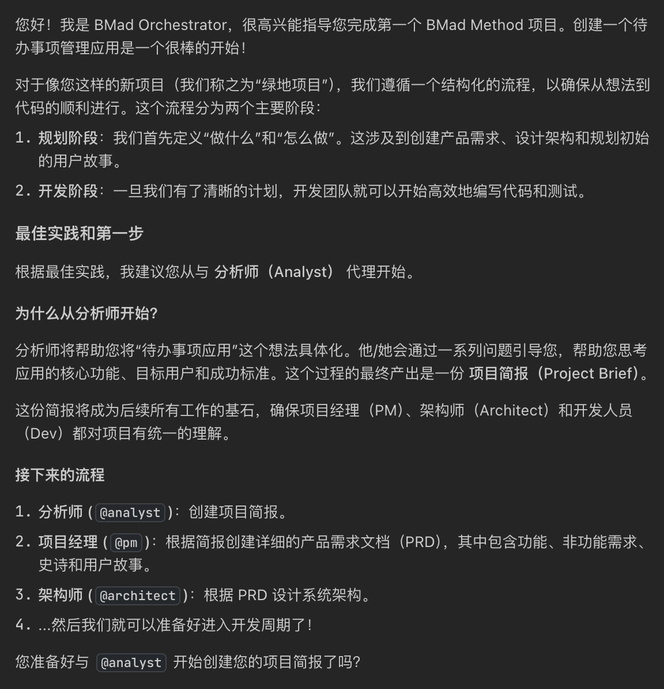
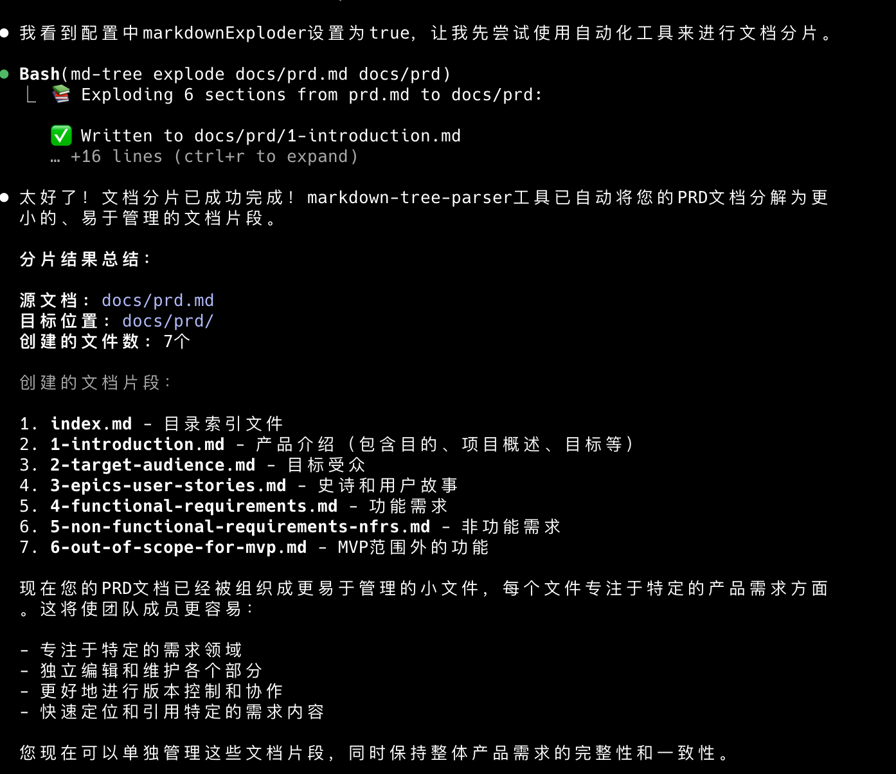

操作步骤

```
npx bmad-method install
```


创建智能体,因为需要web这种创建好需求


```
知识库内容: /Users/xxxx/PycharmProjects/test/todolist_demo/web-bundles/teams/team-fullstack.txt
系统指令: 
Your critical operating instructions are attached, do not break character as directed
注意:使用中文和我进行对话
```

需要使用Gemini


```
我需要使用bmad-method,阅读当前项目,学习相关指令
```


## 规划阶段实践

```
我想创建一个待办事项管理应用，这是我第一次使用BMAD-METHOD。请指导我应该从哪个代理开始，以及整个流程的最佳实践。
```




```
*analyst
```


```
我想创建一个名为"TodoMaster"的智能待办事项管理应用。

项目背景：
- 目标用户：学生、职场人士、小团队
- 核心痛点：现有应用功能简单，缺乏智能分类和团队协作
- 期望特色：智能提醒、优先级管理、简洁易用

请帮我进行市场调研和用户分析。
```


```
生成这份项目简报
```


```
*pm
```


```
基于刚才分析师的调研结果，请为TodoMaster待办事项应用创建详细的产品需求文档(PRD)。

项目概述：
- 产品名称：TodoMaster
- 目标用户：学生、职场人士、个人用户
- 核心价值：简洁易用的智能任务管理

请基于分析师的建议，创建完整的PRD文档。
```


省略中间过程


```
准备好了,请生成最终的prd
```


```
@architect，请接手。这是“TodoMaster”最终版的 PRD，请开始创建架构设计。
请特别关注：
1. 技术栈选择和理由
2. 数据库设计
3. API架构
4. 前端组件结构
5. 安全考虑
6. 可扩展性设计
我的技术偏好
1.  **前端应用 (Frontend Web App)**: 基于 **React** 的单页应用，使用 **Magic UI Design** 组件库，负责提供完整的用户界面。
2.  **后端 API 服务 (Backend API Service)**: 基于 **Python + FastAPI + Tortoise-ORM** 的核心服务，实现所有业务逻辑和 API。
3.  **数据库 (Database)**: **SQLite** (开发) / **MySQL** (生产)，用于持久化存储所有应用数据。
```


## 开发阶段实践

这一部分我们就需要使用`claude code`来完成了

```
/po
```


```
请帮我分片docs/prd.md文档，将其分解为更小的、易于管理的文档片段。

请创建以下分片：
1. product-overview.md - 产品概述
2. user-stories.md - 用户故事  
3. functional-requirements.md - 功能需求
4. non-functional-requirements.md - 非功能需求
5. project-timeline.md - 项目时间线
```




```
请帮我分片docs/architecture.md文档。

请创建以下分片：
1. tech-stack.md - 技术栈选择
2. database-design.md - 数据库设计
3. api-specification.md - API规范
4. frontend-architecture.md - 前端架构
5. security-design.md - 安全设计
```


```
基于我们项目的PRD和架构文档，请为TodoMaster项目创建第一个开发故事。

项目背景：
- 这是一个待办事项管理应用
- 已完成需求分析和架构设计
- 准备开始MVP开发

请分析所有规划文档，然后创建第一个应该实现的开发故事。
```


```
/dev
```


```
使用中文和我进行对话,帮我完成/Users/xxxx/PycharmProjects/test/todolist_demo
  /docs/stories/1.1.user-registration.md的开发
```


```
/qa
```


```
review /Users/xxxxx/PycharmProjects/test/todolist_demo/docs/stories/1.1.user
  -registration.md
```


```
标记任务已完成,并且在根目录下生成一个makefile文件,支持服务端的启动停止
```


## 下一轮开发


```
/sm
```


```
第一个故事已经完成，请基于当前进度创建下一个优先级最高的开发故事。

当前完成状态：
- ✅ 项目基础架构搭建完成
- ✅ 前后端通信正常
- ✅ 开发环境配置完成

请分析下一步应该实现什么功能。
```

